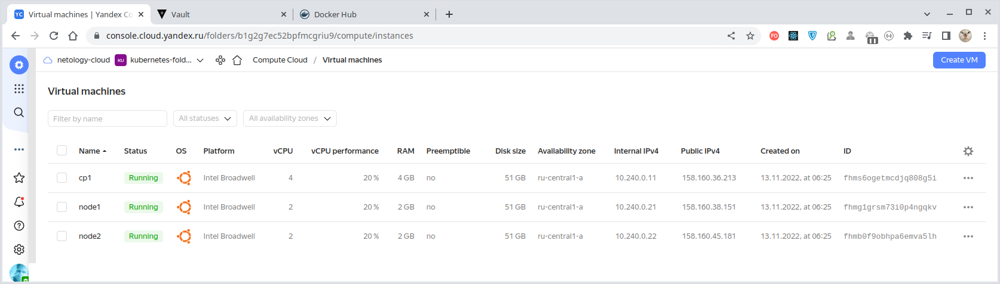
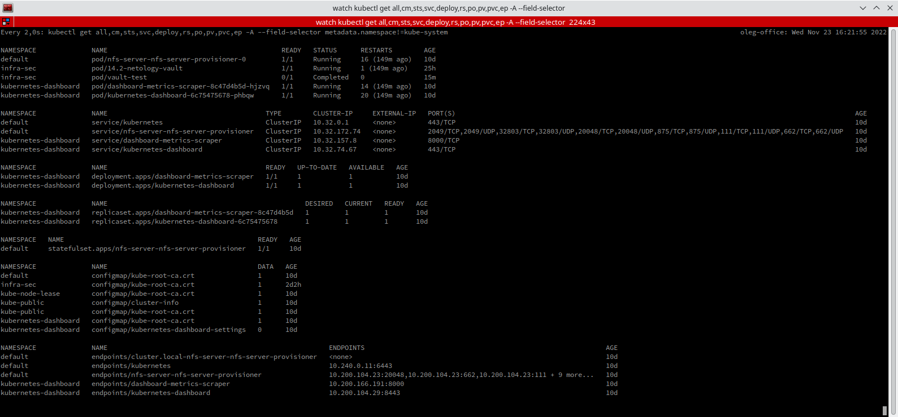
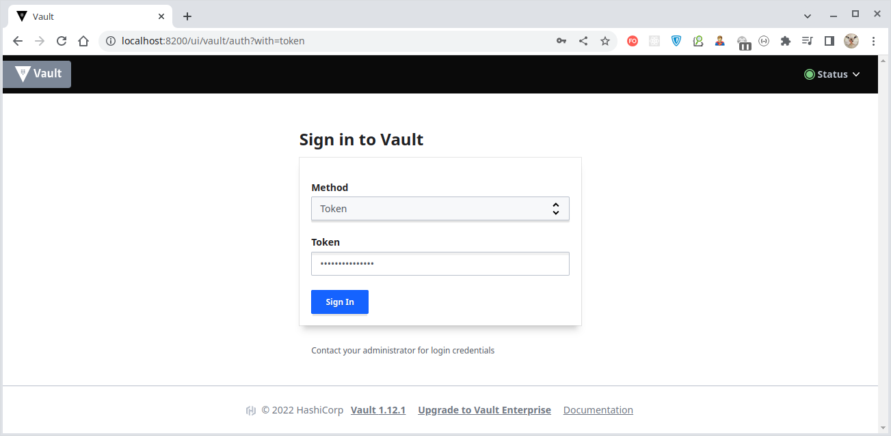
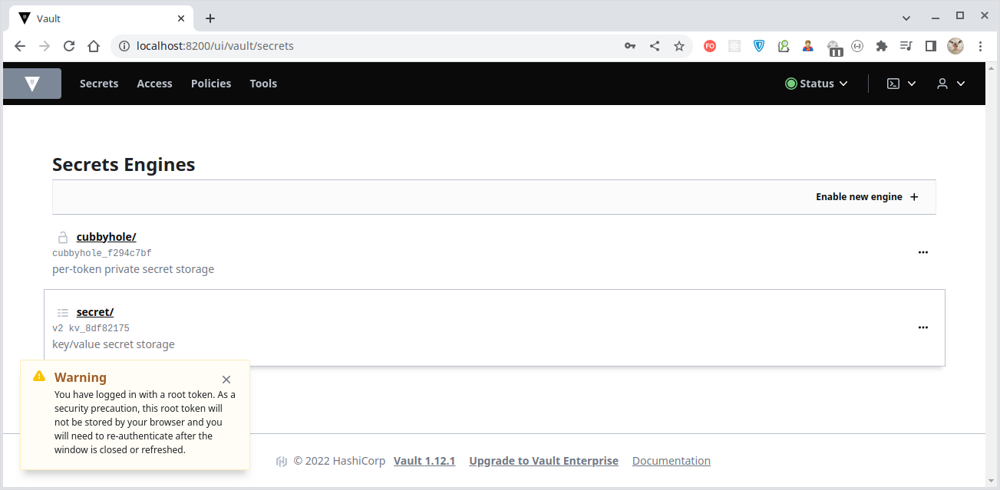
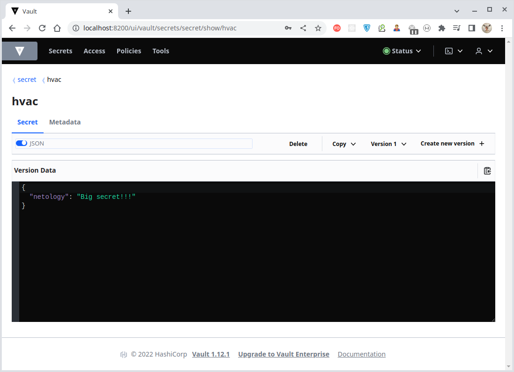
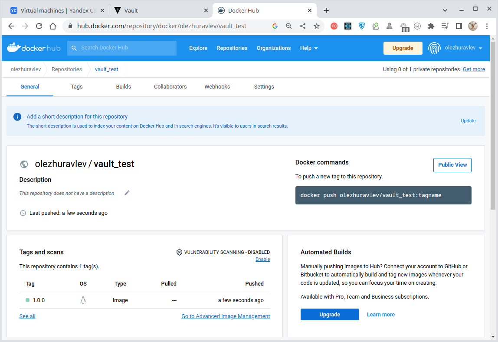
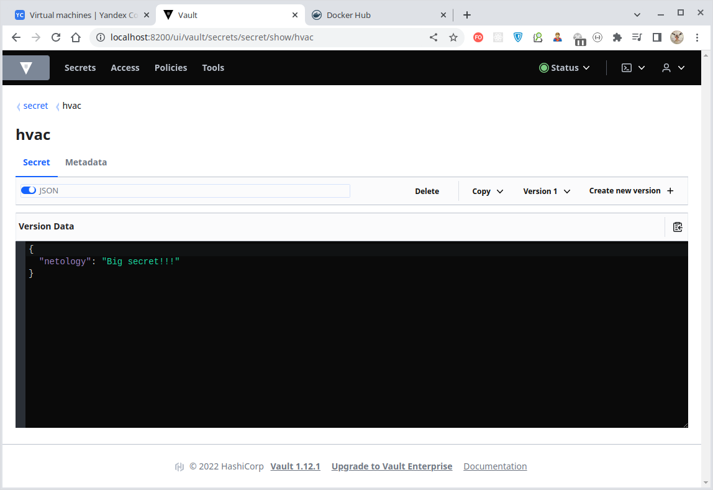

# Домашнее задание к занятию "14.2 Синхронизация секретов с внешними сервисами. Vault"

## Задача 1: Работа с модулем Vault

Запустить модуль Vault конфигураций через утилиту kubectl в установленном minikube

```
kubectl apply -f 14.2/vault-pod.yml
```

Получить значение внутреннего IP пода

```
kubectl get pod 14.2-netology-vault -o json | jq -c '.status.podIPs'
```

Примечание: jq - утилита для работы с JSON в командной строке

Запустить второй модуль для использования в качестве клиента

```
kubectl run -i --tty fedora --image=fedora --restart=Never -- sh
```

Установить дополнительные пакеты

```
dnf -y install pip
pip install hvac
```

Запустить интепретатор Python и выполнить следующий код, предварительно
поменяв IP и токен

```
import hvac
client = hvac.Client(
    url='http://10.10.133.71:8200',
    token='aiphohTaa0eeHei'
)
client.is_authenticated()

# Пишем секрет
client.secrets.kv.v2.create_or_update_secret(
    path='hvac',
    secret=dict(netology='Big secret!!!'),
)

# Читаем секрет
client.secrets.kv.v2.read_secret_version(
    path='hvac',
)
```

---

### Предварительная подготовка - разворачивание кластера Kubernetes

С помощью команды `terraform apply -auto-approve`, примененной к [конфигурации Terraform](./terraform/main.tf)
подготовим виртуальную инфраструктуру:



Наполним нашу виртуальную инфраструктуру программным содержимым с помощью [конфигурации Ansible](./infrastructure/site.yaml).
Для разворачивания кластера Kubernetes [используем Kubespray](./infrastructure/playbooks/mount-cluster.ansible.yaml).

<details>
  <summary>Полная инфраструктура нашего Kubernetes-кластера выглядит следующим образом:</summary>

````bash
$ kubectl get cm,sts,svc,deploy,rs,po,pv,pvc,ep -A --field-selector metadata.namespace!=kube-system -o wide --show-labels 
NAMESPACE              NAME                                      DATA   AGE    LABELS
default                configmap/kube-root-ca.crt                1      10d    <none>
infra-sec              configmap/kube-root-ca.crt                1      2d1h   <none>
kube-node-lease        configmap/kube-root-ca.crt                1      10d    <none>
kube-public            configmap/cluster-info                    1      10d    <none>
kube-public            configmap/kube-root-ca.crt                1      10d    <none>
kubernetes-dashboard   configmap/kube-root-ca.crt                1      10d    <none>
kubernetes-dashboard   configmap/kubernetes-dashboard-settings   0      10d    k8s-app=kubernetes-dashboard

NAMESPACE   NAME                                                 READY   AGE   CONTAINERS               IMAGES                                                LABELS
default     statefulset.apps/nfs-server-nfs-server-provisioner   1/1     10d   nfs-server-provisioner   quay.io/kubernetes_incubator/nfs-provisioner:v2.3.0   app.kubernetes.io/managed-by=Helm,app=nfs-server-provisioner,chart=nfs-server-provisioner-1.1.3,heritage=Helm,release=nfs-server

NAMESPACE              NAME                                        TYPE        CLUSTER-IP     EXTERNAL-IP   PORT(S)                                                                                                     AGE   SELECTOR                                        LABELS
default                service/kubernetes                          ClusterIP   10.32.0.1      <none>        443/TCP                                                                                                     10d   <none>                                          component=apiserver,provider=kubernetes
default                service/nfs-server-nfs-server-provisioner   ClusterIP   10.32.172.74   <none>        2049/TCP,2049/UDP,32803/TCP,32803/UDP,20048/TCP,20048/UDP,875/TCP,875/UDP,111/TCP,111/UDP,662/TCP,662/UDP   10d   app=nfs-server-provisioner,release=nfs-server   app.kubernetes.io/managed-by=Helm,app=nfs-server-provisioner,chart=nfs-server-provisioner-1.1.3,heritage=Helm,release=nfs-server
kubernetes-dashboard   service/dashboard-metrics-scraper           ClusterIP   10.32.157.8    <none>        8000/TCP                                                                                                    10d   k8s-app=dashboard-metrics-scraper               k8s-app=dashboard-metrics-scraper
kubernetes-dashboard   service/kubernetes-dashboard                ClusterIP   10.32.74.67    <none>        443/TCP                                                                                                     10d   k8s-app=kubernetes-dashboard                    k8s-app=kubernetes-dashboard

NAMESPACE              NAME                                        READY   UP-TO-DATE   AVAILABLE   AGE   CONTAINERS                  IMAGES                                SELECTOR                            LABELS
kubernetes-dashboard   deployment.apps/dashboard-metrics-scraper   1/1     1            1           10d   dashboard-metrics-scraper   kubernetesui/metrics-scraper:v1.0.8   k8s-app=dashboard-metrics-scraper   k8s-app=dashboard-metrics-scraper
kubernetes-dashboard   deployment.apps/kubernetes-dashboard        1/1     1            1           10d   kubernetes-dashboard        kubernetesui/dashboard:v2.6.1         k8s-app=kubernetes-dashboard        k8s-app=kubernetes-dashboard

NAMESPACE              NAME                                                  DESIRED   CURRENT   READY   AGE   CONTAINERS                  IMAGES                                SELECTOR                                                        LABELS
kubernetes-dashboard   replicaset.apps/dashboard-metrics-scraper-8c47d4b5d   1         1         1       10d   dashboard-metrics-scraper   kubernetesui/metrics-scraper:v1.0.8   k8s-app=dashboard-metrics-scraper,pod-template-hash=8c47d4b5d   k8s-app=dashboard-metrics-scraper,pod-template-hash=8c47d4b5d
kubernetes-dashboard   replicaset.apps/kubernetes-dashboard-6c75475678       1         1         1       10d   kubernetes-dashboard        kubernetesui/dashboard:v2.6.1         k8s-app=kubernetes-dashboard,pod-template-hash=6c75475678       k8s-app=kubernetes-dashboard,pod-template-hash=6c75475678

NAMESPACE              NAME                                            READY   STATUS      RESTARTS        AGE   IP               NODE    NOMINATED NODE   READINESS GATES   LABELS
default                pod/nfs-server-nfs-server-provisioner-0         1/1     Running     16 (148m ago)   10d   10.200.104.23    node2   <none>           <none>            app=nfs-server-provisioner,chart=nfs-server-provisioner-1.1.3,controller-revision-hash=nfs-server-nfs-server-provisioner-64bd6d7f65,heritage=Helm,release=nfs-server,statefulset.kubernetes.io/pod-name=nfs-server-nfs-server-provisioner-0
infra-sec              pod/14.2-netology-vault                         1/1     Running     1 (147m ago)    25h   10.200.166.190   node1   <none>           <none>            <none>
infra-sec              pod/vault-test                                  0/1     Completed   0               13m   10.200.104.50    node2   <none>           <none>            <none>
kubernetes-dashboard   pod/dashboard-metrics-scraper-8c47d4b5d-hjzvq   1/1     Running     14 (147m ago)   10d   10.200.166.191   node1   <none>           <none>            k8s-app=dashboard-metrics-scraper,pod-template-hash=8c47d4b5d
kubernetes-dashboard   pod/kubernetes-dashboard-6c75475678-phbqw       1/1     Running     20 (148m ago)   10d   10.200.104.29    node2   <none>           <none>            k8s-app=kubernetes-dashboard,pod-template-hash=6c75475678

NAMESPACE              NAME                                                        ENDPOINTS                                                             AGE   LABELS
default                endpoints/cluster.local-nfs-server-nfs-server-provisioner   <none>                                                                10d   <none>
default                endpoints/kubernetes                                        10.240.0.11:6443                                                      10d   endpointslice.kubernetes.io/skip-mirror=true
default                endpoints/nfs-server-nfs-server-provisioner                 10.200.104.23:20048,10.200.104.23:662,10.200.104.23:111 + 9 more...   10d   app.kubernetes.io/managed-by=Helm,app=nfs-server-provisioner,chart=nfs-server-provisioner-1.1.3,heritage=Helm,release=nfs-server
kubernetes-dashboard   endpoints/dashboard-metrics-scraper                         10.200.166.191:8000                                                   10d   k8s-app=dashboard-metrics-scraper
kubernetes-dashboard   endpoints/kubernetes-dashboard                              10.200.104.29:8443                                                    10d   k8s-app=kubernetes-dashboard
````

</details>



Kubernetes-кластер развёрнут и готов к использованию.

---

### Решение

<details>
  <summary>Запускаем под с "Vault".</summary>

````bash
$ kubectl apply -f ./vault/vault-pod.yaml 
pod/14.2-netology-vault created
````

</details>

<details>
  <summary>Получаем IP пода.</summary>

````bash
$ kubectl get pod/14.2-netology-vault -o json | jq -c '.status.podIPs'
[{"ip":"10.200.166.188"}]
````

> Или проще:
> ````bash
> $ kubectl get pod/14.2-netology-vault -o wide
> NAME                  READY   STATUS    RESTARTS   AGE   IP               NODE    NOMINATED NODE   READINESS GATES
> 14.2-netology-vault   1/1     Running   0          18m   10.200.166.188   node1   <none>           <none>
> ````

</details>

<details>
  <summary>Для упрощения доступа к кластеру пробрасываем порт `8200` на такой же порт `localhost`.</summary>

````bash
$ kubectl port-forward pod/14.2-netology-vault 8200:8200
Forwarding from 127.0.0.1:8200 -> 8200
Forwarding from [::1]:8200 -> 8200
Handling connection for 8200
...
````

</details>

Теперь "Vault" доступен из браузера. Залогинимся с помощью токена, используя строку `aiphohTaa0eeHei`, указанную
в [инициализационном файле пода](./vault/vault-pod.yaml):



<details>
  <summary>Логин выполнен.</summary>



</details>

<details>
  <summary>На базе ОС "Fedora" создадим клиента, использующего "Vault".</summary>

Для этого запустим контейнер на основе образа ОС "Fedora":

````bash
$ kubectl run -i --tty fedora --image=fedora --restart=Never -- sh
If you don't see a command prompt, try pressing enter.
sh-5.1# cat /etc/os-release
NAME="Fedora Linux"
VERSION="37 (Container Image)"
ID=fedora
VERSION_ID=37
VERSION_CODENAME=""
PLATFORM_ID="platform:f37"
PRETTY_NAME="Fedora Linux 37 (Container Image)"
ANSI_COLOR="0;38;2;60;110;180"
LOGO=fedora-logo-icon
CPE_NAME="cpe:/o:fedoraproject:fedora:37"
DEFAULT_HOSTNAME="fedora"
HOME_URL="https://fedoraproject.org/"
DOCUMENTATION_URL="https://docs.fedoraproject.org/en-US/fedora/f37/system-administrators-guide/"
SUPPORT_URL="https://ask.fedoraproject.org/"
BUG_REPORT_URL="https://bugzilla.redhat.com/"
REDHAT_BUGZILLA_PRODUCT="Fedora"
REDHAT_BUGZILLA_PRODUCT_VERSION=37
REDHAT_SUPPORT_PRODUCT="Fedora"
REDHAT_SUPPORT_PRODUCT_VERSION=37
VARIANT="Container Image"
VARIANT_ID=container
````

> В данном дистрибутиве используется версия `Python 3.11.0`:
> ````bash
> sh-5.1# python3 --version
> Python 3.11.0
> ````

</details>

<details>
  <summary>Установим клиенту утилиту "hvac".</summary>

Сначала установим менеджер пакетов "pip" и затем с его помощью утилиту "hvac",
являющуюся Python-клиентом для "Vault":
````bash
sh-5.1# dnf -y install pip
Fedora 37 - x86_64                                                                                                                                                                                      6.2 MB/s |  64 MB     00:10    
Fedora 37 openh264 (From Cisco) - x86_64                                                                                                                                                                1.3 kB/s | 2.5 kB     00:01    
Fedora Modular 37 - x86_64                                                                                                                                                                              4.6 MB/s | 3.0 MB     00:00    
Fedora 37 - x86_64 - Updates                                                                                                                                                                            6.1 MB/s |  14 MB     00:02    
Fedora Modular 37 - x86_64 - Updates                                                                                                                                                                    5.8 MB/s | 3.7 MB     00:00    
Last metadata expiration check: 0:00:01 ago on Tue Nov 22 13:45:57 2022.
Dependencies resolved.
========================================================================================================================================================================================================================================
 Package                                                        Architecture                                       Version                                                     Repository                                          Size
========================================================================================================================================================================================================================================
Installing:
 python3-pip                                                    noarch                                             22.2.2-2.fc37                                               fedora                                             3.1 M
Installing weak dependencies:
 libxcrypt-compat                                               x86_64                                             4.4.28-3.fc37                                               fedora                                              89 k
 python3-setuptools                                             noarch                                             62.6.0-2.fc37                                               fedora                                             1.6 M

Transaction Summary
========================================================================================================================================================================================================================================
Install  3 Packages

Total download size: 4.8 M
Installed size: 23 M
Downloading Packages:
(1/3): libxcrypt-compat-4.4.28-3.fc37.x86_64.rpm                                                                                                                                                        741 kB/s |  89 kB     00:00    
(2/3): python3-setuptools-62.6.0-2.fc37.noarch.rpm                                                                                                                                                      9.3 MB/s | 1.6 MB     00:00    
(3/3): python3-pip-22.2.2-2.fc37.noarch.rpm                                                                                                                                                             9.7 MB/s | 3.1 MB     00:00    
----------------------------------------------------------------------------------------------------------------------------------------------------------------------------------------------------------------------------------------
Total                                                                                                                                                                                                   8.2 MB/s | 4.8 MB     00:00     
Running transaction check
Transaction check succeeded.
Running transaction test
Transaction test succeeded.
Running transaction
  Preparing        :                                                                                                                                                                                                                1/1 
  Installing       : python3-setuptools-62.6.0-2.fc37.noarch                                                                                                                                                                        1/3 
  Installing       : libxcrypt-compat-4.4.28-3.fc37.x86_64                                                                                                                                                                          2/3 
  Installing       : python3-pip-22.2.2-2.fc37.noarch                                                                                                                                                                               3/3 
  Running scriptlet: python3-pip-22.2.2-2.fc37.noarch                                                                                                                                                                               3/3 
  Verifying        : libxcrypt-compat-4.4.28-3.fc37.x86_64                                                                                                                                                                          1/3 
  Verifying        : python3-pip-22.2.2-2.fc37.noarch                                                                                                                                                                               2/3 
  Verifying        : python3-setuptools-62.6.0-2.fc37.noarch                                                                                                                                                                        3/3 

Installed:
  libxcrypt-compat-4.4.28-3.fc37.x86_64                                         python3-pip-22.2.2-2.fc37.noarch                                         python3-setuptools-62.6.0-2.fc37.noarch                                        

Complete!
sh-5.1# pip install hvac
Collecting hvac
  Downloading hvac-1.0.2-py3-none-any.whl (143 kB)
     ━━━━━━━━━━━━━━━━━━━━━━━━━━━━━━━━━━━━━━━━ 143.5/143.5 kB 2.7 MB/s eta 0:00:00
Collecting pyhcl<0.5.0,>=0.4.4
  Downloading pyhcl-0.4.4.tar.gz (61 kB)
     ━━━━━━━━━━━━━━━━━━━━━━━━━━━━━━━━━━━━━━━━ 61.1/61.1 kB 4.6 MB/s eta 0:00:00
  Installing build dependencies ... done
  Getting requirements to build wheel ... done
  Preparing metadata (pyproject.toml) ... done
Collecting requests<3.0.0,>=2.27.1
  Downloading requests-2.28.1-py3-none-any.whl (62 kB)
     ━━━━━━━━━━━━━━━━━━━━━━━━━━━━━━━━━━━━━━━━ 62.8/62.8 kB 2.9 MB/s eta 0:00:00
Collecting charset-normalizer<3,>=2
  Downloading charset_normalizer-2.1.1-py3-none-any.whl (39 kB)
Collecting idna<4,>=2.5
  Downloading idna-3.4-py3-none-any.whl (61 kB)
     ━━━━━━━━━━━━━━━━━━━━━━━━━━━━━━━━━━━━━━━━ 61.5/61.5 kB 6.0 MB/s eta 0:00:00
Collecting urllib3<1.27,>=1.21.1
  Downloading urllib3-1.26.12-py2.py3-none-any.whl (140 kB)
     ━━━━━━━━━━━━━━━━━━━━━━━━━━━━━━━━━━━━━━━━ 140.4/140.4 kB 11.7 MB/s eta 0:00:00
Collecting certifi>=2017.4.17
  Downloading certifi-2022.9.24-py3-none-any.whl (161 kB)
     ━━━━━━━━━━━━━━━━━━━━━━━━━━━━━━━━━━━━━━━━ 161.1/161.1 kB 15.3 MB/s eta 0:00:00
Building wheels for collected packages: pyhcl
  Building wheel for pyhcl (pyproject.toml) ... done
  Created wheel for pyhcl: filename=pyhcl-0.4.4-py3-none-any.whl size=50127 sha256=f0828e9d181a6ab58d0ea69e5700208da5b083891fa265dde7fd3362af748dab
  Stored in directory: /root/.cache/pip/wheels/e4/f4/3a/691e55b36281820a2e2676ffd693a7f7a068fab60d89353d74
Successfully built pyhcl
Installing collected packages: pyhcl, urllib3, idna, charset-normalizer, certifi, requests, hvac
Successfully installed certifi-2022.9.24 charset-normalizer-2.1.1 hvac-1.0.2 idna-3.4 pyhcl-0.4.4 requests-2.28.1 urllib3-1.26.12
WARNING: Running pip as the 'root' user can result in broken permissions and conflicting behaviour with the system package manager. It is recommended to use a virtual environment instead: https://pip.pypa.io/warnings/venv
sh-5.1# 
````

</details>

<details>
  <summary>Создадим исполняемый файл Python.</summary>

Используя ssh-соединение с нашим экземляром "Fedora" создадим файл
[vault_test.py](./docker/vault_test.py),
имеющий следующее содержимое:
````python
import json
import hvac
import os

def main():
    env_url = os.environ['url']
    env_token = os.environ['token']
    env_write = os.getenv('write', 'False').lower() in ('true', '1', 't')

    print("Authenticating client to URL(token): " + env_url + "('" + env_token + "') for "
          + ("writing" if env_write else "reading"))

    client = hvac.Client(
        url=env_url,
        token=env_token
    )

    is_authenticated = client.is_authenticated()
    if not is_authenticated:
        print("Client is not authenticated!")
        return

    print("Client is authenticated: " + str(client.is_authenticated()))

    # Write secret
    if env_write:
        print("Writing secret...")
        client.secrets.kv.v2.create_or_update_secret(
            path='hvac',
            secret=dict(netology='Big secret!!!'),
        )

    print("Reading secret...")
    secret = client.secrets.kv.v2.read_secret_version(
        path='hvac',
    )
    print("Secret is: " + json.dumps(secret, indent=2))
````

> Здесь параметр `env_url` - это переданный через переменную окружения `url` URL нашего пода, обслуживающего "Vault",
> a параметр `env_token` - это переданная через переменную окружения `token` последовательность символов,
> заданная в качестве токена в [инициализационном файле пода](./vault/vault-pod.yaml)
> (используя её же мы ранее залогинились в "Vault" через браузер).
> 
> ПРИМЕЧАНИЕ: Мы использовали передачу параметров через переменные окружения с целью унификации
> файла [vault_test.py](./docker/vault_test.py) для запуска его как скрипта, так и для запуска в контейнере. 

</details>

<details>
  <summary>Запустим исполняемый файл Python.</summary>

Используя ssh-соединение с нашим экземляром "Fedora" зададим переменные окружения,
а затем командой `python3 vault_test.py` запустим файл [vault_test.py](./docker/vault_test.py) на выполнение:
````bash
sh-5.1# export url=http://10.200.166.188:8200
sh-5.1# export token=aiphohTaa0eeHei
sh-5.1# python3 vault_test.py
````

</details>

После выполнения Python-кода в составе секретов "Vault" можно будет наблюдать наш созданный секрет:



Таким образом, мы запустили экземпляр "Vault" и с помощью Python-кода сохранили в нём секрет.

---

## Задача 2 (*): Работа с секретами внутри модуля

* На основе образа fedora создать модуль;
* Создать секрет, в котором будет указан токен;
* Подключить секрет к модулю;
* Запустить модуль и проверить доступность сервиса Vault.

---

### Решение

<details>
  <summary>Создадим образ на базе "Fedora".</summary>

Используя [Dockerfile](./docker/Dockerfile) собираем образ:
````bash
$ docker build -t olezhuravlev/vault_test:1.0.0 .
Sending build context to Docker daemon  4.096kB
Step 1/5 : FROM fedora
 ---> d1cd7f8c89a9
Step 2/5 : RUN dnf -y install pip && pip install hvac
 ---> Running in 171b50e9195f
Fedora 37 - x86_64                              3.2 MB/s |  64 MB     00:20    
Fedora 37 openh264 (From Cisco) - x86_64        1.3 kB/s | 2.5 kB     00:01    
Fedora Modular 37 - x86_64                      763 kB/s | 3.0 MB     00:04    
Fedora 37 - x86_64 - Updates                    5.9 MB/s |  14 MB     00:02    
Fedora Modular 37 - x86_64 - Updates            1.3 MB/s | 3.7 MB     00:02    
Dependencies resolved.
================================================================================
 Package                  Architecture Version               Repository    Size
================================================================================
Installing:
 python3-pip              noarch       22.2.2-2.fc37         fedora       3.1 M
Installing weak dependencies:
 libxcrypt-compat         x86_64       4.4.28-3.fc37         fedora        89 k
 python3-setuptools       noarch       62.6.0-2.fc37         fedora       1.6 M

Transaction Summary
================================================================================
Install  3 Packages

Total download size: 4.8 M
Installed size: 23 M
Downloading Packages:
(1/3): libxcrypt-compat-4.4.28-3.fc37.x86_64.rp 315 kB/s |  89 kB     00:00    
(2/3): python3-setuptools-62.6.0-2.fc37.noarch. 1.4 MB/s | 1.6 MB     00:01    
(3/3): python3-pip-22.2.2-2.fc37.noarch.rpm     650 kB/s | 3.1 MB     00:04    
--------------------------------------------------------------------------------
Total                                           934 kB/s | 4.8 MB     00:05     
Running transaction check
Transaction check succeeded.
Running transaction test
Transaction test succeeded.
Running transaction
  Preparing        :                                                        1/1 
  Installing       : python3-setuptools-62.6.0-2.fc37.noarch                1/3 
  Installing       : libxcrypt-compat-4.4.28-3.fc37.x86_64                  2/3 
  Installing       : python3-pip-22.2.2-2.fc37.noarch                       3/3 
  Running scriptlet: python3-pip-22.2.2-2.fc37.noarch                       3/3 
  Verifying        : libxcrypt-compat-4.4.28-3.fc37.x86_64                  1/3 
  Verifying        : python3-pip-22.2.2-2.fc37.noarch                       2/3 
  Verifying        : python3-setuptools-62.6.0-2.fc37.noarch                3/3 

Installed:
  libxcrypt-compat-4.4.28-3.fc37.x86_64      python3-pip-22.2.2-2.fc37.noarch   
  python3-setuptools-62.6.0-2.fc37.noarch   

Complete!
Collecting hvac
  Downloading hvac-1.0.2-py3-none-any.whl (143 kB)
     ━━━━━━━━━━━━━━━━━━━━━━━━━━━━━━━━━━━━━ 143.5/143.5 kB 694.9 kB/s eta 0:00:00
Collecting pyhcl<0.5.0,>=0.4.4
  Downloading pyhcl-0.4.4.tar.gz (61 kB)
     ━━━━━━━━━━━━━━━━━━━━━━━━━━━━━━━━━━━━━━━━ 61.1/61.1 kB 2.0 MB/s eta 0:00:00
  Installing build dependencies: started
  Installing build dependencies: finished with status 'done'
  Getting requirements to build wheel: started
  Getting requirements to build wheel: finished with status 'done'
  Preparing metadata (pyproject.toml): started
  Preparing metadata (pyproject.toml): finished with status 'done'
Collecting requests<3.0.0,>=2.27.1
  Downloading requests-2.28.1-py3-none-any.whl (62 kB)
     ━━━━━━━━━━━━━━━━━━━━━━━━━━━━━━━━━━━━━━━━ 62.8/62.8 kB 2.2 MB/s eta 0:00:00
Collecting charset-normalizer<3,>=2
  Downloading charset_normalizer-2.1.1-py3-none-any.whl (39 kB)
Collecting idna<4,>=2.5
  Downloading idna-3.4-py3-none-any.whl (61 kB)
     ━━━━━━━━━━━━━━━━━━━━━━━━━━━━━━━━━━━━━━━━ 61.5/61.5 kB 2.7 MB/s eta 0:00:00
Collecting urllib3<1.27,>=1.21.1
  Downloading urllib3-1.26.12-py2.py3-none-any.whl (140 kB)
     ━━━━━━━━━━━━━━━━━━━━━━━━━━━━━━━━━━━━━ 140.4/140.4 kB 704.7 kB/s eta 0:00:00
Collecting certifi>=2017.4.17
  Downloading certifi-2022.9.24-py3-none-any.whl (161 kB)
     ━━━━━━━━━━━━━━━━━━━━━━━━━━━━━━━━━━━━━━━ 161.1/161.1 kB 1.6 MB/s eta 0:00:00
Building wheels for collected packages: pyhcl
  Building wheel for pyhcl (pyproject.toml): started
  Building wheel for pyhcl (pyproject.toml): finished with status 'done'
  Created wheel for pyhcl: filename=pyhcl-0.4.4-py3-none-any.whl size=50127 sha256=9212ee312c0a0c548db9b7e55dd30b28ae62d370d6a711a91e82fe017eb57708
  Stored in directory: /root/.cache/pip/wheels/e4/f4/3a/691e55b36281820a2e2676ffd693a7f7a068fab60d89353d74
Successfully built pyhcl
Installing collected packages: pyhcl, urllib3, idna, charset-normalizer, certifi, requests, hvac
Successfully installed certifi-2022.9.24 charset-normalizer-2.1.1 hvac-1.0.2 idna-3.4 pyhcl-0.4.4 requests-2.28.1 urllib3-1.26.12
WARNING: Running pip as the 'root' user can result in broken permissions and conflicting behaviour with the system package manager. It is recommended to use a virtual environment instead: https://pip.pypa.io/warnings/venv
Removing intermediate container 171b50e9195f
 ---> c05bba6ee7c0
Step 3/5 : COPY vault_test.py /
 ---> a83ea9a742c2
Step 4/5 : ENV write false
 ---> Running in ea4367e6fb04
Removing intermediate container ea4367e6fb04
 ---> d5658615132f
Step 5/5 : CMD python3 vault_test.py
 ---> Running in 1eae9764d546
Removing intermediate container 1eae9764d546
 ---> 143bca1510b7
Successfully built 143bca1510b7
Successfully tagged olezhuravlev/vault_test:1.0.0
````

</details>

<details>
  <summary>Опубликуем образ в репозиторий.</summary>

Логинимся в [публичный репозиторий](https://hub.docker.com/repository/docker/olezhuravlev/vault_test)
и отправляем в него созданный образ:
````bash
$ docker login                                   
Authenticating with existing credentials...
WARNING! Your password will be stored unencrypted in /home/oleg/.docker/config.json.
Configure a credential helper to remove this warning. See
https://docs.docker.com/engine/reference/commandline/login/#credentials-store

Login Succeeded

$ docker push olezhuravlev/vault_test:1.0.0      
The push refers to repository [docker.io/olezhuravlev/vault_test]
b6e70a4c133c: Layer already exists 
bed63162af20: Pushed 
a2747030d91b: Layer already exists 
1.0.0: digest: sha256:493cea0dac9648db0653efcd62712ff4b544e10826d4a2896ccceb61abc81f23 size: 949
````



</details>

<details>
  <summary>Запускаем под в кластере Kubernetes.</summary>

В [конфигурационном файле](./vault/vault-test-pod.yaml) укажем требуемые параметры `url`, `token` и `write` после чего
запускаем под:
````bash
$ kubectl apply -f ./vault/vault-test-pod.yaml
pod/vault-test created
````

Запущенный под выполнился и перешел в статус "Completed":
````bash
$ kubectl get po -o wide
NAME                  READY   STATUS      RESTARTS       AGE   IP               NODE    NOMINATED NODE   READINESS GATES
14.2-netology-vault   1/1     Running     1 (134m ago)   25h   10.200.166.190   node1   <none>           <none>
vault-test            0/1     Completed   0              30s   10.200.104.50    node2   <none>           <none>
````

Проверим логи пода:
````bash
$ kubectl logs pod/vault-test
Authenticating client to URL(token): http://10.200.166.190:8200('aiphohTaa0eeHei') for writing
Client is authenticated: True
Writing secret...
Reading secret...
Secret is: {
  "request_id": "b721a8c6-13fd-dd05-9647-e1b8fe53a0d6",
  "lease_id": "",
  "renewable": false,
  "lease_duration": 0,
  "data": {
    "data": {
      "netology": "Big secret!!!"
    },
    "metadata": {
      "created_time": "2022-11-23T15:06:59.991627158Z",
      "custom_metadata": null,
      "deletion_time": "",
      "destroyed": false,
      "version": 1
    }
  },
  "wrap_info": null,
  "warnings": null,
  "auth": null
}
````

</details>

В результате под создал в "Vault" секрет и вывел в `stdout` его содержимое.

Содержимое секрета можно увидеть и через GUI:



Таким образом, мы создали под, выполняющий роль клиента "Vault", запустили его в кластере Kubernetes,
под записал в хранилище секрет и считал его.

---

<details>
  <summary>Приложение 1 - Лекция</summary>

Объявление переменной пути к конфигурации (если ещё не объявлена):
````bash
$ export KUBECONFIG=~/.kube/config

$ echo $KUBECONFIG
/home/oleg/.kube/config
````

Создание пространства имен:
````bash
$ kubectl create ns infra-sec
````

Переключение на пространство имен infra-sec
````bash
$ kubens infra-sec
````

> Можно переключиться без использования kubens:
>
> ````bash
> $ kubectl config set-context --current --namespace=infra-sec
> Context "kubernetes-admin@cluster.local" modified.
> 
> $ kubectl config view --minify | grep namespace
> namespace: infra-sec
> ````

Применение конфигурации для создания ConfigMap:
````bash
$ kubectl apply -f ./manifests/00-cm.yaml
configmap/vault-config created

$ kubectl get cm
NAME               DATA   AGE
kube-root-ca.crt   1      10m
vault-config       1      3m15s
````

Применение конфигурации для создания StatefulSet:
````bash
$ kubectl apply -f ./manifests/01-ss.yaml
statefulset.apps/vault created

$ kubectl get sts
NAME    READY   AGE
vault   1/1     36sk
````

Применение конфигурации для создания Service:
````bash
$ kubectl apply -f ./manifests/02-svc.yaml
service/vault created

$ kubectl get svc
NAME    TYPE        CLUSTER-IP   EXTERNAL-IP   PORT(S)    AGE
vault   ClusterIP   None         <none>        8200/TCP   40s

$ kubectl get pvc -o wide
NAME                 STATUS   VOLUME                                     CAPACITY   ACCESS MODES   STORAGECLASS   AGE    VOLUMEMODE
vault-data-vault-0   Bound    pvc-a583d8d9-9eb5-4782-8431-96cdf439a13f   1Gi        RWO            nfs            119m   Filesystem

$ kubectl get pv -o wide
NAME                                       CAPACITY   ACCESS MODES   RECLAIM POLICY   STATUS   CLAIM                          STORAGECLASS   REASON   AGE    VOLUMEMODE
pvc-a583d8d9-9eb5-4782-8431-96cdf439a13f   1Gi        RWO            Delete           Bound    infra-sec/vault-data-vault-0   nfs                     119m   Filesystem
````

> Для доступа снаружи не будем выполнять проброс портов сервиса `vault` на localhost,
> а сразу создадим сервис типа NodePort:
> ````bash
> $ kubectl apply -f ./manifests/03-svc-nodeport.yaml
> service/vault-nodeport created
> 
> $ kubectl get svc
> NAME             TYPE       CLUSTER-IP      EXTERNAL-IP   PORT(S)          AGE
> vault-nodeport   NodePort   10.32.146.139   <none>        8200:31000/TCP   5m30s
> ````

> Для ускорения процесса установки "Vault" все конфигурации были собраны
> в один файл [vault.yaml](vault/vault.yaml).

Теперь под, представляющий "Vault", находится в рабочем состоянии:
````bash
$ kubectl get po -o wide
NAME      READY   STATUS    RESTARTS   AGE    IP               NODE    NOMINATED NODE   READINESS GATES
vault-0   1/1     Running   0          104s   10.200.166.150   node1   <none>           <none>
````

С этого момента доступ к Vault появляется, но сам Vault находится в "запечатанном" состоянии:


Для распечатывания Vault укажем общее количество ключей и количество ключей, необходимых для распечатывания:


Vault инициализирован:


И созданный набор ключей можно скачать в виде JSON-файла:


После нажатия кнопки Unseal Vault следует последовательно ввести любые 3 ключа (используя форму base64):

|             1 of 3             |             2 of 3             |             3 of 3             |
|:------------------------------:|:------------------------------:|:------------------------------:|
|  |  |  |

И ввести корневой токен (root token):


После этого Vault готов к использованию:


### Включим метод аутентификации

На закладке Access в качестве метода авторизации:


Выбираем "App Role":


Указываем путь для доступа через URL (оставим дефолтный `approle`):


Метод авторизации установлен:


### Создадим политику

Инициализируем  новое секретное хранилище, нажав кнопку "Enable new engine" на закладке "Secrets":


Затем выбираем "KV":


И задаём URL-путь (здесь - `secrets`):


Секретное хранилище `secrets` создано:


Укажем URL, по которому расположен наш экземпляр Vault:
````bash
$ export VAULT_ADDR=http://158.160.36.213:31000

$ echo $VAULT_ADDR
http://158.160.36.213:31000
````

Укажем токен для доступа к Vault:
````bash
$ export VAULT_TOKEN=s.3ySA9R4xMoZL3xZBAFA65Ue1

$ echo $VAULT_TOKEN
s.3ySA9R4xMoZL3xZBAFA65Ue1
````

Добавим ключ в созданное хранилище:
````bash
$ vault kv put secrets/k11s/demo/app/nginx responseText="Hello from Vault"
========== Secret Path ==========
secrets/data/k11s/demo/app/nginx

======= Metadata =======
Key                Value
---                -----
created_time       2022-11-21T13:33:06.336956819Z
custom_metadata    <nil>
deletion_time      n/a
destroyed          false
version            1
````

Созданный ключ можно наблюдать через GUI:


Также можно добраться до его значения:


Создадим политику, указывающую, что по пути `secrets/data/k11s/demo/app/nginx` возможно только чтение:
````bash
$ vault policy write -tls-skip-verify nginx_conf_demo -<<EOF 
# Read-only permission on secrets stored at 'secrets/k11s/demo/app/nginx'
path "secrets/data/k11s/demo/app/nginx" {
  capabilities = [ "read" ]
}
EOF

Success! Uploaded policy: nginx_conf_demo
````

Созданную политику можно наблюдать в GUI на закладке "Policies":


Также можно увидеть содержимое политики:


### Создадим роль

Создадим роль, указав помимо прочих параметров применяемую политику "nginx_conf_demo":
````bash
$ vault write -tls-skip-verify auth/approle/role/nginx-demo \
  token_policies="nginx_conf_demo" \
  token_ttl=1h \
  token_max_ttl=4h \
  secret_id_bound_cidrs="0.0.0.0/0","127.0.0.1/32" \
  token_bound_cidrs="0.0.0.0/0","127.0.0.1/32" \
  secret_id_ttl=60m policies="nginx_conf_demo" \
  bind_secret_id=false

Success! Data written to: auth/approle/role/nginx-demo
````

Можно получить описание имеющейся роли:
````bash
$ vault read -tls-skip-verify auth/approle/role/nginx-demo
Key                        Value
---                        -----
bind_secret_id             false
local_secret_ids           false
policies                   [nginx_conf_demo]
secret_id_bound_cidrs      [0.0.0.0/0 127.0.0.1/32]
secret_id_num_uses         0
secret_id_ttl              1h
token_bound_cidrs          [0.0.0.0/0 127.0.0.1]
token_explicit_max_ttl     0s
token_max_ttl              4h
token_no_default_policy    false
token_num_uses             0
token_period               0s
token_policies             [nginx_conf_demo]
token_ttl                  1h
token_type                 default
````

Получаем идентификатор роли:
````bash
$ vault read -tls-skip-verify auth/approle/role/nginx-demo/role-id
Key        Value
---        -----
role_id    c823e94e-1cc0-ec8b-13c4-61e231b9ba1e
````

Полученный идентификатор роли указываем в [ConfigMap](./nginx/00-cm.yaml):
````yaml
  app-role-id: |
    c823e94e-1cc0-ec8b-13c4-61e231b9ba1e
````

Применяем [конфигурацию](./nginx/00-cm.yaml), создавая ConfigMaps:
````bash
$ kubectl apply -f ./nginx/00-cm.yaml
configmap/vault-nginx-template created
configmap/vault-agent-configs created

$ kubectl get cm --show-labels
NAME                   DATA   AGE     LABELS
kube-root-ca.crt       1      24h     <none>
vault-agent-configs    3      48s     app=vault
vault-config           1      4h54m   app=vault
vault-nginx-template   1      49s     app=vault
````

Применяем [деплоймент](./nginx/01-dp.yaml):
````bash
$ kubectl apply -f ./nginx/01-dp.yaml
deployment.apps/nginx-autoreload created

$ kubectl get deploy --show-labels
NAME               READY   UP-TO-DATE   AVAILABLE   AGE    LABELS
nginx-autoreload   1/1     1            1           4m8s   app=vault,role=nginx-reload-test
````

> Для ускорения процесса установки этого экземпляра "nginx" все конфигурации были собраны
> в один файл [nginx.yaml](./nginx/nginx.yaml).

В [конфигурации для nginx](./nginx/00-cm.yaml) указано выводить содержимое секрета `secrets/k11s/demo/app/nginx`:
````bash
location / {
  {{ with secret "secrets/k11s/demo/app/nginx" }}
  return 200 '{{ .Data.data.responseText }}';
  add_header Content-Type text/plain always;
  {{ end }}
}
````

Поэтому обратившись по порту, прослушиваемому nginx, можно получить содержимое секрета:


Если изменить значение секрета:


То по прошествии периода, заданного в [конфигурации nginx](./nginx/00-cm.yaml) (здесь - 1 минута):
````bash
template_config {
      static_secret_render_interval = "1m"
}
````

Изменится и отображаемое значение:


</details>

---

<details>
  <summary>Приложение 2 - Полезная информация</summary>

Список ресурсов с указанием коротких имён:
````bash
$ kubectl api-resources
NAME                SHORTNAMES   APIVERSION   NAMESPACED   KIND
bindings                         v1           true         Binding
componentstatuses   cs           v1           false        ComponentStatus
configmaps          cm           v1           true         ConfigMap
endpoints           ep           v1           true         Endpoints
events              ev           v1           true         Event
...
````

Установка Vault на Manjaro:
````bash
$ sudo snap install vault
[sudo] пароль для oleg:
vault (1.10/stable) 1.10.6 from Canonical✓ installed

> $ vault --version
Vault v1.10.6 (cgo)
````

Принудительное удаление пода:
````bash
$ kubectl delete pod/vault-0 -n infra-sec --grace-period=0 --force 
Warning: Immediate deletion does not wait for confirmation that the running resource has been terminated. The resource may continue to run on the cluster indefinitely.
pod "vault-0" force deleted
````

</details>

---
