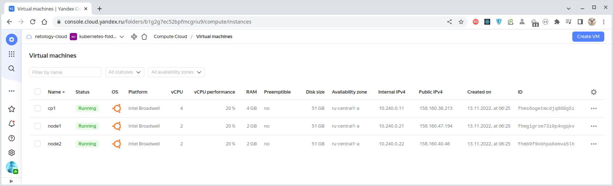
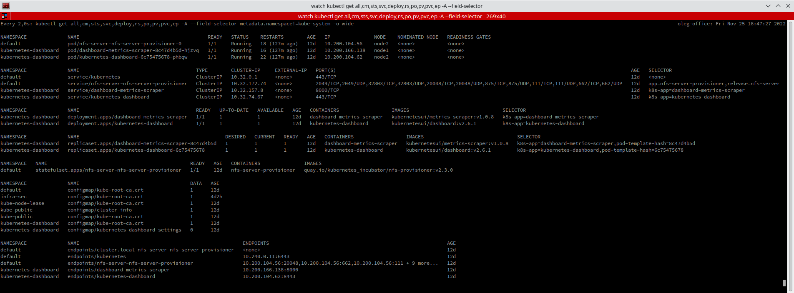

# Домашнее задание к занятию "14.3 Карты конфигураций"

## Задача 1: Работа с картами конфигураций через утилиту kubectl в установленном minikube

Выполните приведённые команды в консоли. Получите вывод команд. Сохраните
задачу 1 как справочный материал.

### Как создать карту конфигураций?

```
kubectl create configmap nginx-config --from-file=nginx.conf
kubectl create configmap domain --from-literal=name=netology.ru
```

### Как просмотреть список карт конфигураций?

```
kubectl get configmaps
kubectl get configmap
```

### Как просмотреть карту конфигурации?

```
kubectl get configmap nginx-config
kubectl describe configmap domain
```

### Как получить информацию в формате YAML и/или JSON?

```
kubectl get configmap nginx-config -o yaml
kubectl get configmap domain -o json
```

### Как выгрузить карту конфигурации и сохранить его в файл?

```
kubectl get configmaps -o json > configmaps.json
kubectl get configmap nginx-config -o yaml > nginx-config.yml
```

### Как удалить карту конфигурации?

```
kubectl delete configmap nginx-config
```

### Как загрузить карту конфигурации из файла?

```
kubectl apply -f nginx-config.yml
```

---

### Предварительная подготовка - разворачивание кластера Kubernetes

С помощью команды `terraform apply -auto-approve`, примененной к [конфигурации Terraform](./terraform/main.tf)
подготовим виртуальную инфраструктуру:



Наполним нашу виртуальную инфраструктуру программным содержимым с помощью [конфигурации Ansible](./infrastructure/site.yaml).
Для разворачивания кластера Kubernetes [используем Kubespray](./infrastructure/playbooks/mount-cluster.ansible.yaml).

<details>
  <summary>Полная инфраструктура нашего Kubernetes-кластера выглядит следующим образом:</summary>

````bash
$ kubectl get all,cm,sts,svc,deploy,rs,po,pv,pvc,ep -A --field-selector metadata.namespace!=kube-system -o wide --show-labels
NAMESPACE              NAME                                            READY   STATUS    RESTARTS        AGE   IP               NODE    NOMINATED NODE   READINESS GATES   LABELS
default                pod/nfs-server-nfs-server-provisioner-0         1/1     Running   18 (129m ago)   12d   10.200.104.56    node2   <none>           <none>            app=nfs-server-provisioner,chart=nfs-server-provisioner-1.1.3,controller-revision-hash=nfs-server-nfs-server-provisioner-64bd6d7f65,heritage=Helm,release=nfs-server,statefulset.kubernetes.io/pod-name=nfs-server-nfs-server-provisioner-0
kubernetes-dashboard   pod/dashboard-metrics-scraper-8c47d4b5d-hjzvq   1/1     Running   16 (129m ago)   12d   10.200.166.138   node1   <none>           <none>            k8s-app=dashboard-metrics-scraper,pod-template-hash=8c47d4b5d
kubernetes-dashboard   pod/kubernetes-dashboard-6c75475678-phbqw       1/1     Running   22 (129m ago)   12d   10.200.104.62    node2   <none>           <none>            k8s-app=kubernetes-dashboard,pod-template-hash=6c75475678

NAMESPACE              NAME                                        TYPE        CLUSTER-IP     EXTERNAL-IP   PORT(S)                                                                                                     AGE   SELECTOR                                        LABELS
default                service/kubernetes                          ClusterIP   10.32.0.1      <none>        443/TCP                                                                                                     12d   <none>                                          component=apiserver,provider=kubernetes
default                service/nfs-server-nfs-server-provisioner   ClusterIP   10.32.172.74   <none>        2049/TCP,2049/UDP,32803/TCP,32803/UDP,20048/TCP,20048/UDP,875/TCP,875/UDP,111/TCP,111/UDP,662/TCP,662/UDP   12d   app=nfs-server-provisioner,release=nfs-server   app.kubernetes.io/managed-by=Helm,app=nfs-server-provisioner,chart=nfs-server-provisioner-1.1.3,heritage=Helm,release=nfs-server
kubernetes-dashboard   service/dashboard-metrics-scraper           ClusterIP   10.32.157.8    <none>        8000/TCP                                                                                                    12d   k8s-app=dashboard-metrics-scraper               k8s-app=dashboard-metrics-scraper
kubernetes-dashboard   service/kubernetes-dashboard                ClusterIP   10.32.74.67    <none>        443/TCP                                                                                                     12d   k8s-app=kubernetes-dashboard                    k8s-app=kubernetes-dashboard

NAMESPACE              NAME                                        READY   UP-TO-DATE   AVAILABLE   AGE   CONTAINERS                  IMAGES                                SELECTOR                            LABELS
kubernetes-dashboard   deployment.apps/dashboard-metrics-scraper   1/1     1            1           12d   dashboard-metrics-scraper   kubernetesui/metrics-scraper:v1.0.8   k8s-app=dashboard-metrics-scraper   k8s-app=dashboard-metrics-scraper
kubernetes-dashboard   deployment.apps/kubernetes-dashboard        1/1     1            1           12d   kubernetes-dashboard        kubernetesui/dashboard:v2.6.1         k8s-app=kubernetes-dashboard        k8s-app=kubernetes-dashboard

NAMESPACE              NAME                                                  DESIRED   CURRENT   READY   AGE   CONTAINERS                  IMAGES                                SELECTOR                                                        LABELS
kubernetes-dashboard   replicaset.apps/dashboard-metrics-scraper-8c47d4b5d   1         1         1       12d   dashboard-metrics-scraper   kubernetesui/metrics-scraper:v1.0.8   k8s-app=dashboard-metrics-scraper,pod-template-hash=8c47d4b5d   k8s-app=dashboard-metrics-scraper,pod-template-hash=8c47d4b5d
kubernetes-dashboard   replicaset.apps/kubernetes-dashboard-6c75475678       1         1         1       12d   kubernetes-dashboard        kubernetesui/dashboard:v2.6.1         k8s-app=kubernetes-dashboard,pod-template-hash=6c75475678       k8s-app=kubernetes-dashboard,pod-template-hash=6c75475678

NAMESPACE   NAME                                                 READY   AGE   CONTAINERS               IMAGES                                                LABELS
default     statefulset.apps/nfs-server-nfs-server-provisioner   1/1     12d   nfs-server-provisioner   quay.io/kubernetes_incubator/nfs-provisioner:v2.3.0   app.kubernetes.io/managed-by=Helm,app=nfs-server-provisioner,chart=nfs-server-provisioner-1.1.3,heritage=Helm,release=nfs-server

NAMESPACE              NAME                                      DATA   AGE    LABELS
default                configmap/kube-root-ca.crt                1      12d    <none>
infra-sec              configmap/kube-root-ca.crt                1      4d2h   <none>
kube-node-lease        configmap/kube-root-ca.crt                1      12d    <none>
kube-public            configmap/cluster-info                    1      12d    <none>
kube-public            configmap/kube-root-ca.crt                1      12d    <none>
kubernetes-dashboard   configmap/kube-root-ca.crt                1      12d    <none>
kubernetes-dashboard   configmap/kubernetes-dashboard-settings   0      12d    k8s-app=kubernetes-dashboard

NAMESPACE              NAME                                                        ENDPOINTS                                                             AGE   LABELS
default                endpoints/cluster.local-nfs-server-nfs-server-provisioner   <none>                                                                12d   <none>
default                endpoints/kubernetes                                        10.240.0.11:6443                                                      12d   endpointslice.kubernetes.io/skip-mirror=true
default                endpoints/nfs-server-nfs-server-provisioner                 10.200.104.56:20048,10.200.104.56:662,10.200.104.56:111 + 9 more...   12d   app.kubernetes.io/managed-by=Helm,app=nfs-server-provisioner,chart=nfs-server-provisioner-1.1.3,heritage=Helm,release=nfs-server
kubernetes-dashboard   endpoints/dashboard-metrics-scraper                         10.200.166.138:8000                                                   12d   k8s-app=dashboard-metrics-scraper
kubernetes-dashboard   endpoints/kubernetes-dashboard                              10.200.104.62:8443                                                    12d   k8s-app=kubernetes-dashboard
````

</details>



Kubernetes-кластер развёрнут и готов к использованию.

---

### Решение


<details>
  <summary>Создаём карты конфигураций.</summary>

````bash
$ kubectl create configmap nginx-config --from-file=nginx.conf
configmap/nginx-config created

$ kubectl create configmap domain --from-literal=name=netology.ru
configmap/domain created

$ kubectl get cm                                                                                                         
NAME               DATA   AGE
domain             1      5s
kube-root-ca.crt   1      3d2h
nginx-config       1      15s
````

</details>

<details>
  <summary>Выводим содержимое карт конфигураций в `stdout`.</summary>

````bash
$ kubectl describe cm nginx-config
Name:         nginx-config
Namespace:    infra-sec
Labels:       <none>
Annotations:  <none>

Data
====
nginx.conf:
----
server {
    listen 80;
    server_name  netology.ru www.netology.ru;
    access_log  /var/log/nginx/domains/netology.ru-access.log  main;
    error_log   /var/log/nginx/domains/netology.ru-error.log info;
    location / {
        include proxy_params;
        proxy_pass http://10.10.10.10:8080/;
    }
}


BinaryData
====

Events:  <none>

$ kubectl describe cm domain
Name:         domain
Namespace:    infra-sec
Labels:       <none>
Annotations:  <none>

Data
====
name:
----
netology.ru

BinaryData
====

Events:  <none>
````

</details>

<details>
  <summary>Выводим содержимое карт конфигураций в `stdout` в форматах `json` и `yaml`.</summary>

````bash
$ kubectl get cm/domain -o json
{
    "apiVersion": "v1",
    "data": {
        "name": "netology.ru"
    },
    "kind": "ConfigMap",
    "metadata": {
        "creationTimestamp": "2022-11-24T15:43:35Z",
        "name": "domain",
        "namespace": "infra-sec",
        "resourceVersion": "219733",
        "uid": "514084b5-638a-4f20-b650-7c5a39a7c6c1"
    }
}

$ kubectl get cm/nginx-config -o yaml
apiVersion: v1
data:
  nginx.conf: |
    server {
        listen 80;
        server_name  netology.ru www.netology.ru;
        access_log  /var/log/nginx/domains/netology.ru-access.log  main;
        error_log   /var/log/nginx/domains/netology.ru-error.log info;
        location / {
            include proxy_params;
            proxy_pass http://10.10.10.10:8080/;
        }
    }
kind: ConfigMap
metadata:
  creationTimestamp: "2022-11-24T15:43:25Z"
  name: nginx-config
  namespace: infra-sec
  resourceVersion: "219710"
  uid: 5ad67aa2-c861-4287-b053-8a1de40c7ccc
````

</details>

<details>
  <summary>Выводим содержимое карт конфигураций в `stdout` в форматах `json` и `yaml` с сохранением в файл.</summary>

````bash
$ kubectl get cm/domain -o json > domain.json

$ kubectl get cm/nginx-config -o yaml > nginx-config.yaml
````

</details>

<details>
  <summary>Удаляем карты конфигураций из кластера.</summary>

````bash
$ kubectl delete cm/domain
configmap "domain" deleted

$ kubectl delete cm/nginx-config
configmap "nginx-config" deleted

$ kubectl get cm
NAME               DATA   AGE
kube-root-ca.crt   1      3d2h
````

</details>

<details>
  <summary>Загружаем карту конфигурации из файла (выгруженного ранее).</summary>

````bash
$ kubectl apply -f nginx-config.yaml 
configmap/nginx-config created

$ kubectl get cm
NAME               DATA   AGE
kube-root-ca.crt   1      3d2h
nginx-config       1      3s

$ kubectl describe cm/nginx-config
Name:         nginx-config
Namespace:    infra-sec
Labels:       <none>
Annotations:  <none>

Data
====
nginx.conf:
----
server {
    listen 80;
    server_name  netology.ru www.netology.ru;
    access_log  /var/log/nginx/domains/netology.ru-access.log  main;
    error_log   /var/log/nginx/domains/netology.ru-error.log info;
    location / {
        include proxy_params;
        proxy_pass http://10.10.10.10:8080/;
    }
}


BinaryData
====

Events:  <none>
````

</details>

---

## Задача 2 (*): Работа с картами конфигураций внутри модуля

Выбрать любимый образ контейнера, подключить карты конфигураций и проверить
их доступность как в виде переменных окружения, так и в виде примонтированного
тома.

---

### Решение

Создаём [карту конфигураций](./cm.yaml) с набором требуемых нам значений
(здесь это значения с ключами `myKey1` и `myKey1`):
````bash
$ kubectl apply -f cm.yaml    
configmap/centos-cm created
````

Запускаем [под с образом Centos](./centos.yaml):
````bash
$ kubectl apply -f centos.yaml 
pod/centos created
````

Для данного пода по пути `/configMap` смонтирована наша карта конфигураций. Проверим её содержимое, подключившись к поду
с работающим образом "Centos" по ssh-соединению и выведя содержимое директории `/configMap`:
````bash
$ kubectl exec --stdin --tty centos -- sh

sh-4.2# cd configMap/

sh-4.2# ls -l
total 0
lrwxrwxrwx 1 root root 13 Nov 25 15:12 myKey1 -> ..data/myKey1
lrwxrwxrwx 1 root root 13 Nov 25 15:12 myKey2 -> ..data/myKey2

sh-4.2# cat myKey1
myValue1

sh-4.2# cat myKey2
myValue2
````

Как видим, в директории `/configMap` содержатся ссылки на значения, объявленные
с помощью [карты конфигураций](./cm.yaml). При этом имя ссылки соответствует ключу, а содержимое - значению.

Также проверим значение переменной окружения `MY_ENV`:
````bash
sh-4.2# echo $MY_ENV
myValue2
````

Как видим, значением переменной окружения `MY_ENV` является значение, объявленное в [карте конфигураций](./cm.yaml)
и смонтированное в [под](./centos.yaml) в качестве переменной окружения с помощью конструкции:
````yaml
env:
- name: MY_ENV
  valueFrom:
    configMapKeyRef:
      name: centos-cm
      key: myKey2
````
Где у значения `configMapKeyRef`:
- `name` - имя карты конфигураций;
- `key` - ключ, значение которого д.б. использовано в качестве значения переменной окружения.

Таким образом, используя карту конфигураций мы объявили переменные окружения в образе операционной системы "Centos",
а также организовали доступ к самому конфигурационному файлу через папку файловой системы.

---

<details>
  <summary>Приложение 1 - Полезная информация</summary>

Проверка сертификатов:
````bash
$ kubeadm certs check-expiration
CERTIFICATE                          EXPIRES   RESIDUAL TIME   CERTIFICATE AUTHORITY   EXTERNALLY MANAGED
!MISSING! admin.conf                                                                   
!MISSING! apiserver                                                                    
!MISSING! apiserver-etcd-client                                                        
!MISSING! apiserver-kubelet-client                                                     
!MISSING! controller-manager.conf                                                      
!MISSING! etcd-healthcheck-client                                                      
!MISSING! etcd-peer                                                                    
!MISSING! etcd-server                                                                  
!MISSING! front-proxy-client                                                           
!MISSING! scheduler.conf                                                               

CERTIFICATE AUTHORITY      EXPIRES   RESIDUAL TIME   EXTERNALLY MANAGED
!MISSING! ca                                         
!MISSING! etcd-ca                                    
!MISSING! front-proxy-ca  
````


Список всех объявленных в ОС "Linux" переменных окружения можно получить командой `env`:
````bash
sh-4.2# env
HOSTNAME=centos
TERM=xterm
KUBERNETES_PORT=tcp://10.32.0.1:443
KUBERNETES_PORT_443_TCP=tcp://10.32.0.1:443
KUBERNETES_PORT_443_TCP_PORT=443
KUBERNETES_PORT_443_TCP_PROTO=tcp
KUBERNETES_PORT_443_TCP_ADDR=10.32.0.1
KUBERNETES_SERVICE_PORT=443
KUBERNETES_SERVICE_PORT_HTTPS=443
KUBERNETES_SERVICE_HOST=10.32.0.1
PATH=/usr/local/sbin:/usr/local/bin:/usr/sbin:/usr/bin:/sbin:/bin
PWD=/
SHLVL=1
_=/usr/bin/env
HOME=/root
MY_ENV=myValue2
````

</details>


---
