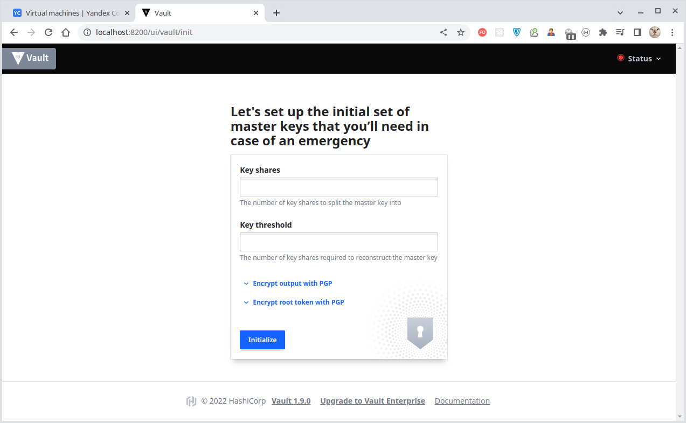

# Домашнее задание к занятию "14.4 Сервис-аккаунты"

## Задача 1: Работа с сервис-аккаунтами через утилиту kubectl в установленном minikube

Выполните приведённые команды в консоли. Получите вывод команд. Сохраните
задачу 1 как справочный материал.

### Как создать сервис-аккаунт?

```
kubectl create serviceaccount netology
```

### Как просмотреть список сервис-акаунтов?

```
kubectl get serviceaccounts
kubectl get serviceaccount
```

### Как получить информацию в формате YAML и/или JSON?

```
kubectl get serviceaccount netology -o yaml
kubectl get serviceaccount default -o json
```

### Как выгрузить сервис-акаунты и сохранить его в файл?

```
kubectl get serviceaccounts -o json > serviceaccounts.json
kubectl get serviceaccount netology -o yaml > netology.yml
```

### Как удалить сервис-акаунт?

```
kubectl delete serviceaccount netology
```

### Как загрузить сервис-акаунт из файла?

```
kubectl apply -f netology.yml
```
---

### Предварительная подготовка - разворачивание кластера Kubernetes

С помощью команды `terraform apply -auto-approve`, примененной к [конфигурации Terraform](./terraform/main.tf)
подготовим виртуальную инфраструктуру:


Наполним нашу виртуальную инфраструктуру программным содержимым с помощью [конфигурации Ansible](./infrastructure/site.yaml).
Для разворачивания кластера Kubernetes [используем Kubespray](./infrastructure/playbooks/mount-cluster.ansible.yaml).

<details>
  <summary>Полная инфраструктура нашего Kubernetes-кластера выглядит следующим образом:</summary>

````bash
$ kubectl get all,cm,sts,svc,deploy,rs,po,pv,pvc,ep -A --field-selector metadata.namespace!=kube-system -o wide --show-labels
NAMESPACE              NAME                                            READY   STATUS    RESTARTS         AGE   IP               NODE    NOMINATED NODE   READINESS GATES   LABELS
default                pod/nfs-server-nfs-server-provisioner-0         1/1     Running   23 (4h26m ago)   19d   10.200.104.10    node2   <none>           <none>            app=nfs-server-provisioner,chart=nfs-server-provisioner-1.1.3,controller-revision-hash=nfs-server-nfs-server-provisioner-64bd6d7f65,heritage=Helm,release=nfs-server,statefulset.kubernetes.io/pod-name=nfs-server-nfs-server-provisioner-0
infra-sec              pod/centos                                      1/1     Running   3 (4h26m ago)    42h   10.200.166.157   node1   <none>           <none>            app=cm-test
infra-sec              pod/fedora                                      1/1     Running   0                12m   10.200.104.20    node2   <none>           <none>            run=fedora
infra-sec              pod/vault-0                                     1/1     Running   3 (4h26m ago)    41h   10.200.166.156   node1   <none>           <none>            app=vault,controller-revision-hash=vault-9474dd6c8,statefulset.kubernetes.io/pod-name=vault-0
kubernetes-dashboard   pod/dashboard-metrics-scraper-8c47d4b5d-hjzvq   1/1     Running   20 (4h26m ago)   19d   10.200.166.155   node1   <none>           <none>            k8s-app=dashboard-metrics-scraper,pod-template-hash=8c47d4b5d
kubernetes-dashboard   pod/kubernetes-dashboard-6c75475678-phbqw       1/1     Running   28 (4h26m ago)   19d   10.200.104.21    node2   <none>           <none>            k8s-app=kubernetes-dashboard,pod-template-hash=6c75475678

NAMESPACE              NAME                                        TYPE        CLUSTER-IP     EXTERNAL-IP   PORT(S)                                                                                                     AGE   SELECTOR                                        LABELS
default                service/kubernetes                          ClusterIP   10.32.0.1      <none>        443/TCP                                                                                                     19d   <none>                                          component=apiserver,provider=kubernetes
default                service/nfs-server-nfs-server-provisioner   ClusterIP   10.32.172.74   <none>        2049/TCP,2049/UDP,32803/TCP,32803/UDP,20048/TCP,20048/UDP,875/TCP,875/UDP,111/TCP,111/UDP,662/TCP,662/UDP   19d   app=nfs-server-provisioner,release=nfs-server   app.kubernetes.io/managed-by=Helm,app=nfs-server-provisioner,chart=nfs-server-provisioner-1.1.3,heritage=Helm,release=nfs-server
infra-sec              service/vault                               ClusterIP   None           <none>        8200/TCP                                                                                                    41h   app=vault                                       app=vault
kubernetes-dashboard   service/dashboard-metrics-scraper           ClusterIP   10.32.157.8    <none>        8000/TCP                                                                                                    19d   k8s-app=dashboard-metrics-scraper               k8s-app=dashboard-metrics-scraper
kubernetes-dashboard   service/kubernetes-dashboard                ClusterIP   10.32.74.67    <none>        443/TCP                                                                                                     19d   k8s-app=kubernetes-dashboard                    k8s-app=kubernetes-dashboard

NAMESPACE              NAME                                        READY   UP-TO-DATE   AVAILABLE   AGE   CONTAINERS                  IMAGES                                SELECTOR                            LABELS
kubernetes-dashboard   deployment.apps/dashboard-metrics-scraper   1/1     1            1           19d   dashboard-metrics-scraper   kubernetesui/metrics-scraper:v1.0.8   k8s-app=dashboard-metrics-scraper   k8s-app=dashboard-metrics-scraper
kubernetes-dashboard   deployment.apps/kubernetes-dashboard        1/1     1            1           19d   kubernetes-dashboard        kubernetesui/dashboard:v2.6.1         k8s-app=kubernetes-dashboard        k8s-app=kubernetes-dashboard

NAMESPACE              NAME                                                  DESIRED   CURRENT   READY   AGE   CONTAINERS                  IMAGES                                SELECTOR                                                        LABELS
kubernetes-dashboard   replicaset.apps/dashboard-metrics-scraper-8c47d4b5d   1         1         1       19d   dashboard-metrics-scraper   kubernetesui/metrics-scraper:v1.0.8   k8s-app=dashboard-metrics-scraper,pod-template-hash=8c47d4b5d   k8s-app=dashboard-metrics-scraper,pod-template-hash=8c47d4b5d
kubernetes-dashboard   replicaset.apps/kubernetes-dashboard-6c75475678       1         1         1       19d   kubernetes-dashboard        kubernetesui/dashboard:v2.6.1         k8s-app=kubernetes-dashboard,pod-template-hash=6c75475678       k8s-app=kubernetes-dashboard,pod-template-hash=6c75475678

NAMESPACE   NAME                                                 READY   AGE   CONTAINERS               IMAGES                                                LABELS
default     statefulset.apps/nfs-server-nfs-server-provisioner   1/1     19d   nfs-server-provisioner   quay.io/kubernetes_incubator/nfs-provisioner:v2.3.0   app.kubernetes.io/managed-by=Helm,app=nfs-server-provisioner,chart=nfs-server-provisioner-1.1.3,heritage=Helm,release=nfs-server
infra-sec   statefulset.apps/vault                               1/1     41h   vault                    vault:1.9.0                                           app=vault

NAMESPACE              NAME                                      DATA   AGE   LABELS
default                configmap/kube-root-ca.crt                1      19d   <none>
infra-sec              configmap/centos-cm                       2      42h   app=cm-test
infra-sec              configmap/kube-root-ca.crt                1      10d   <none>
infra-sec              configmap/vault-config                    1      41h   app=vault
kube-node-lease        configmap/kube-root-ca.crt                1      19d   <none>
kube-public            configmap/cluster-info                    1      19d   <none>
kube-public            configmap/kube-root-ca.crt                1      19d   <none>
kubernetes-dashboard   configmap/kube-root-ca.crt                1      19d   <none>
kubernetes-dashboard   configmap/kubernetes-dashboard-settings   0      19d   k8s-app=kubernetes-dashboard

NAMESPACE   NAME                                                        CAPACITY   ACCESS MODES   RECLAIM POLICY   STATUS   CLAIM                          STORAGECLASS   REASON   AGE   VOLUMEMODE   LABELS
            persistentvolume/pvc-48cded2b-3730-46a6-bc72-d626db1d1f59   1Gi        RWO            Delete           Bound    infra-sec/vault-data-vault-0   nfs                     41h   Filesystem   <none>

NAMESPACE   NAME                                       STATUS   VOLUME                                     CAPACITY   ACCESS MODES   STORAGECLASS   AGE   VOLUMEMODE   LABELS
infra-sec   persistentvolumeclaim/vault-data-vault-0   Bound    pvc-48cded2b-3730-46a6-bc72-d626db1d1f59   1Gi        RWO            nfs            41h   Filesystem   app=vault

NAMESPACE              NAME                                                        ENDPOINTS                                                             AGE   LABELS
default                endpoints/cluster.local-nfs-server-nfs-server-provisioner   <none>                                                                19d   <none>
default                endpoints/kubernetes                                        10.240.0.11:6443                                                      19d   endpointslice.kubernetes.io/skip-mirror=true
default                endpoints/nfs-server-nfs-server-provisioner                 10.200.104.10:20048,10.200.104.10:662,10.200.104.10:111 + 9 more...   19d   app.kubernetes.io/managed-by=Helm,app=nfs-server-provisioner,chart=nfs-server-provisioner-1.1.3,heritage=Helm,release=nfs-server
infra-sec              endpoints/vault                                             10.200.166.156:8200                                                   41h   app=vault,service.kubernetes.io/headless=
kubernetes-dashboard   endpoints/dashboard-metrics-scraper                         10.200.166.155:8000                                                   19d   k8s-app=dashboard-metrics-scraper
kubernetes-dashboard   endpoints/kubernetes-dashboard                              10.200.104.21:8443                                                    19d   k8s-app=kubernetes-dashboard
````

</details>


Kubernetes-кластер развёрнут и готов к использованию.


---

### Решение задачи 1


<details>
  <summary>Создание сервисного аккаунта с именем "netology2"</summary>

````bash
$ kubectl create serviceaccount netology2
serviceaccount/netology2 created
````

</details>

<details>
  <summary>Просмотр списка сервисных аккаунтов</summary>

````bash
$ kubectl get sa                                     
NAME        SECRETS   AGE
default     0         12d
netology    0         42h
netology2   0         66s
petya       0         40h
vasya       0         3h40m
````

</details>

<details>
  <summary>Получение информации о сервисном аккаунте и сохранение её в файл</summary>

````bash
$ kubectl get sa/netology2 -o yaml    
apiVersion: v1
kind: ServiceAccount
metadata:
  creationTimestamp: "2022-12-02T07:15:26Z"
  name: netology2
  namespace: infra-sec
  resourceVersion: "373601"
  uid: f29d895b-b2d5-4694-b525-c5873b4fc37e

$ kubectl get sa/netology2 -o yaml > netology2.yaml
````
</details>

<details>
  <summary>Удаление сервисного аккаунта "netology2"</summary>

````bash
$ kubectl delete sa/netology2
serviceaccount "netology2" deleted

$ kubectl get sa
NAME       SECRETS   AGE
default    0         12d
netology   0         42h
petya      0         40h
vasya      0         3h44m
````

</details>

<details>
  <summary>Загрузка сервисного аккаунта из файла</summary>

````bash
$ kubectl apply -f netology2.yaml
serviceaccount/netology2 created

$ kubectl get sa
NAME        SECRETS   AGE
default     0         12d
netology    0         42h
netology2   0         7s
petya       0         40h
vasya       0         3h45m
````

</details>

---

## Задача 2 (*): Работа с сервис-акаунтами внутри модуля

Выбрать любимый образ контейнера, подключить сервис-акаунты и проверить
доступность API Kubernetes

```
kubectl run -i --tty fedora --image=fedora --restart=Never -- sh
```

Просмотреть переменные среды

```
env | grep KUBE
```

Получить значения переменных

```
K8S=https://$KUBERNETES_SERVICE_HOST:$KUBERNETES_SERVICE_PORT
SADIR=/var/run/secrets/kubernetes.io/serviceaccount
TOKEN=$(cat $SADIR/token)
CACERT=$SADIR/ca.crt
NAMESPACE=$(cat $SADIR/namespace)
```

Подключаемся к API

```
curl -H "Authorization: Bearer $TOKEN" --cacert $CACERT $K8S/api/v1/
```

В случае с minikube может быть другой адрес и порт, который можно взять здесь

```
cat ~/.kube/config
```

или здесь

```
kubectl cluster-info
```

---

### Решение задачи 2


<details>
  <summary>Запуск в поде экземпляра ОС Fedora</summary>

````bash
$ kubectl run -i --tty fedora --image=fedora --restart=Never -- sh
If you don't see a command prompt, try pressing enter.
sh-5.1# 

$ kubectl get po                         
NAME      READY   STATUS    RESTARTS        AGE
fedora    1/1     Running   0               20s
...
````

</details>

<details>
  <summary>Список переменных среды, внедренных Kubernetes в контейнер</summary>

````bash
sh-5.1# env | grep KUBE
KUBERNETES_SERVICE_PORT_HTTPS=443
KUBERNETES_SERVICE_PORT=443
KUBERNETES_PORT_443_TCP=tcp://10.32.0.1:443
KUBERNETES_PORT_443_TCP_PROTO=tcp
KUBERNETES_PORT_443_TCP_ADDR=10.32.0.1
KUBERNETES_SERVICE_HOST=10.32.0.1
KUBERNETES_PORT=tcp://10.32.0.1:443
KUBERNETES_PORT_443_TCP_PORT=443
````

</details>

<details>
  <summary>Установка значений переменных</summary>

````bash
sh-5.1# K8S=https://$KUBERNETES_SERVICE_HOST:$KUBERNETES_SERVICE_PORT
sh-5.1# echo $K8S
https://10.32.0.1:443

sh-5.1# SADIR=/var/run/secrets/kubernetes.io/serviceaccount
sh-5.1# echo $SADIR
/var/run/secrets/kubernetes.io/serviceaccount

sh-5.1# TOKEN=$(cat $SADIR/token)
sh-5.1# echo $TOKEN
eyJhbGciOiJSUzI1NiIsImtpZCI6IjFMVm...SbcKZhaQ

sh-5.1# CACERT=$SADIR/ca.crt
sh-5.1# echo $CACERT
/var/run/secrets/kubernetes.io/serviceaccount/ca.crt

sh-5.1# NAMESPACE=$(cat $SADIR/namespace)
sh-5.1# echo $NAMESPACE
infra-sec
````

</details>

<details>
  <summary>Получение списка API-ресурсов кластера используя предоставленный токен:</summary>

````bash
sh-5.1# curl -H "Authorization: Bearer $TOKEN" --cacert $CACERT $K8S/api/v1/
{
  "kind": "APIResourceList",
  "groupVersion": "v1",
  "resources": [
    {
      "name": "bindings",
      "singularName": "",
      "namespaced": true,
      "kind": "Binding",
      "verbs": [
        "create"
      ]
    },
    {
      "name": "componentstatuses",
      "singularName": "",
      "namespaced": false,
      "kind": "ComponentStatus",
      "verbs": [
        "get",
        "list"
      ],
      "shortNames": [
        "cs"
      ]
    },
    {
      "name": "configmaps",
      "singularName": "",
      "namespaced": true,
      "kind": "ConfigMap",
      "verbs": [
        "create",
        "delete",
        "deletecollection",
        "get",
        "list",
        "patch",
        "update",
        "watch"
      ],
      "shortNames": [
        "cm"
      ],
      "storageVersionHash": "qFsyl6wFWjQ="
    },
    {
      "name": "endpoints",
      "singularName": "",
      "namespaced": true,
      "kind": "Endpoints",
      "verbs": [
        "create",
        "delete",
        "deletecollection",
        "get",
        "list",
        "patch",
        "update",
        "watch"
      ],
      "shortNames": [
        "ep"
      ],
      "storageVersionHash": "fWeeMqaN/OA="
    },
    {
      "name": "events",
      "singularName": "",
      "namespaced": true,
      "kind": "Event",
      "verbs": [
        "create",
        "delete",
        "deletecollection",
        "get",
        "list",
        "patch",
        "update",
        "watch"
      ],
      "shortNames": [
        "ev"
      ],
      "storageVersionHash": "r2yiGXH7wu8="
    },
    {
      "name": "limitranges",
      "singularName": "",
      "namespaced": true,
      "kind": "LimitRange",
      "verbs": [
        "create",
        "delete",
        "deletecollection",
        "get",
        "list",
        "patch",
        "update",
        "watch"
      ],
      "shortNames": [
        "limits"
      ],
      "storageVersionHash": "EBKMFVe6cwo="
    },
    {
      "name": "namespaces",
      "singularName": "",
      "namespaced": false,
      "kind": "Namespace",
      "verbs": [
        "create",
        "delete",
        "get",
        "list",
        "patch",
        "update",
        "watch"
      ],
      "shortNames": [
        "ns"
      ],
      "storageVersionHash": "Q3oi5N2YM8M="
    },
    {
      "name": "namespaces/finalize",
      "singularName": "",
      "namespaced": false,
      "kind": "Namespace",
      "verbs": [
        "update"
      ]
    },
    {
      "name": "namespaces/status",
      "singularName": "",
      "namespaced": false,
      "kind": "Namespace",
      "verbs": [
        "get",
        "patch",
        "update"
      ]
    },
    {
      "name": "nodes",
      "singularName": "",
      "namespaced": false,
      "kind": "Node",
      "verbs": [
        "create",
        "delete",
        "deletecollection",
        "get",
        "list",
        "patch",
        "update",
        "watch"
      ],
      "shortNames": [
        "no"
      ],
      "storageVersionHash": "XwShjMxG9Fs="
    },
    {
      "name": "nodes/proxy",
      "singularName": "",
      "namespaced": false,
      "kind": "NodeProxyOptions",
      "verbs": [
        "create",
        "delete",
        "get",
        "patch",
        "update"
      ]
    },
    {
      "name": "nodes/status",
      "singularName": "",
      "namespaced": false,
      "kind": "Node",
      "verbs": [
        "get",
        "patch",
        "update"
      ]
    },
    {
      "name": "persistentvolumeclaims",
      "singularName": "",
      "namespaced": true,
      "kind": "PersistentVolumeClaim",
      "verbs": [
        "create",
        "delete",
        "deletecollection",
        "get",
        "list",
        "patch",
        "update",
        "watch"
      ],
      "shortNames": [
        "pvc"
      ],
      "storageVersionHash": "QWTyNDq0dC4="
    },
    {
      "name": "persistentvolumeclaims/status",
      "singularName": "",
      "namespaced": true,
      "kind": "PersistentVolumeClaim",
      "verbs": [
        "get",
        "patch",
        "update"
      ]
    },
    {
      "name": "persistentvolumes",
      "singularName": "",
      "namespaced": false,
      "kind": "PersistentVolume",
      "verbs": [
        "create",
        "delete",
        "deletecollection",
        "get",
        "list",
        "patch",
        "update",
        "watch"
      ],
      "shortNames": [
        "pv"
      ],
      "storageVersionHash": "HN/zwEC+JgM="
    },
    {
      "name": "persistentvolumes/status",
      "singularName": "",
      "namespaced": false,
      "kind": "PersistentVolume",
      "verbs": [
        "get",
        "patch",
        "update"
      ]
    },
    {
      "name": "pods",
      "singularName": "",
      "namespaced": true,
      "kind": "Pod",
      "verbs": [
        "create",
        "delete",
        "deletecollection",
        "get",
        "list",
        "patch",
        "update",
        "watch"
      ],
      "shortNames": [
        "po"
      ],
      "categories": [
        "all"
      ],
      "storageVersionHash": "xPOwRZ+Yhw8="
    },
    {
      "name": "pods/attach",
      "singularName": "",
      "namespaced": true,
      "kind": "PodAttachOptions",
      "verbs": [
        "create",
        "get"
      ]
    },
    {
      "name": "pods/binding",
      "singularName": "",
      "namespaced": true,
      "kind": "Binding",
      "verbs": [
        "create"
      ]
    },
    {
      "name": "pods/ephemeralcontainers",
      "singularName": "",
      "namespaced": true,
      "kind": "Pod",
      "verbs": [
        "get",
        "patch",
        "update"
      ]
    },
    {
      "name": "pods/eviction",
      "singularName": "",
      "namespaced": true,
      "group": "policy",
      "version": "v1",
      "kind": "Eviction",
      "verbs": [
        "create"
      ]
    },
    {
      "name": "pods/exec",
      "singularName": "",
      "namespaced": true,
      "kind": "PodExecOptions",
      "verbs": [
        "create",
        "get"
      ]
    },
    {
      "name": "pods/log",
      "singularName": "",
      "namespaced": true,
      "kind": "Pod",
      "verbs": [
        "get"
      ]
    },
    {
      "name": "pods/portforward",
      "singularName": "",
      "namespaced": true,
      "kind": "PodPortForwardOptions",
      "verbs": [
        "create",
        "get"
      ]
    },
    {
      "name": "pods/proxy",
      "singularName": "",
      "namespaced": true,
      "kind": "PodProxyOptions",
      "verbs": [
        "create",
        "delete",
        "get",
        "patch",
        "update"
      ]
    },
    {
      "name": "pods/status",
      "singularName": "",
      "namespaced": true,
      "kind": "Pod",
      "verbs": [
        "get",
        "patch",
        "update"
      ]
    },
    {
      "name": "podtemplates",
      "singularName": "",
      "namespaced": true,
      "kind": "PodTemplate",
      "verbs": [
        "create",
        "delete",
        "deletecollection",
        "get",
        "list",
        "patch",
        "update",
        "watch"
      ],
      "storageVersionHash": "LIXB2x4IFpk="
    },
    {
      "name": "replicationcontrollers",
      "singularName": "",
      "namespaced": true,
      "kind": "ReplicationController",
      "verbs": [
        "create",
        "delete",
        "deletecollection",
        "get",
        "list",
        "patch",
        "update",
        "watch"
      ],
      "shortNames": [
        "rc"
      ],
      "categories": [
        "all"
      ],
      "storageVersionHash": "Jond2If31h0="
    },
    {
      "name": "replicationcontrollers/scale",
      "singularName": "",
      "namespaced": true,
      "group": "autoscaling",
      "version": "v1",
      "kind": "Scale",
      "verbs": [
        "get",
        "patch",
        "update"
      ]
    },
    {
      "name": "replicationcontrollers/status",
      "singularName": "",
      "namespaced": true,
      "kind": "ReplicationController",
      "verbs": [
        "get",
        "patch",
        "update"
      ]
    },
    {
      "name": "resourcequotas",
      "singularName": "",
      "namespaced": true,
      "kind": "ResourceQuota",
      "verbs": [
        "create",
        "delete",
        "deletecollection",
        "get",
        "list",
        "patch",
        "update",
        "watch"
      ],
      "shortNames": [
        "quota"
      ],
      "storageVersionHash": "8uhSgffRX6w="
    },
    {
      "name": "resourcequotas/status",
      "singularName": "",
      "namespaced": true,
      "kind": "ResourceQuota",
      "verbs": [
        "get",
        "patch",
        "update"
      ]
    },
    {
      "name": "secrets",
      "singularName": "",
      "namespaced": true,
      "kind": "Secret",
      "verbs": [
        "create",
        "delete",
        "deletecollection",
        "get",
        "list",
        "patch",
        "update",
        "watch"
      ],
      "storageVersionHash": "S6u1pOWzb84="
    },
    {
      "name": "serviceaccounts",
      "singularName": "",
      "namespaced": true,
      "kind": "ServiceAccount",
      "verbs": [
        "create",
        "delete",
        "deletecollection",
        "get",
        "list",
        "patch",
        "update",
        "watch"
      ],
      "shortNames": [
        "sa"
      ],
      "storageVersionHash": "pbx9ZvyFpBE="
    },
    {
      "name": "serviceaccounts/token",
      "singularName": "",
      "namespaced": true,
      "group": "authentication.k8s.io",
      "version": "v1",
      "kind": "TokenRequest",
      "verbs": [
        "create"
      ]
    },
    {
      "name": "services",
      "singularName": "",
      "namespaced": true,
      "kind": "Service",
      "verbs": [
        "create",
        "delete",
        "deletecollection",
        "get",
        "list",
        "patch",
        "update",
        "watch"
      ],
      "shortNames": [
        "svc"
      ],
      "categories": [
        "all"
      ],
      "storageVersionHash": "0/CO1lhkEBI="
    },
    {
      "name": "services/proxy",
      "singularName": "",
      "namespaced": true,
      "kind": "ServiceProxyOptions",
      "verbs": [
        "create",
        "delete",
        "get",
        "patch",
        "update"
      ]
    },
    {
      "name": "services/status",
      "singularName": "",
      "namespaced": true,
      "kind": "Service",
      "verbs": [
        "get",
        "patch",
        "update"
      ]
    }
  ]
} 
````

</details>

---

<details>
  <summary>Приложение 1 - Лекция</summary>


#### Из презентации

````bash
$ kubectl get ns -o wide
NAME                   STATUS   AGE
default                Active   17d
infra-sec              Active   10d
kube-node-lease        Active   17d
kube-public            Active   17d
kube-system            Active   17d
kubernetes-dashboard   Active   17d
````

````bash
$ kubectl get secret -A                                                 
NAMESPACE              NAME                               TYPE                 DATA   AGE
default                domain-cert                        kubernetes.io/tls    2      17d
default                sh.helm.release.v1.nfs-server.v1   helm.sh/release.v1   1      17d
kubernetes-dashboard   kubernetes-dashboard-certs         Opaque               0      17d
kubernetes-dashboard   kubernetes-dashboard-csrf          Opaque               1      17d
kubernetes-dashboard   kubernetes-dashboard-key-holder    Opaque               2      17d
````

````bash
$ kubectl get secret/domain-cert -n default
NAME          TYPE                DATA   AGE
domain-cert   kubernetes.io/tls   2      17d
````

````bash
$ kubectl describe secret/domain-cert -n default        
Name:         domain-cert
Namespace:    default
Labels:       <none>
Annotations:  <none>

Type:  kubernetes.io/tls

Data
====
tls.crt:  1968 bytes
tls.key:  3243 bytes
````

````bash
$ kubectl get secret/domain-cert -n default -o json 
{
    "apiVersion": "v1",
    "data": {
        "tls.crt": "LS0tLS1CRUdJTiBDRVJUSUZJQ0FURS0t...",
        "tls.key": "LS0tLS1CRUdJTiBSU0EgUFJJVkFURSBL..."
    },
    "kind": "Secret",
    "metadata": {
        "annotations": {
            "kubectl.kubernetes.io/last-applied-configuration": "{\"apiVersion\":\"v1\",\"data\":{\"tls.crt\":\"LS0tLS1CRUdJTiBDRVJUSUZJQ0FURS0t...\",\"tls.key\":\"LS0tLS1CRUdJTiBSU0EgUFJJVkFURSBL...\"},\"kind\":\"Secret\",\"metadata\":{\"annotations\":{},\"creationTimestamp\":\"2022-11-13T06:13:16Z\",\"name\":\"domain-cert\",\"namespace\":\"default\",\"resourceVersion\":\"4452\",\"uid\":\"53108a41-aa7b-48d7-a639-2d1ebd919399\"},\"type\":\"kubernetes.io/tls\"}\n"
        },
        "creationTimestamp": "2022-11-13T06:26:03Z",
        "name": "domain-cert",
        "namespace": "default",
        "resourceVersion": "6119",
        "uid": "e8d6f6f6-8180-4daa-be8f-6a3268a1969c"
    },
    "type": "kubernetes.io/tls"
}
````

````bash
$ kubectl get sa -A
NAMESPACE              NAME                                 SECRETS   AGE
default                default                              0         17d
default                nfs-server-nfs-server-provisioner    0         17d
infra-sec              default                              0         10d
kube-node-lease        default                              0         17d
kube-public            default                              0         17d
kube-system            attachdetach-controller              0         17d
kube-system            bootstrap-signer                     0         17d
kube-system            calico-kube-controllers              0         17d
kube-system            calico-node                          0         17d
kube-system            certificate-controller               0         17d
kube-system            clusterrole-aggregation-controller   0         17d
kube-system            coredns                              0         17d
kube-system            cronjob-controller                   0         17d
kube-system            daemon-set-controller                0         17d
kube-system            default                              0         17d
kube-system            deployment-controller                0         17d
kube-system            disruption-controller                0         17d
kube-system            dns-autoscaler                       0         17d
kube-system            endpoint-controller                  0         17d
kube-system            endpointslice-controller             0         17d
kube-system            endpointslicemirroring-controller    0         17d
kube-system            ephemeral-volume-controller          0         17d
kube-system            expand-controller                    0         17d
kube-system            generic-garbage-collector            0         17d
kube-system            horizontal-pod-autoscaler            0         17d
kube-system            job-controller                       0         17d
kube-system            kube-proxy                           0         17d
kube-system            namespace-controller                 0         17d
kube-system            node-controller                      0         17d
kube-system            nodelocaldns                         0         17d
kube-system            persistent-volume-binder             0         17d
kube-system            pod-garbage-collector                0         17d
kube-system            pv-protection-controller             0         17d
kube-system            pvc-protection-controller            0         17d
kube-system            replicaset-controller                0         17d
kube-system            replication-controller               0         17d
kube-system            resourcequota-controller             0         17d
kube-system            root-ca-cert-publisher               0         17d
kube-system            service-account-controller           0         17d
kube-system            service-controller                   0         17d
kube-system            statefulset-controller               0         17d
kube-system            token-cleaner                        0         17d
kube-system            ttl-after-finished-controller        0         17d
kube-system            ttl-controller                       0         17d
kubernetes-dashboard   admin-user                           0         17d
kubernetes-dashboard   default                              0         17d
````

````bash
$ kubectl get sa/default -n infra-sec -o json
{
    "apiVersion": "v1",
    "kind": "ServiceAccount",
    "metadata": {
        "creationTimestamp": "2022-11-19T13:25:32Z",
        "name": "default",
        "namespace": "infra-sec",
        "resourceVersion": "33363",
        "uid": "e90bbb8f-f2ca-4252-9a38-9ebd71c841ae"
    }
}
````

````bash
$ kubectl describe sa/default -n infra-sec        
Name:                default
Namespace:           infra-sec
Labels:              <none>
Annotations:         <none>
Image pull secrets:  <none>
Mountable secrets:   <none>
Tokens:              <none>
Events:              <none>
````

Создание сервисного аккаунта:
````bash
$ kubectl create sa netology                                          
serviceaccount/netology created

$ kubectl get sa -n infra-sec
NAME       SECRETS   AGE
default    0         10d
netology   0         2s

$ kubectl get sa netology -o json
{
    "apiVersion": "v1",
    "kind": "ServiceAccount",
    "metadata": {
        "creationTimestamp": "2022-11-30T13:06:06Z",
        "name": "netology",
        "namespace": "infra-sec",
        "resourceVersion": "253883",
        "uid": "1ceba43f-1836-461d-a355-10bade482be9"
    }
}
````

Просмотр сервисных аккаунтов:
````bash
$ kubectl apply -f cm.yaml    
configmap/centos-cm created

$ kubectl apply -f centos.yaml                     
pod/centos created

$ kubectl exec --stdin --tty centos -- sh           
sh-4.2# env | grep KUBE
KUBERNETES_PORT=tcp://10.32.0.1:443
KUBERNETES_SERVICE_HOST=10.32.0.1
KUBERNETES_SERVICE_PORT=443
KUBERNETES_SERVICE_PORT_HTTPS=443
KUBERNETES_PORT_443_TCP_PORT=443
KUBERNETES_PORT_443_TCP_PROTO=tcp
KUBERNETES_PORT_443_TCP_ADDR=10.32.0.1
KUBERNETES_PORT_443_TCP=tcp://10.32.0.1:443
````

Удаление сервисного аккаунта:
````bash
$ kubectl delete sa netology
````

Местонахождение корневого сертификата:
````bash
sh-4.2# cd /var/run/secrets/kubernetes.io/serviceaccount/

sh-4.2# ls -l
total 0
lrwxrwxrwx 1 root root 13 Nov 30 13:14 ca.crt -> ..data/ca.crt
lrwxrwxrwx 1 root root 16 Nov 30 13:14 namespace -> ..data/namespace
lrwxrwxrwx 1 root root 12 Nov 30 13:14 token -> ..data/token

sh-4.2# cat namespace
infra-sec

sh-4.2# cat token
eyJhbGciOiJSUzI1NiIsImtpZCI6IjFMVmFYaGY... 

sh-4.2# cat ca.crt
-----BEGIN CERTIFICATE-----
MIIC/jCCAeagAwIBAgIBADANBgkqhkiG9w0BAQsFADAVMRMwEQYDVQQDEwprdWJl
cm5ldGVzMB4XDTIyMTExMzA1NDQwNVoXDTMyMTExMDA1NDQwNVowFTETMBEGA1UE
...
Oe1UJxsan5fynele/gvxY3Dp0LFeVoeFLW3ebAxuOdqZnhG/hkYMz/WyFg/8CzP1
Umk=
-----END CERTIFICATE-----
````

Пример обращения к API "Kubernetes":
````bash
sh-4.2# pwd
/var/run/secrets/kubernetes.io/serviceaccount

sh-4.2# ls -l
total 0
lrwxrwxrwx 1 root root 13 Nov 30 13:14 ca.crt -> ..data/ca.crt
lrwxrwxrwx 1 root root 16 Nov 30 13:14 namespace -> ..data/namespace
lrwxrwxrwx 1 root root 12 Nov 30 13:14 token -> ..data/token

sh-4.2# TOKEN=$(cat token)
sh-4.2# echo $TOKEN
eyJhbGciOiJSUzI1NiIsImtpZCI6IjFMVmFYaGY...

sh-4.2# CACERT=ca.crt
sh-4.2# echo $CACERT
ca.crt

sh-4.2# K8S=https://$KUBERNETES_SERVICE_HOST:$KUBERNETES_SERVICE_PORT
sh-4.2# echo $K8S
https://10.32.0.1:443

sh-4.2# curl -H "Authorization: Bearer $TOKEN" --cacert $CACERT $K8S/api/v1/
{
  "kind": "APIResourceList",
  "groupVersion": "v1",
  "resources": [
    {
      "name": "bindings",
      "singularName": "",
      "namespaced": true,
      "kind": "Binding",
      "verbs": [
        "create"
      ]
    },
...
    {
      "name": "services/status",
      "singularName": "",
      "namespaced": true,
      "kind": "Service",
      "verbs": [
        "get",
        "patch",
        "update"
      ]
    }
  ]
````

---
-

#### Практика


Монтируем Vault в кластер:
````bash
$ kubectl apply -f 00-cm.yaml 
configmap/vault-config created

$ kubectl apply -f 01-ss.yaml 
statefulset.apps/vault created

$ kubectl apply -f 02-svc.yaml 
service/vault created

$ kubectl get po                                        
NAME      READY   STATUS    RESTARTS   AGE
centos    1/1     Running   0          68m
vault-0   1/1     Running   0          61s
````

Пробрасываем порты, чтобы иметь возможность доступа из локальной машины:
````bash
$ kubectl port-forward po/vault-0 8200:8200 
Forwarding from 127.0.0.1:8200 -> 8200
Forwarding from [::1]:8200 -> 8200
````

"Vault" теперь доступен:



#### Создание роли пользователя (имеет доступ к определенному пространству имен)

Объявим переменную окружения для имени аккаунта:
````bash
$ export ACCOUNT_NAME=petya
````

Также объявим переменную окружения для пространства имён:
````bash
$ export NAMESPACE=$(kubectl config view --minify -o jsonpath="{.contexts[0].context.namespace}")

$ echo $NAMESPACE
infra-sec
````

Создаём сервисный аккаунт:
````bash
$ kubectl create sa $ACCOUNT_NAME -n $NAMESPACE
serviceaccount/petya created

$ kubectl get sa        
NAME       SECRETS   AGE
default    0         11d
netology   0         101m
petya      0         11m

$ kubectl get sa/$ACCOUNT_NAME -o yaml 
apiVersion: v1
kind: ServiceAccount
metadata:
  creationTimestamp: "2022-11-30T14:36:27Z"
  name: petya
  namespace: infra-sec
  resourceVersion: "265690"
  uid: c3a8f2af-e7e2-46c7-acaf-aeefa9fb4e43
````

У сервисного аккаунта отсутствует секрет. Это произошло по причине того, что начиная с версии Kubernetes `1.24`
секреты для сервисных аккаунтов автоматически не создаются:
````bash
$ kubectl version --short
Flag --short has been deprecated, and will be removed in the future. The --short output will become the default.
Client Version: v1.25.3
Kustomize Version: v4.5.7
Server Version: v1.24.4
````

Создадим секрет для сервисного аккаунта:
````bash
$ kubectl apply -f sa_petya.yaml
secret/petya-token created

$ kubectl get secret
NAME          TYPE                                  DATA   AGE
petya-token   kubernetes.io/service-account-token   3      14s

$ kubectl get secret/petya-token -o json
{
    "apiVersion": "v1",
    "data": {
        "ca.crt": "LS0tLS1CRUdJTiBDRVJUSUZJQ0FURS0t...0tLS0tCg==",
        "namespace": "aW5mcmEtc2Vj",
        "token": "ZXlKaGJHY2lPaUpTVXpJMU5pSXNJbXRw...Q1a1JuUQ=="
    },
    "kind": "Secret",
    "metadata": {
        "annotations": {
            "kubectl.kubernetes.io/last-applied-configuration": "{\"apiVersion\":\"v1\",\"kind\":\"Secret\",\"metadata\":{\"annotations\":{\"kubernetes.io/service-account.name\":\"petya\"},\"name\":\"petya-token\",\"namespace\":\"infra-sec\"},\"type\":\"kubernetes.io/service-account-token\"}\n",
            "kubernetes.io/service-account.name": "petya",
            "kubernetes.io/service-account.uid": "c3a8f2af-e7e2-46c7-acaf-aeefa9fb4e43"
        },
        "creationTimestamp": "2022-11-30T14:58:02Z",
        "name": "petya-token",
        "namespace": "infra-sec",
        "resourceVersion": "268492",
        "uid": "64e36a23-0d16-471a-ad3e-95c9f8cdce8b"
    },
    "type": "kubernetes.io/service-account-token"
}
````

Сохраним имя токена из секрета `petya-token` в переменную `TOKEN_NAME`:
````bash
$ export TOKEN_NAME=$(kubectl get secret/petya-token -o jsonpath="{.metadata.name}") 

$ echo $TOKEN_NAME
petya-token
````

Получим из из секрета `petya-token` закодированный в `base64` токен, раскодируем его и поместим в переменную `TOKEN`:
````bash
$ export TOKEN=$(kubectl get secret/petya-token -o jsonpath="{.data.token}" | base64 --decode)

$ echo $TOKEN
eyJhbGciOiJSUzI1NiIsImtpZCI6IjFMVmFY...Rzt5kRnQ
````

> Признаком строки, вероятно закодированной в `base64` является наличие на её конце знака равенства `=`!

Сохраним в переменную `CERTIFICATE_AUTHORITY_DATA` `base64`-представление клиентского сертификата (сам сертификат
хранится на клиенте в файле `/var/run/secrets/kubernetes.io/serviceaccount/ca.crt`):
````bash
$ export CERTIFICATE_AUTHORITY_DATA=$(kubectl config view --flatten --minify -o jsonpath="{.clusters[0].cluster.certificate-authority-data}")

$ echo $CERTIFICATE_AUTHORITY_DATA
LS0tLS1CRUdJTiBDRVJUSUZJQ0FURS0...0tLS0tCg==
````

Сохраним в переменную `SERVER_URL` значение URL-адреса сервера:
````bash
$ export SERVER_URL=$(kubectl config view --flatten --minify -o jsonpath="{.clusters[0].cluster.server}")

$ echo $SERVER_URL
https://158.160.36.213:6443
````

Сохраним имя сервера в переменную `CLUSTER_NAME`:
````bash
$ export CLUSTER_NAME=$(kubectl config view --flatten --minify -o jsonpath="{.clusters[0].name}")

$ echo $CLUSTER_NAME
cluster.local
````

Создадим [шаблон конфигурации](./templates/config_template.yaml) и заменим в нём имена переменных окружения на их
реальные значения:
````bash
$ eval "echo \"$(cat config_template.yaml)\"" > $CLUSTER_NAME-$ACCOUNT_NAME-kube.conf
````

В результате получаем [файл конфигурации пользователя](./templates/cluster.local-petya-kube.conf), использующий
реальные значения указанных переменных окружения:
````yaml
---
apiVersion: v1
kind: Config
users:
  - name: petya
    user:
      token: eyJhbGciOiJSUzI1NiIsImtpZCI6IjFMVmFY...Rzt5kRnQ
clusters:
  - cluster:
      certificate-authority-data: LS0tLS1CRUdJTiBDRVJUSUZJQ0FURS0...0tLS0tCg==
      server: https://158.160.36.213:6443
    name: cluster.local
contexts:
  - context:
      cluster: cluster.local
      user: petya
    name: cluster.local-petya-context
current-context: cluster.local-petya-context
````

> Если при попытке использовать конфигурацию другого пользователя возникает ошибка
> "You must be logged in to the server (Unauthorized)":
> ````bash
> $ kubectl --kubeconfig=$CLUSTER_NAME-$ACCOUNT_NAME-kube.conf get po -n $NAMESPACE
> error: You must be logged in to the server (Unauthorized)
> ````
> то причина в невалидности данных, с которыми осуществляется подключение. Например, м.б. следующее:
> 1. В `users[0].user.token` указан неправильный токен, например, не дешифрованный из `base64`.
> 2. Истёк срок годности сертификата. Его можно проверить утилитой `openssl`:
> ````bash
> $ (echo $CERTIFICATE_AUTHORITY_DATA | base64 --decode) | openssl x509 -noout -dates
> notBefore=Nov 13 05:44:05 2022 GMT
> notAfter=Nov 10 05:44:05 2032 GMT
> ````
>> В качестве учетных данных можно использовать не только `token`, но и поля `client-certificate-data`
>> и `client-key-data`, достоверные значения которых можно получить из файла `/etc/kubernetes/admin.conf`,
>> расположенного на хосте, где была запущена мастер-нода. Адрес этого хоста можно выяснить командой `kubectl cluster-info`:
>> ````bash
>> $ kubectl cluster-info                                                    
>> Kubernetes control plane is running at https://158.160.36.213:6443
>>
>> To further debug and diagnose cluster problems, use 'kubectl cluster-info dump'.
>> ````
>>
>> Второй способ выяснить адрес мастер-ноды, это выполнить команду `kubectl get nodes -o wide` и по IP-адресу вычислить,
>> на каком хосте расположена нода с ролью `control-plane`.
>> 
>> Узнав адрес мастер-ноды подключаемся к ней по `ssh` и находим на хосте файл `/etc/kubernetes/admin.conf`,
>> где в полях `client-certificate-data` и `client-key-data` находятся значения,
>> которые нужно БЕЗ BASE64-ПРЕОБРАЗОВАНИЯ разместить в файле конфигурации пользователя, под которым предполагается
>> подключаться к кластеру.
>>
>> Именно такой подход применен в файле конфигурации пользователя
>> [config_petya_cert_and_key.conf](./templates/config_petya_cert_and_key.conf).

При попытке получить список подов используя аккаунт `petya` получаем ошибку `401 Unauthorized` и сообщение о том,
что доступ к ресурсу запрещён:
````bash
$ kubectl --kubeconfig=$CLUSTER_NAME-$ACCOUNT_NAME-kube.conf get po -n $NAMESPACE
Error from server (Forbidden): pods is forbidden:
User "system:serviceaccount:infra-sec:petya" cannot list resource "pods" in API group "" in the namespace "infra-sec"
````

Хотя под текущим пользователем всё работает - список подов получить можно:
````bash
$ kubectl get po -n $NAMESPACE
NAME      READY   STATUS    RESTARTS        AGE
centos    1/1     Running   2 (4h22m ago)   26h
vault-0   1/1     Running   2 (4h22m ago)   25h
````

Объявим переменную окружения для имени роли:
````bash
$ ROLENAME=read-exec-pods-svc-ing
````

Создадим [шаблон роли](./templates/role_template.yaml) и заменим в нём имена переменных окружения на их
реальные значения:
````bash
$ eval "echo \"$(cat role_template.yaml)\"" > $ROLENAME-role.yaml
````

В результате получаем [файл конфигурации роли](./templates/read-exec-pods-svc-ing-role.yaml), использующий реальные переменные:
````yaml
---
apiVersion: rbac.authorization.k8s.io/v1
kind: Role
metadata:
  namespace: infra-sec
  name: read-exec-pods-svc-ing
rules:
  - apiGroups: [ "" ]
    resources: [ pods, pods/log, services, persistentvolumeclaims ]
    verbs: [ get, list, watch, describe ]
  - apiGroups: [ "" ]
    resources: [ pods/exec ]
    verbs: [ create ]
  - apiGroups: [ extensions ]
    resources: [ ingresses ]
    verbs: [ get, list, watch ]
````

Применим созданный файл конфигурации роли:
````bash
$ kubectl apply -f read-exec-pods-svc-ing-role.yaml
role.rbac.authorization.k8s.io/read-exec-pods-svc-ing created
````

Роль с именем `read-exec-pods-svc-ing` создана:
````bash
$ kubectl get role                                 
NAME                     CREATED AT
read-exec-pods-svc-ing   2022-12-01T15:58:19Z

$ kubectl describe role/read-exec-pods-svc-ing                       
Name:         read-exec-pods-svc-ing
Labels:       <none>
Annotations:  <none>
PolicyRule:
  Resources               Non-Resource URLs  Resource Names  Verbs
  ---------               -----------------  --------------  -----
  pods/exec               []                 []              [create]
  persistentvolumeclaims  []                 []              [get list watch describe]
  pods/log                []                 []              [get list watch describe]
  pods                    []                 []              [get list watch describe]
  services                []                 []              [get list watch describe]
  ingresses.extensions    []                 []              [get list watch]
````

Привяжем созданную роль к имеющемуся сервисному аккаунту. Для этого создадим
[шаблон привязки роли](./templates/role-binding_template.yaml) и заменим в нём имена переменных окружения на их реальные значения:
````bash
$ eval "echo \"$(cat role-binding_template.yaml)\"" > $ROLENAME-rolebinding.yaml
````

В результате получаем [файл конфигурации привязки роли](./templates/read-exec-pods-svc-ing-rolebinding.yaml),
использующий реальные переменные:
````bash
---
apiVersion: rbac.authorization.k8s.io/v1
kind: RoleBinding
metadata:
  namespace: infra-sec
  name: petya-read-exec-pods-svc-ing-rolebinding
subjects:
  - kind: User
    name: system:serviceaccount:infra-sec:petya # Service account to bind role to. Case-sensitive!
    apiGroup: rbac.authorization.k8s.io
roleRef:
  kind: Role # Role or ClusterRole
  name: read-exec-pods-svc-ing # Role to bind to service account.
  apiGroup: rbac.authorization.k8s.io
````

Применим созданный файл конфигурации привязки роли:
````bash
$ kubectl apply -f read-exec-pods-svc-ing-rolebinding.yaml
rolebinding.rbac.authorization.k8s.io/petya-read-exec-pods-svc-ing-rolebinding created
````

Теперь сервисный аккаунт `petya` имеет права, определяемые ролью `read-exec-pods-svc-ing`:
````bash
$ kubectl get rolebinding -o wide
NAME                                       ROLE                          AGE   USERS                                   GROUPS   SERVICEACCOUNTS
petya-read-exec-pods-svc-ing-rolebinding   Role/read-exec-pods-svc-ing   17s   system:serviceaccount:infra-sec:petya
````

Снова попытаемся получить список подов, используя сервисный аккаунт 'petya':
````bash
$ kubectl --kubeconfig=$CLUSTER_NAME-$ACCOUNT_NAME-kube.conf get po -n $NAMESPACE
NAME      READY   STATUS    RESTARTS        AGE
centos    1/1     Running   2 (4h26m ago)   26h
vault-0   1/1     Running   2 (4h26m ago)   25h
````

В этот раз список подов успешно получен.

Теперь попробуем получить список подов, используя сервисный аккаунт 'petya', но в другом пространстве имён (`default`):
````bash
$ kubectl --kubeconfig=$CLUSTER_NAME-$ACCOUNT_NAME-kube.conf get cm -n default
Error from server (Forbidden): configmaps is forbidden:
User "system:serviceaccount:infra-sec:petya" cannot list resource "configmaps" in API group "" in the namespace "default"
````

Список подов пространства имен `default` не м.б. получен, потому что у аккаунта `petya` нет на это прав.

Попробуем получить карты конфигураций:
````bash
$ kubectl --kubeconfig=$CLUSTER_NAME-$ACCOUNT_NAME-kube.conf get cm -n $NAMESPACE
Error from server (Forbidden): configmaps is forbidden:
User "system:serviceaccount:infra-sec:petya" cannot list resource "configmaps" in API group "" in the namespace "infra-sec"
````

Список карт конфигураций (ConfigMaps) не м.б. получен, потому что у аккаунта `petya` и на это нет прав.

Но логи пода получитать разрешается:
````bash
$ kubectl --kubeconfig=$CLUSTER_NAME-$ACCOUNT_NAME-kube.conf logs vault-0 -n $NAMESPACE
==> Vault server configuration:

             Api Address: http://vault:8200
                     Cgo: disabled
         Cluster Address: https://vault:8201
              Go Version: go1.17.2
              Listener 1: tcp (addr: "[::]:8200", cluster address: "[::]:8201", max_request_duration: "1m30s", max_request_size: "33554432", tls: "disabled")
               Log Level: info
                   Mlock: supported: true, enabled: false
           Recovery Mode: false
                 Storage: file
                 Version: Vault v1.9.0

2022-12-01T11:37:13.463Z [INFO]  proxy environment: http_proxy="\"\"" https_proxy="\"\"" no_proxy="\"\""
2022-12-01T11:37:13.491Z [INFO]  core: Initializing VersionTimestamps for core
==> Vault server started! Log data will stream in below:

2022-12-01T12:54:22.883Z [INFO]  core.cluster-listener.tcp: starting listener: listener_address=[::]:8201
2022-12-01T12:54:22.884Z [INFO]  core.cluster-listener: serving cluster requests: cluster_listen_address=[::]:8201
2022-12-01T12:54:22.902Z [INFO]  core: post-unseal setup starting
2022-12-01T12:54:22.937Z [INFO]  core: loaded wrapping token key
2022-12-01T12:54:22.946Z [INFO]  core: successfully setup plugin catalog: plugin-directory="\"\""
2022-12-01T12:54:22.997Z [INFO]  core: successfully mounted backend: type=system path=sys/
2022-12-01T12:54:23.115Z [INFO]  core: successfully mounted backend: type=identity path=identity/
2022-12-01T12:54:23.116Z [INFO]  core: successfully mounted backend: type=cubbyhole path=cubbyhole/
2022-12-01T12:54:23.182Z [INFO]  core: successfully enabled credential backend: type=token path=token/
2022-12-01T12:54:23.183Z [INFO]  rollback: starting rollback manager
2022-12-01T12:54:23.184Z [INFO]  core: restoring leases
2022-12-01T12:54:23.186Z [INFO]  expiration: lease restore complete
2022-12-01T12:54:23.279Z [INFO]  identity: entities restored
2022-12-01T12:54:23.279Z [INFO]  identity: groups restored
2022-12-01T12:54:23.282Z [INFO]  core: usage gauge collection is disabled
2022-12-01T12:54:23.293Z [INFO]  core: post-unseal setup complete
2022-12-01T12:54:23.293Z [INFO]  core: vault is unsealed
````

---
-

#### Создание кластерной роли (имеет доступ ко всем пространствам имён)

Объявим переменную окружения для имени аккаунта:
````bash
$ export ACCOUNT_NAME=vasya
````

Создаём сервисный аккаунт:
````bash
$ kubectl create sa $ACCOUNT_NAME                                                                       
serviceaccount/vasya created

$ kubectl get sa       
NAME       SECRETS   AGE
default    0         12d
netology   0         38h
petya      0         36h
vasya      0         17s

$ kubectl get sa/$ACCOUNT_NAME -o yaml
apiVersion: v1
kind: ServiceAccount
metadata:
  creationTimestamp: "2022-12-02T03:36:03Z"
  name: vasya
  namespace: infra-sec
  resourceVersion: "345090"
  uid: 799be6c9-ccab-4d7c-92ee-a90748075982
````

Создадим секрет для сервисного аккаунта:
````bash
$ kubectl apply -f sa_vasya.yaml
secret/vasya-token created

$ kubectl get secret
NAME          TYPE                                  DATA   AGE
petya-token   kubernetes.io/service-account-token   3      36h
vasya-token   kubernetes.io/service-account-token   3      12s

$ kubectl get secret/vasya-token -o json
{
    "apiVersion": "v1",
    "data": {
        "ca.crt": "LS0tLS1CRUdJTiBDRVJUSUZJQ0FURS0t...0tLS0tCg==",
        "namespace": "aW5mcmEtc2Vj",
        "token": "ZXlKaGJHY2lPaUpTVXpJMU5pSXNJbXRw...JxYUswZw=="
    },
    "kind": "Secret",
    "metadata": {
        "annotations": {
            "kubectl.kubernetes.io/last-applied-configuration": "{\"apiVersion\":\"v1\",\"kind\":\"Secret\",\"metadata\":{\"annotations\":{\"kubernetes.io/service-account.name\":\"vasya\"},\"name\":\"vasya-token\",\"namespace\":\"infra-sec\"},\"type\":\"kubernetes.io/service-account-token\"}\n",
            "kubernetes.io/service-account.name": "vasya",
            "kubernetes.io/service-account.uid": "799be6c9-ccab-4d7c-92ee-a90748075982"
        },
        "creationTimestamp": "2022-12-02T03:50:30Z",
        "name": "vasya-token",
        "namespace": "infra-sec",
        "resourceVersion": "346969",
        "uid": "39d738b5-5d47-455a-8188-ae372c022011"
    },
    "type": "kubernetes.io/service-account-token"
}
````

Объявим прочие переменные окружения:
````bash
$ export ROLENAME=read-exec-pods-svc-ing-global
$ export TOKEN_NAME=$(kubectl get secret/vasya-token -o jsonpath="{.metadata.name}")
$ export TOKEN=$(kubectl get secret/vasya-token -o jsonpath="{.data.token}" | base64 --decode)
$ export CERTIFICATE_AUTHORITY_DATA=$(kubectl config view --flatten --minify -o jsonpath="{.clusters[0].cluster.certificate-authority-data}")
$ export SERVER_URL=$(kubectl config view --flatten --minify -o jsonpath="{.clusters[0].cluster.server}")
$ export CLUSTER_NAME=$(kubectl config view --flatten --minify -o jsonpath="{.clusters[0].name}")

$ echo $ACCOUNT_NAME
vasya
$ echo $ROLENAME
read-exec-pods-svc-ing-global
$ echo $TOKEN_NAME
vasya-token
$ echo $TOKEN
eyJhbGciOiJSUzI1NiIsImtpZCI6IjFMVmFY...rqrqaK0g
$ echo $CERTIFICATE_AUTHORITY_DATA
LS0tLS1CRUdJTiBDRVJUSUZJQ0FURS0...0tLS0tCg==
$ echo $SERVER_URL
https://158.160.36.213:6443
$ echo $CLUSTER_NAME
cluster.local
````

Используем уже существующий [шаблон конфигурации](./templates/config_template.yaml) и заменим в нём имена переменных
окружения на их текущие значения:
````bash
$ eval "echo \"$(cat config_template.yaml)\"" > $CLUSTER_NAME-$ACCOUNT_NAME-kube.conf
````

В результате получаем [файл конфигурации пользователя](./templates/cluster.local-petya-kube.conf), использующий
реальные значения указанных переменных окружения:
````yaml
---
apiVersion: v1
kind: Config
users:
  - name: vasya
    user:
      token: eyJhbGciOiJSUzI1NiIsImtpZCI6IjFMVmFY...rqrqaK0g
clusters:
  - cluster:
      certificate-authority-data: LS0tLS1CRUdJTiBDRVJUSUZJQ0FURS0...0tLS0tCg==
      server: https://158.160.36.213:6443
    name: cluster.local
contexts:
  - context:
      cluster: cluster.local
      user: vasya
    name: cluster.local-vasya-context
current-context: cluster.local-vasya-context
````

Создадим [шаблон кластерной роли](./templates/cluster_role_template.yaml) и заменим в нём имена переменных окружения на их
реальные значения:
````bash
$ eval "echo \"$(cat cluster_role_template.yaml)\"" > $ROLENAME-role.yaml
````

В результате получаем [файл конфигурации кластерной роли](./templates/read-exec-pods-svc-ing-global-role.yaml),
использующий реальные переменные:
````bash
---
apiVersion: rbac.authorization.k8s.io/v1
kind: ClusterRole
metadata:
  namespace: infra-sec
  name: read-exec-pods-svc-ing-global
rules:
  - apiGroups: [ "" ]
    resources: [ pods, pods/log, services, persistentvolumeclaims ]
    verbs: [ get, list, watch, describe ]
  - apiGroups: [ "" ]
    resources: [ pods/exec ]
    verbs: [ create ]
  - apiGroups: [ extensions ]
    resources: [ ingresses ]
    verbs: [ get, list, watch ]
````

Применим созданный файл конфигурации кластерной роли:
````bash
$ kubectl apply -f read-exec-pods-svc-ing-global-role.yaml
clusterrole.rbac.authorization.k8s.io/read-exec-pods-svc-ing-global created
````

Роль с именем `read-exec-pods-svc-ing-global` создана:
````bash
$ kubectl get clusterrole
NAME                                                                   CREATED AT
read-exec-pods-svc-ing-global                                          2022-12-02T04:49:41Z
...
admin                                                                  2022-11-13T05:44:24Z
calico-kube-controllers                                                2022-11-13T05:48:01Z
calico-node                                                            2022-11-13T05:46:52Z
cluster-admin                                                          2022-11-13T05:44:24Z
edit                                                                   2022-11-13T05:44:24Z
kubeadm:get-nodes                                                      2022-11-13T05:44:28Z
kubernetes-dashboard                                                   2022-11-13T05:50:35Z
nfs-server-nfs-server-provisioner                                      2022-11-13T05:51:27Z
system:aggregate-to-admin                                              2022-11-13T05:44:24Z
view                                                                   2022-11-13T05:44:24Z

$ kubectl describe clusterrole/read-exec-pods-svc-ing-global
Name:         read-exec-pods-svc-ing-global
Labels:       <none>
Annotations:  <none>
PolicyRule:
  Resources               Non-Resource URLs  Resource Names  Verbs
  ---------               -----------------  --------------  -----
  pods/exec               []                 []              [create]
  persistentvolumeclaims  []                 []              [get list watch describe]
  pods/log                []                 []              [get list watch describe]
  pods                    []                 []              [get list watch describe]
  services                []                 []              [get list watch describe]
  ingresses.extensions    []                 []              [get list watch]
````

Привяжем созданную кластерную роль к имеющемуся сервисному аккаунту. Для этого создадим
[шаблон привязки кластерной роли](./templates/cluster-role-binding_template.yaml) и заменим в нём имена переменных
окружения на их реальные значения:
````bash
$ eval "echo \"$(cat cluster-role-binding_template.yaml)\"" > $ROLENAME-rolebinding.yaml
````

В результате получаем [файл конфигурации привязки кластерной роли](./templates/read-exec-pods-svc-ing-global-rolebinding.yaml),
использующий реальные переменные:
````bash
---
apiVersion: rbac.authorization.k8s.io/v1
kind: ClusterRoleBinding
metadata:
  namespace: infra-sec
  name: vasya-read-exec-pods-svc-ing-global-rolebinding
subjects:
  - kind: User
    name: system:serviceaccount:infra-sec:vasya # Service account to bind role to. Case-sensitive!
    apiGroup: rbac.authorization.k8s.io
roleRef:
  kind: ClusterRole
  name: read-exec-pods-svc-ing-global # Role to bind to service account.
  apiGroup: rbac.authorization.k8s.io
````

Применим созданный файл конфигурации привязки кластерной роли:
````bash
$ kubectl apply -f ./templates/read-exec-pods-svc-ing-global-rolebinding.yaml                                                   
clusterrolebinding.rbac.authorization.k8s.io/vasya-read-exec-pods-svc-ing-global-rolebinding created
````

Теперь сервисный аккаунт `vasya` имеет права, определяемые кластерной ролью `vasya-read-exec-pods-svc-ing-global-rolebinding`:
````bash
$ kubectl get clusterrolebinding -o wide
NAME                                              ROLE                                            AGE   USERS                                   GROUPS                                            SERVICEACCOUNTS
vasya-read-exec-pods-svc-ing-global-rolebinding   ClusterRole/read-exec-pods-svc-ing-global       63s   system:serviceaccount:infra-sec:vasya
...
admin-user                                        ClusterRole/cluster-admin                       18d                                                                                             kubernetes-dashboard/admin-user
calico-kube-controllers                           ClusterRole/calico-kube-controllers             18d                                                                                             kube-system/calico-kube-controllers
calico-node                                       ClusterRole/calico-node                         18d                                                                                             kube-system/calico-node
cluster-admin                                     ClusterRole/cluster-admin                       18d                                           system:masters
kubeadm:get-nodes                                 ClusterRole/kubeadm:get-nodes                   18d                                           system:bootstrappers:kubeadm:default-node-token   
kubernetes-dashboard                              ClusterRole/kubernetes-dashboard                18d                                                                                             kubernetes-dashboard/kubernetes-dashboard
nfs-server-nfs-server-provisioner                 ClusterRole/nfs-server-nfs-server-provisioner   18d                                                                                             default/nfs-server-nfs-server-provisioner
````

Попытаемся получить список подов всех пространст имён, используя сервисный аккаунт 'vasya':
````bash
$ kubectl --kubeconfig=$CLUSTER_NAME-$ACCOUNT_NAME-kube.conf get po -A
NAMESPACE              NAME                                        READY   STATUS    RESTARTS        AGE
default                nfs-server-nfs-server-provisioner-0         1/1     Running   23 (115m ago)   18d
infra-sec              centos                                      1/1     Running   3 (115m ago)    39h
infra-sec              vault-0                                     1/1     Running   3 (115m ago)    38h
kube-system            calico-kube-controllers-8847b7b6d-96xjc     1/1     Running   39 (114m ago)   18d
kube-system            calico-node-88ngb                           1/1     Running   20 (115m ago)   18d
kube-system            calico-node-qc29n                           1/1     Running   20 (115m ago)   18d
kube-system            calico-node-tqsx6                           1/1     Running   19 (115m ago)   18d
kube-system            coredns-74d6c5659f-2h5g7                    1/1     Running   19 (115m ago)   18d
kube-system            coredns-74d6c5659f-pjn8b                    1/1     Running   20 (115m ago)   18d
kube-system            dns-autoscaler-59b8867c86-8tchw             1/1     Running   19 (115m ago)   18d
kube-system            kube-apiserver-cp1                          1/1     Running   20 (115m ago)   18d
kube-system            kube-controller-manager-cp1                 1/1     Running   20 (115m ago)   18d
kube-system            kube-proxy-j857r                            1/1     Running   20 (115m ago)   18d
kube-system            kube-proxy-jmhkn                            1/1     Running   20 (115m ago)   18d
kube-system            kube-proxy-vl2bq                            1/1     Running   19 (115m ago)   18d
kube-system            kube-scheduler-cp1                          1/1     Running   20 (115m ago)   18d
kube-system            nginx-proxy-node1                           1/1     Running   20 (115m ago)   18d
kube-system            nginx-proxy-node2                           1/1     Running   20 (115m ago)   18d
kube-system            nodelocaldns-mtrz2                          1/1     Running   20 (115m ago)   18d
kube-system            nodelocaldns-qd892                          1/1     Running   20 (115m ago)   18d
kube-system            nodelocaldns-vs6cz                          1/1     Running   19 (115m ago)   18d
kubernetes-dashboard   dashboard-metrics-scraper-8c47d4b5d-hjzvq   1/1     Running   20 (115m ago)   18d
kubernetes-dashboard   kubernetes-dashboard-6c75475678-phbqw       1/1     Running   28 (115m ago)   18d
````

Список всех подов успешно получен.

При этом на получение ConfigMaps прав недостаточно:
````bash
$ kubectl --kubeconfig=$CLUSTER_NAME-$ACCOUNT_NAME-kube.conf get cm -A
Error from server (Forbidden): configmaps is forbidden: User "system:serviceaccount:infra-sec:vasya" cannot list resource "configmaps" in API group "" at the cluster scope
````

---
-

#### Дополнительные материалы

- Инструмент для выгрузки/загрузки содержимого Vault: https://github.com/jonasvinther/medusa
- Статья по безопасности Kubernetes: https://temofeev.ru/info/articles/33-instrumenta-dlya-bezopasnosti-kubernetes/

</details>


---


<details>
  <summary>Приложение 2 - Полезная информация</summary>

Список ресурсов с указанием коротких имён:
````bash
$ kubectl api-resources
NAME                SHORTNAMES   APIVERSION   NAMESPACED   KIND
bindings                         v1           true         Binding
componentstatuses   cs           v1           false        ComponentStatus
configmaps          cm           v1           true         ConfigMap
endpoints           ep           v1           true         Endpoints
events              ev           v1           true         Event
...
````

Переключение на пространство имён:
````bash
$ kubectl config set-context --current --namespace=infra-sec
Context "kubernetes-admin@cluster.local" modified.

$ kubectl config view --minify | grep namespace
namespace: infra-sec
````

Узнать версию Kubernetes:
````bash
$ kubectl version --short
Flag --short has been deprecated, and will be removed in the future. The --short output will become the default.
Client Version: v1.25.3
Kustomize Version: v4.5.7
Server Version: v1.24.4
````

Установка утилиты kubectl на клиентский хост под управлением ОС "Ubuntu 220.04.4 LTS (Focal Fossa)":
````bash
root@cp1:/home/ubuntu# curl -s https://packages.cloud.google.com/apt/doc/apt-key.gpg | sudo apt-key add -
OK

root@cp1:/home/ubuntu# touch /etc/apt/sources.list.d/kubernetes.list

root@cp1:/home/ubuntu# echo "deb http://apt.kubernetes.io/ kubernetes-xenial main" | sudo tee -a /etc/apt/sources.list.d/kubernetes.list

deb http://apt.kubernetes.io/ kubernetes-xenial main

root@cp1:/home/ubuntu# apt-get update
...

root@cp1:/home/ubuntu# sudo apt-get install -y kubectl
Reading package lists... Done
Building dependency tree       
Reading state information... Done
The following NEW packages will be installed:
  kubectl
0 upgraded, 1 newly installed, 0 to remove and 62 not upgraded.
Need to get 9,498 kB of archives.
After this operation, 45.0 MB of additional disk space will be used.
Get:1 https://packages.cloud.google.com/apt kubernetes-xenial/main amd64 kubectl amd64 1.25.4-00 [9,498 kB]
Fetched 9,498 kB in 0s (19.6 MB/s)
Selecting previously unselected package kubectl.
(Reading database ... 112059 files and directories currently installed.)
Preparing to unpack .../kubectl_1.25.4-00_amd64.deb ...
Unpacking kubectl (1.25.4-00) ...
Setting up kubectl (1.25.4-00) ...

root@cp1:/home/ubuntu# kubectl version --short
Flag --short has been deprecated, and will be removed in the future. The --short output will become the default.
Client Version: v1.24.4
Kustomize Version: v4.5.4
Server Version: v1.24.4
````

Установка утилиты kubectl на клиентский хост под управлением ОС "Centos 7":
````bash
sh-4.2# yum install kubernetes-client
Loaded plugins: fastestmirror, ovl
Determining fastest mirrors
 * base: mirror.corbina.net
 * extras: mirror.corbina.net
 * updates: mirror.corbina.net
base                                                                                                                                                                                                             | 3.6 kB  00:00:00     
extras                                                                                                                                                                                                           | 2.9 kB  00:00:00     
updates                                                                                                                                                                                                          | 2.9 kB  00:00:00     
(1/4): extras/7/x86_64/primary_db                                                                                                                                                                                | 249 kB  00:00:00     
(2/4): base/7/x86_64/group_gz                                                                                                                                                                                    | 153 kB  00:00:00     
(3/4): base/7/x86_64/primary_db                                                                                                                                                                                  | 6.1 MB  00:00:00     
(4/4): updates/7/x86_64/primary_db                                                                                                                                                                               |  18 MB  00:00:00     
Resolving Dependencies
--> Running transaction check
---> Package kubernetes-client.x86_64 0:1.5.2-0.7.git269f928.el7 will be installed
--> Finished Dependency Resolution

Dependencies Resolved

========================================================================================================================================================================================================================================
 Package                                                     Arch                                             Version                                                            Repository                                        Size
========================================================================================================================================================================================================================================
Installing:
 kubernetes-client                                           x86_64                                           1.5.2-0.7.git269f928.el7                                           extras                                            14 M

Transaction Summary
========================================================================================================================================================================================================================================
Install  1 Package

Total download size: 14 M
Installed size: 79 M
Is this ok [y/d/N]: y
Downloading packages:
warning: /var/cache/yum/x86_64/7/extras/packages/kubernetes-client-1.5.2-0.7.git269f928.el7.x86_64.rpm: Header V3 RSA/SHA256 Signature, key ID f4a80eb5: NOKEY                                        ]  0.0 B/s |    0 B  --:--:-- ETA 
Public key for kubernetes-client-1.5.2-0.7.git269f928.el7.x86_64.rpm is not installed
kubernetes-client-1.5.2-0.7.git269f928.el7.x86_64.rpm                                                                                                                                                            |  14 MB  00:00:00     
Retrieving key from file:///etc/pki/rpm-gpg/RPM-GPG-KEY-CentOS-7
Importing GPG key 0xF4A80EB5:
 Userid     : "CentOS-7 Key (CentOS 7 Official Signing Key) <security@centos.org>"
 Fingerprint: 6341 ab27 53d7 8a78 a7c2 7bb1 24c6 a8a7 f4a8 0eb5
 Package    : centos-release-7-9.2009.0.el7.centos.x86_64 (@CentOS)
 From       : /etc/pki/rpm-gpg/RPM-GPG-KEY-CentOS-7
Is this ok [y/N]: y
Running transaction check
Running transaction test
Transaction test succeeded
Running transaction
  Installing : kubernetes-client-1.5.2-0.7.git269f928.el7.x86_64                                                                                                                                                                    1/1 
  Verifying  : kubernetes-client-1.5.2-0.7.git269f928.el7.x86_64                                                                                                                                                                    1/1 

Installed:
  kubernetes-client.x86_64 0:1.5.2-0.7.git269f928.el7                                                                                                                                                                                   

Complete!

sh-4.2# kubectl version --short
Client Version: v1.5.2
Server Version: v1.24.4
````

Установка утилиты `openssl` на "Centos 7":
````bash
sh-4.2# yum install openssl
Loaded plugins: fastestmirror, ovl
Loading mirror speeds from cached hostfile
 * base: mirror.corbina.net
 * extras: mirror.corbina.net
 * updates: mirror.corbina.net
Resolving Dependencies
--> Running transaction check
---> Package openssl.x86_64 1:1.0.2k-25.el7_9 will be installed
--> Processing Dependency: openssl-libs(x86-64) = 1:1.0.2k-25.el7_9 for package: 1:openssl-1.0.2k-25.el7_9.x86_64
--> Processing Dependency: make for package: 1:openssl-1.0.2k-25.el7_9.x86_64
--> Running transaction check
---> Package make.x86_64 1:3.82-24.el7 will be installed
---> Package openssl-libs.x86_64 1:1.0.2k-19.el7 will be updated
---> Package openssl-libs.x86_64 1:1.0.2k-25.el7_9 will be an update
--> Finished Dependency Resolution

Dependencies Resolved

========================================================================================================================================================================================================================================
 Package                                                  Arch                                               Version                                                          Repository                                           Size
========================================================================================================================================================================================================================================
Installing:
 openssl                                                  x86_64                                             1:1.0.2k-25.el7_9                                                updates                                             494 k
Installing for dependencies:
 make                                                     x86_64                                             1:3.82-24.el7                                                    base                                                421 k
Updating for dependencies:
 openssl-libs                                             x86_64                                             1:1.0.2k-25.el7_9                                                updates                                             1.2 M

Transaction Summary
========================================================================================================================================================================================================================================
Install  1 Package  (+1 Dependent package)
Upgrade             ( 1 Dependent package)

Total download size: 2.1 M
Is this ok [y/d/N]: y
Downloading packages:
Delta RPMs disabled because /usr/bin/applydeltarpm not installed.
(1/3): openssl-1.0.2k-25.el7_9.x86_64.rpm                                                                                                                                                                        | 494 kB  00:00:00     
(2/3): make-3.82-24.el7.x86_64.rpm                                                                                                                                                                               | 421 kB  00:00:00     
(3/3): openssl-libs-1.0.2k-25.el7_9.x86_64.rpm                                                                                                                                                                   | 1.2 MB  00:00:00     
----------------------------------------------------------------------------------------------------------------------------------------------------------------------------------------------------------------------------------------
Total                                                                                                                                                                                                   9.0 MB/s | 2.1 MB  00:00:00     
Running transaction check
Running transaction test
Transaction test succeeded
Running transaction
  Installing : 1:make-3.82-24.el7.x86_64                                                                                                                                                                                            1/4 
  Updating   : 1:openssl-libs-1.0.2k-25.el7_9.x86_64                                                                                                                                                                                2/4 
  Installing : 1:openssl-1.0.2k-25.el7_9.x86_64                                                                                                                                                                                     3/4 
  Cleanup    : 1:openssl-libs-1.0.2k-19.el7.x86_64                                                                                                                                                                                  4/4 
  Verifying  : 1:openssl-libs-1.0.2k-25.el7_9.x86_64                                                                                                                                                                                1/4 
  Verifying  : 1:openssl-1.0.2k-25.el7_9.x86_64                                                                                                                                                                                     2/4 
  Verifying  : 1:make-3.82-24.el7.x86_64                                                                                                                                                                                            3/4 
  Verifying  : 1:openssl-libs-1.0.2k-19.el7.x86_64                                                                                                                                                                                  4/4 

Installed:
  openssl.x86_64 1:1.0.2k-25.el7_9                                                                                                                                                                                                      

Dependency Installed:
  make.x86_64 1:3.82-24.el7                                                                                                                                                                                                             

Dependency Updated:
  openssl-libs.x86_64 1:1.0.2k-25.el7_9                                                                                                                                                                                                 

Complete!
````

Проверка срока действия сертификата из файла:
````bash
sh-4.2# openssl x509 -noout -dates -in ca.crt
notBefore=Nov 13 05:44:05 2022 GMT
notAfter=Nov 10 05:44:05 2032 GMT
````

Проверка срока действия сертификата из текста `base64`:
````bash
$ (echo $CERTIFICATE_AUTHORITY_DATA | base64 --decode) | openssl x509 -noout -dates
notBefore=Nov 13 05:44:05 2022 GMT
notAfter=Nov 10 05:44:05 2032 GMT
````
где:
- `CERTIFICATE_AUTHORITY_DATA` - переменная, хранящая `base64`-строку сертификата.


</details>

---