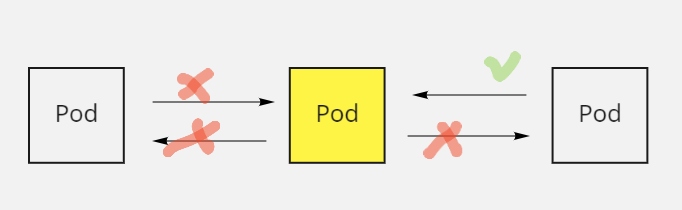
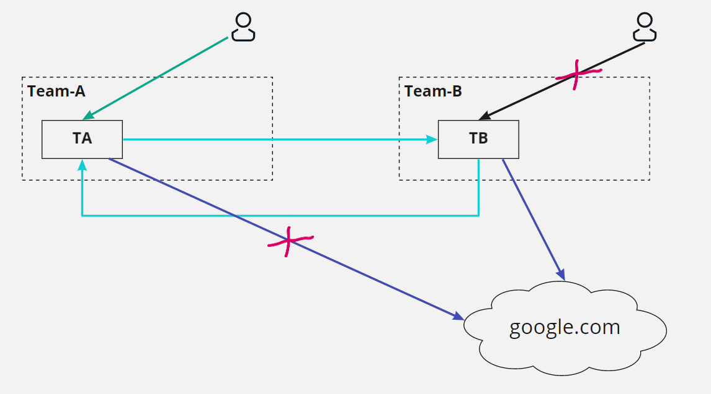

# Network Policies

---

- [ ] Что такое Network Policies
- [ ] Содержание манифестов
- [ ] Как они работают

---

Цель - контроль трафика между pod-ами



---

*Вопрос - использует ли кто-то сейчас Network Policy?*

---

**Кубернетес "из коробки"- т.е. без Network Policy**


---

**Labels Matter!**


```yaml
matchLabels:
  app: shopping
```

```yaml
matchLabels: {}
```

---

**Направление потока трафика**

Ingress


Egress


---

**Структура манифеста**

```yaml
apiVersion: networking.k8s.io/v1
kind: NetworkPolicy
metadata:
  name:
  namespace:
  ...
spec:
  podSelector: ...
  ingress:
  - ...
  - ...
  egress:
  - ...
  - ...
```

---

**Правило I**

Трафик pod-а разрешен, пока нет ни одного правила, применимого к этому pod-у.


**Правило II**

Трафик запрещен, если среди правил применимых к pod-у нет ни одного, которое бы этот трафик разрешало.

---

**Пример запрета по-умолчанию**

```yaml
apiVersion: networking.k8s.io/v1
kind: NetworkPolicy
metadata:
  name: default-deny-all
spec:
  podSelector: {}
  ingress: []
```

Результат - весь входящий трафик запрещен.

---

**Правило III**

Трафик разрешен, если есть хотя бы одно правило позволяющее это.

---

**Пример взаимодействия между pod-ами**


```yaml
kind: NetworkPolicy
spec:
  podSelector: 
    matchLabels:
      app: foo
      tier: db
  ingress: 
  - from:
    - podSelector:
        matchLabels:
          app: foo
          tier: backend
```

Более строго

```yaml
- from:
  - podSelector:
      matchLabels:
        app: foo
        tier: backend
        

ports:
- port: 3306
  protocol: TCP
```

---

**Правило IV**

В случае применение нескольких правил работает OR

Пример с несколькими селекторами

```yaml
  ingress: 
  - from:
    - podSelector:
        matchLabels:
          app: foo
          tier: backend
    - podSelector:
        matchLabels:
          role: secutiry          
```

Пример с несколькими правилами

```yaml
  ingress: 
  - from:
    - podSelector:
        matchLabels:
          app: foo
          tier: backend
  - from:          
    - podSelector:
        matchLabels:
          role: secutiry   
```

Результат одинаковый!

---

Применение пустых селекторов


```yaml
spec:
  podSelector: {}
  ingress: 
  - from:
    - podSelector:
        matchLabels:
          role: monitoring
      ports:
      - port: 5000
```

Возможная проблема - это будет работать в случае, если pod-ы находятся в одном namespace-е.

---

**Правило V**

Network Policyc работают в том namespace, где они объявлены.

"spec.podSelector" не увидит pod-ы в другом namespace.

---

**Встречаем namespaceSelector**

Работает аналогично podSelector, но для namespace-ов, определяя их по lable-ам!

Пример

```yaml
apiVersion: v1
kind: Namespace
metadata:
  name: foo-prod
  labels:
    purpose: prod
    product: foo
```


```yaml
metadata:
  namespace: prod-storage
  name: allow-prod-apps
spec:
  podSelector: {}
  ingress: 
  - from:
    - namespaceSelector:
        matchLabels:
          purpose: prod
```


Ограничение: либо правило работает между pod-ами одного namespace, либо между namespace-ами в целом.

---

**Egress-правила**

Пример запрета исходящих соединений

```yaml
apiVersion: networking.k8s.io/v1
kind: NetworkPolicy
metadata:
  name: default-deny-all-egress
spec:
  podSelector: {}
  policyTypes:
  - Egress
  egress: []
```

---

**Разрешаем некоторые исходящие соединения**


```yaml
kind: NetworkPolicy
spec:
  podSelector: 
    matchLabels:
      app: foo
      tier: frontend
  policyTypes:
  - Egress      
  egress: 
  - to:
    - podSelector:
        matchLabels:
          app: foo
          tier: backend
```

Что могло пойти не так...

```bash
front$ curl http://backend
Cannot resolve host: `backend`
```

Корректируем

```yaml
kind: NetworkPolicy
spec:
  podSelector: 
    matchLabels:
      app: foo
      tier: frontend
  policyTypes:
  - Egress      
  egress: 
  - to:
    - podSelector:
        matchLabels:
          app: foo
          tier: backend
  - to:
    - ports:
      - port: 53
        protocol: UDP
      - port: 53
        protocol: TCP
```

**А что нужно чтобы это работало?**

Сетевой плагин с поддержкой Network Policy

* Calico
* WeaveNet
* Cilium

---

**Полезно знать**

Network Policy
- не применяются к пакетам
- не разрывают уже установленные соединения
- практически не влияют на latency

---

**Best practices**

Сначала все запретить - потом разрешать, что нужно.

Помнить о том, что правила "складываются" (ОR, а не AND)

Быть осторожным с пустыми селекторами.

Тестировать, тестировать и еще раз тестировать. Желательно автотестами.


---

**Практика**

Создадим namespace

```bash
kubectl create ns team-a
kubectl create ns team-b
```

Назначим метки

```bash
kubectl label namespace team-a app=team-a
kubectl label namespace team-b app=team-b
```

Создадим приложения

app.yaml
```yaml
---
apiVersion: v1
kind: Pod
metadata:
  name: ta
  namespace: team-a
  labels:
    app: ta
    run: nginx
spec:
  containers:
    - name: nginx
      imagePullPolicy: IfNotPresent
      image: joshrosso/nginx-curl:v2
---
apiVersion: v1
kind: Service
metadata:
  name: ta
  namespace: team-a
spec:
  ports:
    - port: 80
      name: http
      protocol: TCP
      targetPort: 80
  selector:
    app: ta
---
apiVersion: v1
kind: Pod
metadata:
  name: tb
  namespace: team-b
  labels:
    app: tb
    run: nginx
spec:
  containers:
    - name: nginx
      imagePullPolicy: IfNotPresent
      image: joshrosso/nginx-curl:v2
---
apiVersion: v1
kind: Service
metadata:
  name: tb
  namespace: team-b
spec:
  ports:
    - port: 80
      name: http
      protocol: TCP
      targetPort: 80
  selector:
    app: tb
```

Запустим

```bash
kubectl apply -f app.yaml
```

Дано


```bash
kubectl exec -it ta -n team-a -- bash
root@ta:/# curl tb.team-b
root@ta:/# curl google.com


kubectl exec -it tb -n team-b -- bash
root@ta:/# curl ta.team-a
root@tb:/# curl google.com
```

Начинаем ограничивать трафик.

Для начала, запретим TA ходить в Интернет.


Создадим правило

netpol.yaml

```yaml
# Team-A egress policy
apiVersion: networking.k8s.io/v1
kind: NetworkPolicy
metadata:
  name: team-a-egress
  namespace: team-a
spec:
  podSelector:
    matchLabels:
      app: ta
  policyTypes:
  - Egress
  egress:
  - to:
    - ipBlock:
        cidr: 192.168.0.0/16
    ports:
    - protocol: TCP
      port: 80
```

И применим его

```bash
kubectl apply -f netpol.yaml
```

И посмотрим что получилось

```bash
kubectl exec -it ta -n team-a -- bash
root@ta:/# curl google.com
curl: (6) Could not resolve host: google.com
root@ta:/# curl tb.team-b
curl: (6) Could not resolve host: tb.team-b
```

C google-ом все понятно, мы этого и добивались, но что произшло с tb.team-b???

Произошла блокировка доступа и к DNS тоже, так как у него порт - 53

```bash
root@ta:/# nslookup tb.team-b
;; connection timed out; no servers could be reached
```

Исправляем

```yaml
# Team-A egress policy
apiVersion: networking.k8s.io/v1
kind: NetworkPolicy
metadata:
  name: team-a-egress
  namespace: team-a
spec:
  podSelector:
    matchLabels:
      app: ta
  policyTypes:
  - Egress
  egress:
  - to:
    - ipBlock:
        cidr: 192.168.0.0/16
    ports:
    - protocol: TCP
      port: 80
  - to:
    - namespaceSelector:
        matchLabels:
          name: kube-system
    ports:
    - protocol: UDP
      port: 53
```

И проверяем корректность работы

```bash
root@ta:/# curl google.com
root@ta:/# curl tb.team-b
```

Можеть чуть подправить манифест

```yaml
# Team-A egress policy
apiVersion: networking.k8s.io/v1
kind: NetworkPolicy
metadata:
  name: team-a-egress
  namespace: team-a
spec:
  podSelector:
    matchLabels:
      app: ta
  policyTypes:
  - Egress
  egress:
  - to:
    - namespaceSelector:
        matchLabels:
          app: team-b
  - to:
    - namespaceSelector:
        matchLabels:
          name: kube-system
    ports:
    - protocol: UDP
      port: 53
```

Интересное рядом...

Если мы подправим манифест таким образом (с целью уточнить к кому именно в ns можно обращаться)...

```yaml
  - to:
    - namespaceSelector:
        matchLabels:
          app: team-b
    - podSelector:
        matchLabels:
          app: tb
```

то все будет работать.

Но оно будет работать и даже так...


```yaml
  - to:
    - namespaceSelector:
        matchLabels:
          app: team-b
    - podSelector:
        matchLabels:
          app: tbbbbb
```

Поэтому правильно надо делать так:

```yaml
  - to:
    - namespaceSelector:
        matchLabels:
          app: team-b
      podSelector:
        matchLabels:
          app: tbbbbb
```

А точнее так

```yaml
  - to:
    - namespaceSelector:
        matchLabels:
          app: team-b
      podSelector:
        matchLabels:
          app: tb
```

Ок, вспомним о входящем трафике.



Реализуем

```yaml
# Team-B ingress policy
apiVersion: networking.k8s.io/v1
kind: NetworkPolicy
metadata:
  name: team-b-ingress
  namespace: team-b
spec:
  podSelector:
    matchLabels:
      app: tb
  policyTypes:
  - Ingress
  ingress:
  - from:
    - namespaceSelector:
        matchLabels:
          app: team-a
      podSelector:
        matchLabels:
          app: ta
```

Результат

```bash
kubectl get svc -A
NAMESPACE     NAME         TYPE        CLUSTER-IP       EXTERNAL-IP   PORT(S)                  AGE
...
team-b        tb           ClusterIP   10.102.122.112   &lt;none&gt;        80/TCP                   150m

curl 10.102.122.112
curl: (7) Failed connect to 10.102.122.112:80; Connection timed out
```

---

Расширенный функционал от Calico

https://docs.projectcalico.org/about/about-network-policy

Пример запрета всего, кроме DNS (помним про label - projectcalico.org/name)

```yaml
apiVersion: projectcalico.org/v3
kind: GlobalNetworkPolicy
metadata:
  name: default-app-policy
spec:
  namespaceSelector: has(projectcalico.org/name) && projectcalico.org/name not in {"kube-system", "calico-system"}
  types:
  - Ingress
  - Egress
  egress:
    - action: Allow
      protocol: UDP
      destination:
        selector: k8s-app == "kube-dns"
        ports:
        - 53
```

```bash
kubectl delete -f netpol.yaml
kubectl apply -f calicopol.yaml
error: unable to recognize calicopol.yaml no matches for kind GlobalNetworkPolicy in version projectcalico.org/v3
```

```bash
curl -O -L  https://github.com/projectcalico/calicoctl/releases/download/v3.17.1/calicoctl

chmod +x calicoctl

mv calicoctl /usr/local/bin/
```

```bash
export DATASTORE_TYPE=kubernetes
export KUBECONFIG=~/.kube/config
```

И повторно

```bash
calicoctl apply -f calicopol.yaml
```
