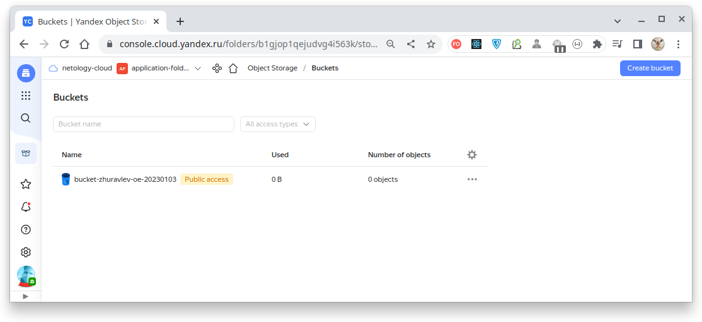
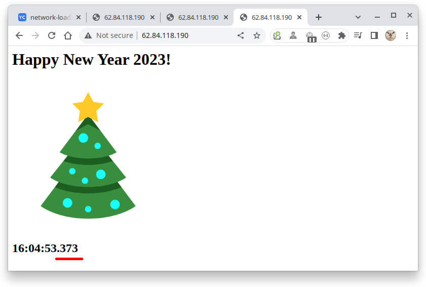
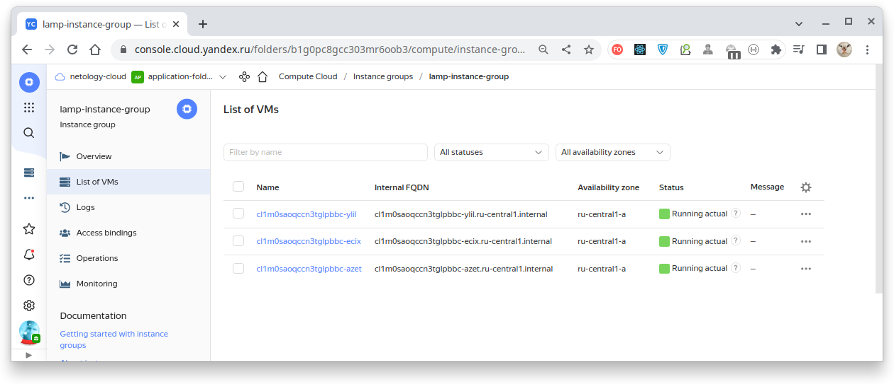
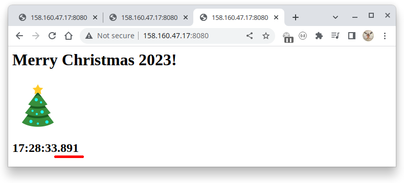

# Домашнее задание к занятию 15.2 "Вычислительные мощности. Балансировщики нагрузки".

---

Домашнее задание будет состоять из обязательной части, которую необходимо выполнить на провайдере Яндекс.Облако, и дополнительной части в AWS (можно выполнить по желанию). Все домашние задания в 15 блоке связаны друг с другом и в конце представляют пример законченной инфраструктуры.
Все задания требуется выполнить с помощью Terraform, результатом выполненного домашнего задания будет код в репозитории. Перед началом работ следует настроить доступ до облачных ресурсов из Terraform, используя материалы прошлых лекций и ДЗ.

---
## Задание 1. Яндекс.Облако (обязательное к выполнению)

1. Создать bucket Object Storage и разместить там файл с картинкой:
- Создать bucket в Object Storage с произвольным именем (например, _имя_студента_дата_);
- Положить в bucket файл с картинкой;
- Сделать файл доступным из Интернет.
2. Создать группу ВМ в public подсети фиксированного размера с шаблоном LAMP и web-страничкой, содержащей ссылку на картинку из bucket:
- Создать Instance Group с 3 ВМ и шаблоном LAMP. Для LAMP рекомендуется использовать `image_id = fd827b91d99psvq5fjit`;
- Для создания стартовой веб-страницы рекомендуется использовать раздел `user_data` в [meta_data](https://cloud.yandex.ru/docs/compute/concepts/vm-metadata);
- Разместить в стартовой веб-странице шаблонной ВМ ссылку на картинку из bucket;
- Настроить проверку состояния ВМ.
3. Подключить группу к сетевому балансировщику:
- Создать сетевой балансировщик;
- Проверить работоспособность, удалив одну или несколько ВМ.
4. *Создать Application Load Balancer с использованием Instance group и проверкой состояния.

Документация
- [Compute instance group](https://registry.terraform.io/providers/yandex-cloud/yandex/latest/docs/resources/compute_instance_group)
- [Network Load Balancer](https://registry.terraform.io/providers/yandex-cloud/yandex/latest/docs/resources/lb_network_load_balancer)
- [Группа ВМ с сетевым балансировщиком](https://cloud.yandex.ru/docs/compute/operations/instance-groups/create-with-balancer)
---


## Решение Задания №1

### **Продемонстрируем работу сетевого балансировщика (Network Load Balancer).**

> **Network Load Balancer** работает на 4-м (транспортном) уровне OSI-модели, призванным обеспечивать надёжную передачу данных
> между пунктами назначения, и использует специфические протоколы, самыми известными из которых являются TCP и UDP.
> Протоколы именно этого уровня имеют в составе своих заголовков такой параметр, как "порт", представляющий собой
> целое неотрицательно число в диапазоне от 0 до 65535 (в зависимости от конкретного протокола использоваться могут не
> все значения).
> 
> Network Load Balancer никак не анализирует содержимое запроса.

Облачная конфигурация Network Load Balancer является относительно несложной и в упрощенном виде приведена на рисунке: 


**Где:**
- **Network Load Balancer (сетевой балансировщик)** — сервис, помогающий обеспечить отказоустойчивость приложений за счет равномерного
распределения сетевой нагрузки по облачным ресурсам. Позволяет создавать сетевые балансировщики и объединять
облачные ресурсы в целевые группы, по которым нужно распределять трафик;
- **Listener** - обработчик, на котором сетевой балансировщик будет принимать трафик, а также проверять состояние ресурсов
в подключенной целевой группе;
- **Target Group (целевая группа)** - объединяет облачные ресурсы, по которым сетевой балансировщик будет распределять
трафик.  Ресурсы из подключенной к балансировщику целевой группы регулярно опрашиваются проверками состояния,
благодаря чему трафик подается только на рабочие ресурсы;

> #### _Кликайте [по ссылкам](./terraform) для перехода к tf-файлам!_

| Действие                                                                        |                               Результат                                | Назначение                                         |
|:--------------------------------------------------------------------------------|:----------------------------------------------------------------------:|:---------------------------------------------------|
| [1. Создание папки](./terraform/01_provider.tf)                                 |                            |                                                    |
| [2. Создание сервисных аккаунтов](./terraform/02_service_accounts.tf)           |            | Полномочия доступа<br/> к Storage и Instance Group |
| [3. Создание Storage Bucket](./terraform/03_storage_bucket.tf)                  |                | Хранилище типа "key-value"                         |
| [4. Создание объекта в Storage Bucket](./terraform/04_storage_bucket_object.tf) |  | png-файл                                           |
| [5. Создание сети](./terraform/05_network.tf)                                   |                              |                                                    |
| [6. Создание подсети](./terraform/06_subnet.tf)                                 |                                |                                                    |
| [7. Создание Instance Group с load_balancer](./terraform/07_instance_group.tf)  |                | Групповое управление<br/> виртуальными машинами    |
| [8. Создание Network Load Balancer](./terraform/08_network_load_balancer.tf)    |  |                                                    |

Сетевой балансировщик создан и работает. Проверим его работу по перераспределению нагрузки посредством многократного
обновлением страницы браузера.

Через некоторое время удаётся получить все три экземпляра обслуживаемых балансировщиком инстансов (они различаются
по времени создания размещённых в них файлов `index.html` - оно выводится ниже картинки, с точностью до миллисекунд):

|                     Экземпляр 1                      |                     Экземпляр 2                      |                     Экземпляр 3                      |
|:----------------------------------------------------:|:----------------------------------------------------:|:----------------------------------------------------:|
|  |  |  |

Обращаем внимание, что экземпляры инстансов доступны через единственный публичный IP-адрес балансировщика,
а сами виртуальные машины имеют только динамически назначаемые приватные IP-адреса:


Теперь проверим работоспособность группы инстансов и сетевого балансировщика, удалив, например, две из 3-х виртуальных
машин:


После чего состав группы виртуальных машин постепенно возвращается в желаемое состояние:

|            Фазы восстановления состава группы инстансов            |
|:------------------------------------------------------------------:|
|  |
|  |
|  |
|  |
|  |

Таким образом мы смогли убедиться, что **сетевой балансировщик функционирует, распределяя нагрузку между инстансами,**
а группа инстансов поддерживает свой состав.

---

### **Продемонстрируем работу балансировщика приложений (Application Load Balancer).**

> **Application Load Balancer** работает на 7-м (прикладном) уровне OSI-модели, обеспечивающем взаимодействие
> пользовательских приложений с сетью (доступ к файлам, БД, пересылка почты, служебной информации, ошибок и т.д.).
> Наиболее известными представителями протоколов этого уровня являются HTTP/HTTPS, FTP, SMTP, POP3 и RDP. 
>
> Application Load Balancer анализирует содержимое заголовка запроса и перенаправляет его тому серверу, который
> более всего подходит для его обработки. Анализ заголовка отнимает дополнительные ресурсы, но в то же время
> позволяет более разумно перераспределять запросы между серверами.

Облачная конфигурация Application Load Balancer в несколько упрощённом виде приведена на рисунке:


**Где:**
- **HTTP-router** - определяют правила маршрутизации запросов к бэкендам, позволяют модифицировать запросы
непосредственно на балансировщике, а также формировать небольшие статические ответы прямо на балансировщике нагрузки;
- **Virtual Host** - объединяют маршруты, относящиеся к одному набору доменов - значений заголовков **"HOST"** HTTP-запроса.
При получении входящего запроса балансировщик по очереди проверяет предикаты маршрутов и выбирает первый,
удовлетворяющий запросу. Также на уровне виртуального хоста можно настраивать модификацю HTTP-заголовков запросов и
ответов;
- **Backend Group** - определяет настройки, на основании которых Application Load Balancer будет подавать трафик
на целевые ресурсы (эндпоинты) бэкендов:
  - протокол для соединения с экземплярами приложения;
  - настройки проверок состояния эндпоинтов;
  - правила распределения (балансировки) трафика между эндпоинтами.
- **Target Group** - набор IP-адресов ВМ, на которых запущены сетевые приложения.
- **Listener** - обработчик, на котором сетевой балансировщик будет принимать трафик, а также проверять состояние ресурсов
  в подключенной целевой группе.

> #### _Кликайте [по ссылкам](./terraform) для перехода к tf-файлам!_

| Действие                                                                                              |                                                               Результат                                                                |
|:------------------------------------------------------------------------------------------------------|:--------------------------------------------------------------------------------------------------------------------------------------:|
| [7. Создание Instance Group с application_load_balancer](./terraform/07_instance_group.tf)            |                                                                        |
| [8. Отключение Network Load Balancer](./terraform/08_network_load_balancer.tf)                        |                                                                   X                                                                    |
| [9. Создание второй подсети](./terraform/09_subnet2.tf)                                               |                                                                                                |
| [10. Создание второй Instance Group с application_load_balancer ](./terraform/10_instance_group_2.tf) | <br/>  |
| [11. Создание двух Backend Group ](./terraform/11_backend_groups.tf)                                  |                                                                                |
| [12. Создание двух HTTP-router](./terraform/12_http_routers.tf)                                       |                                                                                    |
| [13. Создание двух Virtual host](./terraform/13_virtual_host.tf)                                      |     <br/>      |
| [14. Создание Application Load Balancer](./terraform/14_alb_load_balancer.tf)                         |                                                                          |

Сетевой балансировщик создан и все обслуживаемые им хосты находятся в работоспособном состоянии:


> Так как настройка Application Load Balancer является относительно сложной, приведем на диаграмме схему его
> конфигурации, обеспечивающей различную маршрутизацию в зависимости от того, на какой порт пришёл запрос:
>
> 

При такой настройке, пользователь, заходящий на внешний IP по порту `80` получит ответ от одной группы инстансов,
а заходящий по порту `8080` - от другой.

Проверим это путем многократного обновления страницы браузера при обращении
на каждый из этих портов:

|                    Экземпляр 1, порт 80                    |                    Экземпляр 2, порт 80                    |                    Экземпляр 3, порт 80                    |
|:----------------------------------------------------------:|:----------------------------------------------------------:|:----------------------------------------------------------:|
|  |  |  |


|                     Экземпляр 1, порт 8080                     |                     Экземпляр 2, порт 8080                     |                     Экземпляр 3, порт 8080                     |
|:--------------------------------------------------------------:|:--------------------------------------------------------------:|:--------------------------------------------------------------:|
|  |  |  |

Как видим, нам удаётся получить все шесть экземпляров обслуживаемых балансировщиком инстансов - они различаются
не только по времени создания размещённых в них файлов `index.html`, выводимых ниже картинки с точностью до миллисекунд,
но и потому, что обращаясь по порту `80` мы получаем поздравления с новым годом,
а по порту `8080` - подравление с Рождеством.

Таким образом мы смогли убедиться, что **балансировщик приложений функционирует, обеспечивая раздельный доступ к
предоставляемым инстансами сервисам** в зависимости от параметров (здесь - от номера порта) запроса.

Спасибо, что дочитали.

---

### _По причине блокировки AWS банковских карт задание №2 не выполнялось._

## Задание 2*. AWS (необязательное к выполнению)

Используя конфигурации, выполненные в рамках ДЗ на предыдущем занятии, добавить к Production like сети Autoscaling group из 3 EC2-инстансов с автоматической установкой web-сервера в private домен.

1. Создать bucket S3 и разместить там файл с картинкой:
- Создать bucket в S3 с произвольным именем (например, _имя_студента_дата_);
- Положить в bucket файл с картинкой;
- Сделать доступным из Интернета.
2. Сделать Launch configurations с использованием bootstrap скрипта с созданием веб-странички на которой будет ссылка на картинку в S3.
3. Загрузить 3 ЕС2-инстанса и настроить LB с помощью Autoscaling Group.

Resource terraform
- [S3 bucket](https://registry.terraform.io/providers/hashicorp/aws/latest/docs/resources/s3_bucket)
- [Launch Template](https://registry.terraform.io/providers/hashicorp/aws/latest/docs/resources/launch_template)
- [Autoscaling group](https://registry.terraform.io/providers/hashicorp/aws/latest/docs/resources/autoscaling_group)
- [Launch configuration](https://registry.terraform.io/providers/hashicorp/aws/latest/docs/resources/launch_configuration)

Пример bootstrap-скрипта:
```
#!/bin/bash
yum install httpd -y
service httpd start
chkconfig httpd on
cd /var/www/html
echo "<html><h1>My cool web-server</h1></html>" > index.html
```
