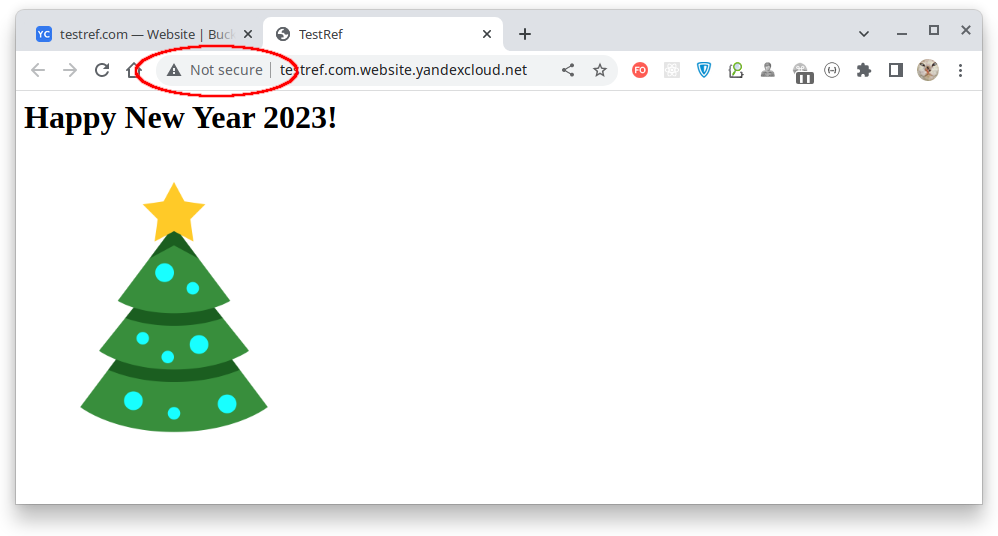

# Домашнее задание к занятию 15.3 "Безопасность в облачных провайдерах"
Используя конфигурации, выполненные в рамках предыдущих домашних заданиях, нужно добавить возможность шифрования бакета.

---
## Задание 1. Яндекс.Облако (обязательное к выполнению)
1. С помощью ключа в KMS необходимо зашифровать содержимое бакета:
- Создать ключ в KMS,
- С помощью ключа зашифровать содержимое бакета, созданного ранее.
2. (Выполняется НЕ в terraform) *Создать статический сайт в Object Storage c собственным публичным адресом и сделать доступным по HTTPS
- Создать сертификат,
- Создать статическую страницу в Object Storage и применить сертификат HTTPS,
- В качестве результата предоставить скриншот на страницу с сертификатом в заголовке ("замочек").

Документация
- [Настройка HTTPS статичного сайта](https://cloud.yandex.ru/docs/storage/operations/hosting/certificate)
- [Object storage bucket](https://registry.terraform.io/providers/yandex-cloud/yandex/latest/docs/resources/storage_bucket)
- [KMS key](https://registry.terraform.io/providers/yandex-cloud/yandex/latest/docs/resources/kms_symmetric_key)

---


## Решение

> #### _Кликайте [по ссылкам](./terraform) для перехода к tf-файлам!_

| Действие                                                                                        |                                                                      Результат                                                                      |
|:------------------------------------------------------------------------------------------------|:---------------------------------------------------------------------------------------------------------------------------------------------------:|
| [1. Создание симметричного ключа](./terraform/15_symmetric_key.tf)                              |                                                                                               |
| [2. Добавление роли, разрешающей шифровку/дешифровку](./terraform/16_encrypter_role.tf)         |                                                                                             |
| [3. Создание шифруемого ключом хранилища Storage Bucket](./terraform/17_storage_bucket_encr.tf) | <br/> |
| [4. Добавление объектов в шифруемое хранилище](./terraform/18_storage_bucket_object_encr.tf)    |                                                                     |

> Здесь следует обратить внимание, что при указании для Storage Bucket KMS-ключа шифрование будет применяться
> только для **ВНОВЬ ДОБАВЛЯЕМЫХ** объектов, идентифицированных по их ключу в хранилище! И даже если удалить такой
> объект из хранилища, а затем добавить его вновь, то шифрование к нему всё равно применяться не будет.
> Таким образом, чтобы объекты в хранилище содержались в зашифрованном виде их следует либо **добавлять в хранилище
> с ключами, которые ранее в этом хранилище не фигурировали**, либо создать новое хранилище и добавлять их уже туда.
>
> Именно по этой причине во избежание путаницы мы не стали использовать существовавшее ранее хранилище,
> а создали новое.

Наше хранилище было оформлено, как статический веб-сайт:


Но если **перед загрузкой файлов** подключить шифрацию, то его данные недоступны ни по адресу статического сайта:


Ни в виде отдельных файлов:


Таким образом мы можем шифровать содержимое Storage Bucket.

---

**Организуем доступ к статическому сайту по протоколу `HTTPS`**

[Создадим](./terraform/19_storage_bucket_https.tf) Storage Bucket под именем "testrefcom" и на его основе
[организуем статический сайт](./terraform/20_storage_bucket_https_object.tf). 

> Имя Storage Bucket должно состоять из символов, допустимых для использования в URL и не содержать точки!

Однако, при попытке доступа к нашему сайту по протоколу `HTTPS` получаем предупреждение, что соединение небезопасно
и фактически используется протокол `HTTP`:



Чтобы обеспечить работу по протоколу HTTPS нам нужно запросить сертификат у цента авторизации "Let's Encrypt".
Для этого в меню "Certificate Manager" выбираем добавление "Let's Encrypt certificate":


В параметрах создаваемого сертификата указываем имена сертифицируемых доменов
(здесь это `testrefcom.website.yandexcloud.net` - адрес, под которым доступен наш статический сайт)
и способ идентификации - `HTTP`:


> Способ идентификации `HTTP` предполагает размещение в открытом доступе на нашем сайте специального файла с ключом,
> наличие которого будет проверено Центром Аутентификации (Certificate Authority) "Let`s Encrypt".
> 
> При способе идентификации `DNS` нам было бы предложено разместить определенные ключи в `CNAME-` или `TXT-`записях
> домена через нашего доменного регистратора. Наличие таких ключей также было бы проверено
> Центром Аутентификации "Let`s Encrypt".
> 
> `HTTP` способ гораздо быстрее, поскольку нам не нужно ожидать обновления записей в глобальном DNS.

Сразу после добавления наш сертификат находится в статусе `Validating`:


Заходим в сертификат и в разделе "Check rights for domains" нам указано где и какой файл следует разместить
на нашем сайте:


Здесь это должен быть [файл](./certificates/6VE3kGnt2Of-YosRKbHhJ3DinW8gO5YBlY3SbM6OqGM)
содержащий последовательность символов `6VE3kGnt2Of-YosRKbHhJ3DinW8gO5YBlY3SbM6OqGM.lUUCkfyOsAvwZIO82SjvdGFz_9dEAJLlQlvHxSH8zJ4`.
Файл должен быть доступен по адресу нашего сайта `http://testrefcom.website.yandexcloud.net`
в особой папке `/.well-known/acme-challenge/` с именем файла `6VE3kGnt2Of-YosRKbHhJ3DinW8gO5YBlY3SbM6OqGM`.

Размещённый файл должен быть доступен снаружи без каких-либо ограничений:


После [публикации этого файла на нашем сайте](./terraform/20_storage_bucket_https_object.tf), сертификат может ожидать
валидации вплоть [до одной недели](https://cloud.yandex.ru/docs/certificate-manager/concepts/challenges).
Предполагается, что в течение этого времени служба Certificate Authority "Let`s Encrypt" посетит наш сайт и проверит,
действительно ли по указанному пути находится специфический файл, чтобы убедиться, что мы действительно контролируем
указанный домен.

К счастью, неделю ждать не пришлось и через полчаса сертификат был провалидирован и получил статус `Issued`:


> Сам [специальный файл](./certificates/6VE3kGnt2Of-YosRKbHhJ3DinW8gO5YBlY3SbM6OqGM) теперь можно с сайта удалить.

[Назначаем](./terraform/19_storage_bucket_https.tf) выпущенный "Let's Encrypt" сертификат по идентификатору нашему
"Storage Bucket". Его можно увидеть на закладке "HTTPS":


После недолгого ожидания (в пределах [получаса](https://cloud.yandex.ru/docs/storage/operations/hosting/certificate))
наш сертификат приходит в работоспособное состояние и мы получаем доступ к нашему статическому сайту по `HTTPS`-протоколу:


Таким образом мы организовали доступ к статическому сайту, размещённому в Storage Bucket по протоколу `HTTPS`.

---

<details>
  <summary>Особенность именования Storage Bucket в целях сертификации</summary> 

Интересным моментом является то, что если мы получим информацию о полученном через Yandex.Cloud сертификате "Let`s Encrypt"
выполнив команду `echo | openssl s_client -connect testrefcom.website.yandexcloud.net:443 2> /dev/null | openssl x509 -dates -issuer -text`,
то выяснится, что данный URL покрывается сертификатом, выданным на набор альтернативных DNS-имен:

````bash
$ echo | openssl s_client -connect testrefcom.website.yandexcloud.net:443 2> /dev/null | openssl x509 -dates -issuer -text
...
X509v3 Subject Alternative Name: 
  DNS:*.s3.ua.yandexcloud.net,
  DNS:website.yandexcloud.net,
  DNS:website.ua.yandexcloud.net,
  DNS:storage.yandexcloud.net,
  DNS:storage.ua.yandexcloud.net,
  DNS:storage-internal.cloud.yandex.net,
  DNS:s3.yandexcloud.net,
  DNS:*.website.ua.yandexcloud.net,
  DNS:*.storage.ua.yandexcloud.net,
  DNS:*.s3.yandexcloud.net,
  DNS:*.storage-internal.cloud.yandex.net,
  DNS:*.storage.yandexcloud.net,
  DNS:*.website.yandexcloud.net,
  DNS:s3.ua.yandexcloud.net
...
````

Наш URL `testrefcom.website.yandexcloud.net` покрывается шаблоном доменного имени `*.website.yandexcloud.net`,
но если бы в имени нашего Storage Bucket была точка, т.е. URL выглядел бы как `testref.com.website.yandexcloud.net`,
то такое имя не попало бы ни под один из шаблонов (`*` не покроет домент 5-го уровня), выданный сертификат к нашему доменному
имени применить бы не удалось и подключение по `HTTPS` было бы невозможным!

Это происходит в полном соответствии с [RFC2818](https://www.rfc-editor.org/rfc/rfc2818), который в п.3.1. декларирует
следующее:
> _Names may contain the wildcard character `*` which is considered to match any single domain name
> component or component fragment. E.g., `*`.a.com matches foo.a.com but
> not bar.foo.a.com. f`*`.com matches foo.com but not bar.com._

Таким образом, для использования HTTPS в Yandex.Cloud имя Storage Bucket не должно содержать разделителя доменных имен, т.е. точки!

</details>

--- 

### _По причине блокировки AWS банковских карт задание №2 не выполнялось._

## Задание 2*. AWS (необязательное к выполнению)

1. С помощью роли IAM записать файлы ЕС2 в S3-бакет:
- Создать роль в IAM для возможности записи в S3 бакет;
- Применить роль к ЕС2-инстансу;
- С помощью бутстрап скрипта записать в бакет файл web-страницы.
2. Организация шифрования содержимого S3-бакета:
- Используя конфигурации, выполненные в рамках ДЗ на предыдущем занятии, добавить к созданному ранее bucket S3 возможность шифрования Server-Side, используя общий ключ;
- Включить шифрование SSE-S3 bucket S3 для шифрования всех вновь добавляемых объектов в данный bucket.
3. *Создание сертификата SSL и применение его к ALB:
- Создать сертификат с подтверждением по email;
- Сделать запись в Route53 на собственный поддомен, указав адрес LB;
- Применить к HTTPS запросам на LB созданный ранее сертификат.

Resource terraform
- [IAM Role](https://registry.terraform.io/providers/hashicorp/aws/latest/docs/resources/iam_role)
- [AWS KMS](https://registry.terraform.io/providers/hashicorp/aws/latest/docs/resources/kms_key)
- [S3 encrypt with KMS key](https://registry.terraform.io/providers/hashicorp/aws/latest/docs/resources/s3_bucket_object#encrypting-with-kms-key)

Пример bootstrap-скрипта:
```
#!/bin/bash
yum install httpd -y
service httpd start
chkconfig httpd on
cd /var/www/html
echo "<html><h1>My cool web-server</h1></html>" > index.html
aws s3 mb s3://mysuperbacketname2021
aws s3 cp index.html s3://mysuperbacketname2021
```


