# Домашнее задание к занятию 15.4 "Кластеры. Ресурсы под управлением облачных провайдеров"

Организация кластера Kubernetes и кластера баз данных MySQL в отказоустойчивой архитектуре.
Размещение в private подсетях кластера БД, а в public - кластера Kubernetes.

---

## Задание 1. Яндекс.Облако (обязательное к выполнению)

1. Настроить с помощью Terraform кластер баз данных MySQL:

- Используя настройки VPC с предыдущих ДЗ, добавить дополнительно подсеть private в разных зонах, чтобы обеспечить
  отказоустойчивость
- Разместить ноды кластера MySQL в разных подсетях
- Необходимо предусмотреть репликацию с произвольным временем технического обслуживания
- Использовать окружение PRESTABLE, платформу Intel Broadwell с производительностью 50% CPU и размером диска 20 Гб
- Задать время начала резервного копирования - 23:59
- Включить защиту кластера от непреднамеренного удаления
- Создать БД с именем `netology_db` с логином и паролем

2. Настроить с помощью Terraform кластер Kubernetes

- Используя настройки VPC с предыдущих ДЗ, добавить дополнительно 2 подсети public в разных зонах, чтобы обеспечить
  отказоустойчивость
- Создать отдельный сервис-аккаунт с необходимыми правами
- Создать региональный мастер kubernetes с размещением нод в разных 3 подсетях
- Добавить возможность шифрования ключом из KMS, созданного в предыдущем ДЗ
- Создать группу узлов состояющую из 3 машин с автомасштабированием до 6
- Подключиться к кластеру с помощью `kubectl`
- *Запустить микросервис phpmyadmin и подключиться к БД, созданной ранее
- *Создать сервис типы Load Balancer и подключиться к phpmyadmin. Предоставить скриншот с публичным адресом и
  подключением к БД

Документация

- [MySQL cluster](https://registry.terraform.io/providers/yandex-cloud/yandex/latest/docs/resources/mdb_mysql_cluster)
- [Создание кластера kubernetes](https://cloud.yandex.ru/docs/managed-kubernetes/operations/kubernetes-cluster/kubernetes-cluster-create)
- [K8S Cluster](https://registry.terraform.io/providers/yandex-cloud/yandex/latest/docs/resources/kubernetes_cluster)
- [K8S node group](https://registry.terraform.io/providers/yandex-cloud/yandex/latest/docs/resources/kubernetes_node_group)

--- 

### Решение

**Сконфигурируем с помощью Terraform кластер баз данных MySQL:**

| Действие                                                                                 | Результат                                                                                                                                                                                                                                                                                                                                                                                                                      |
|:-----------------------------------------------------------------------------------------|:-------------------------------------------------------------------------------------------------------------------------------------------------------------------------------------------------------------------------------------------------------------------------------------------------------------------------------------------------------------------------------------------------------------------------------|
| 1. [Декларация провайдера](./terraform/01_provider.tf)                                   | 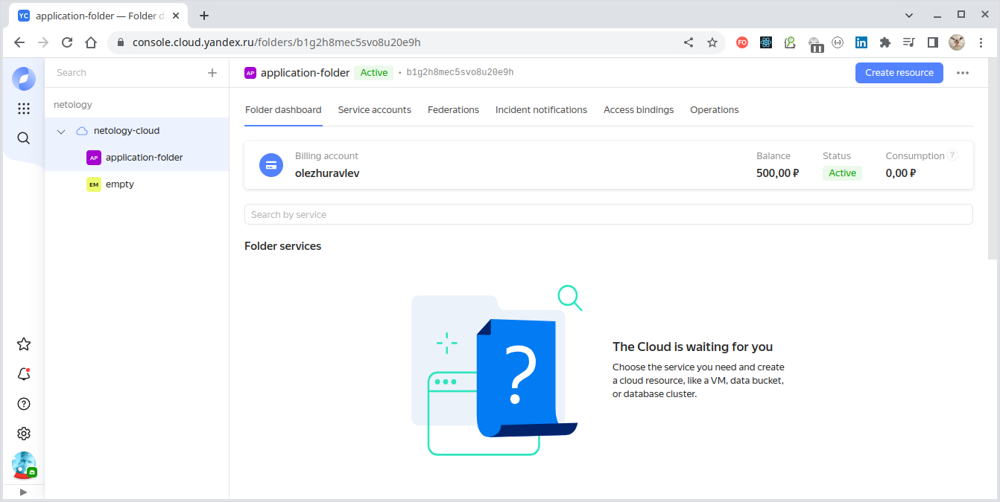                                                                                                                                                                                                                                                                                                                                                                                   |
| 2. [Создание сети](./terraform/02_network.tf)                                            | 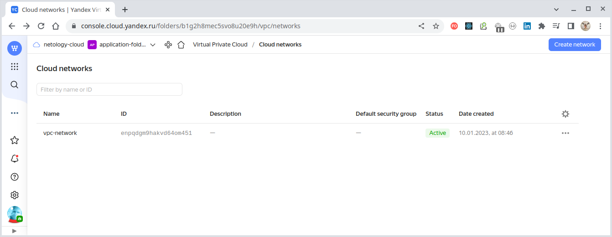                                                                                                                                                                                                                                                                                                                                                                                     |
| 3. [Создание подсетей "private"](./terraform/03_private_subnets.tf)                      | 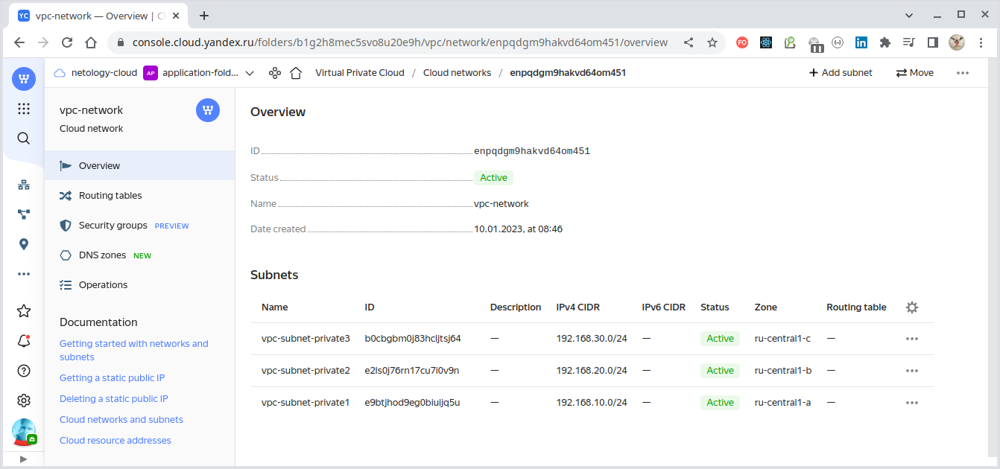                                                                                                                                                                                                                                                                                                                                                                       |
| 4. [Создание группы безопасности кластера MySQL](./terraform/04_mysql_security_group.tf) | 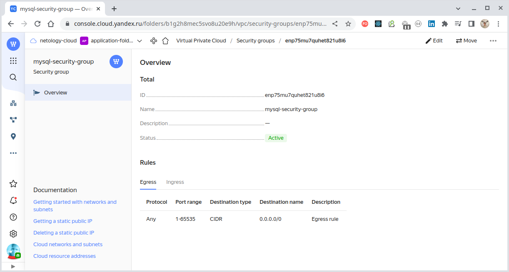<br/>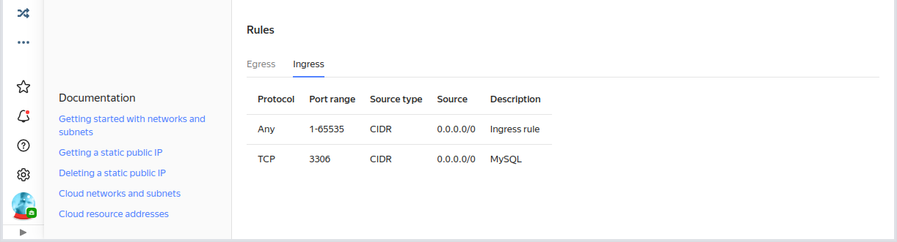                                                                                                                                                                                                                                                                          |
|                                                                                          | **Примечание:**<br/>- веб-интерфейс для просмотра Security Groups на момент написания данной работы находился в состоянии "PREVIEW" и для получения доступа к нему требовалось обратиться к техподдержке Yandex.Cloud;<br/> - в демонстрационных целях мы здесь не накладываем ограничений через Security Groups (CIDR `0.0.0.0/0` и любые порты). В промышленных решениях, конечно, должны выдаваться минимальные разрешения. |
| 5. [Создание кластера MySQL](./terraform/05_mysql_cluster.tf)                            | 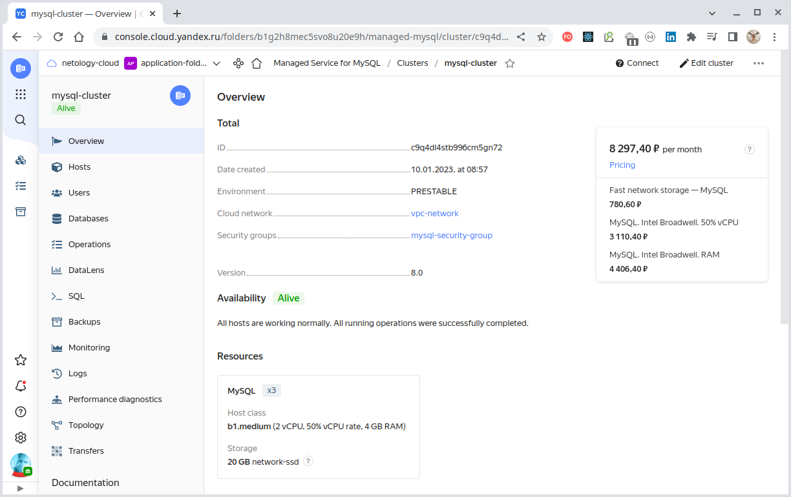                                                                                                                                                                                                                                                                                                                                                                         |
| 6. [Создание БД в кластере MySQL](./terraform/06_mysql_db.tf)                            | 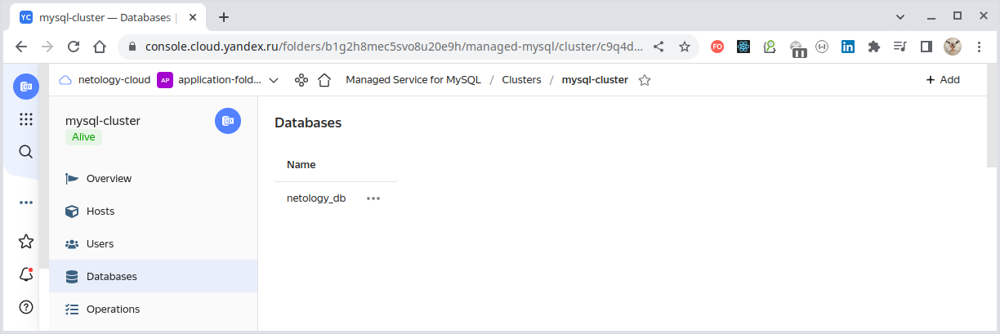                                                                                                                                                                                                                                                                                                                                                                                   |
| 7. [Создание пользователя БД в кластере MySQL](./terraform/07_mysql_user.tf)             | 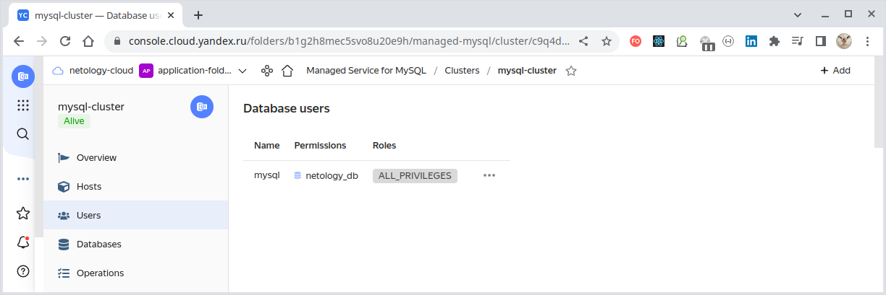                                                                                                                                                                                                                                                                                                                                                                               |

Кластер MySQL создан и работает.

<br/>

**Создадим с помощью Terraform кластер Kubernetes**

| Действие                                                                                         | Результат                                                                |
|:-------------------------------------------------------------------------------------------------|:-------------------------------------------------------------------------|
| 8. [Создание подсетей "public"](./terraform/08_public_subnets.tf)                                | 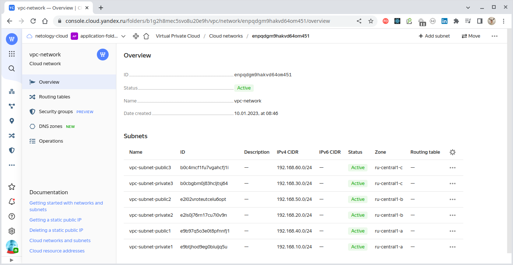                 |
| 9. [Создание групп безопасности кластера Kubernetes](./terraform/09_kuber_security_groups.tf)    | 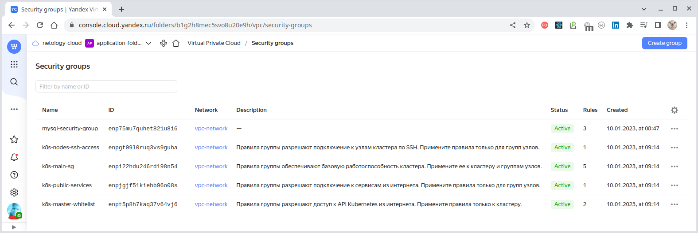   |
| 10. [Создание сервисных аккаунтов кластера Kubernetes](./terraform/10_kuber_service_accounts.tf) | 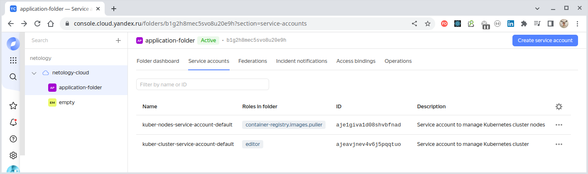 |
| 11. [Создание симметричного ключа](./terraform/11_symmetric_key.tf)                              | 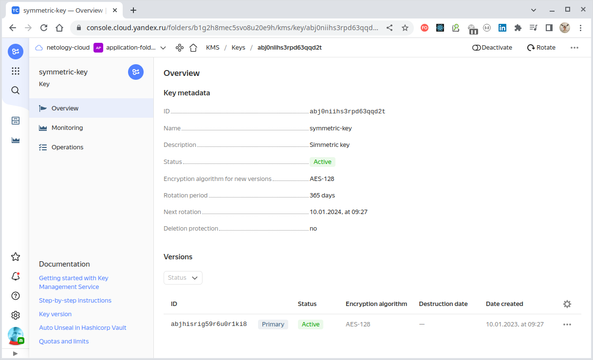                   |
| 12. [Создание регионального кластера Kubernetes](./terraform/12_kuber_region_cluster.tf)         | 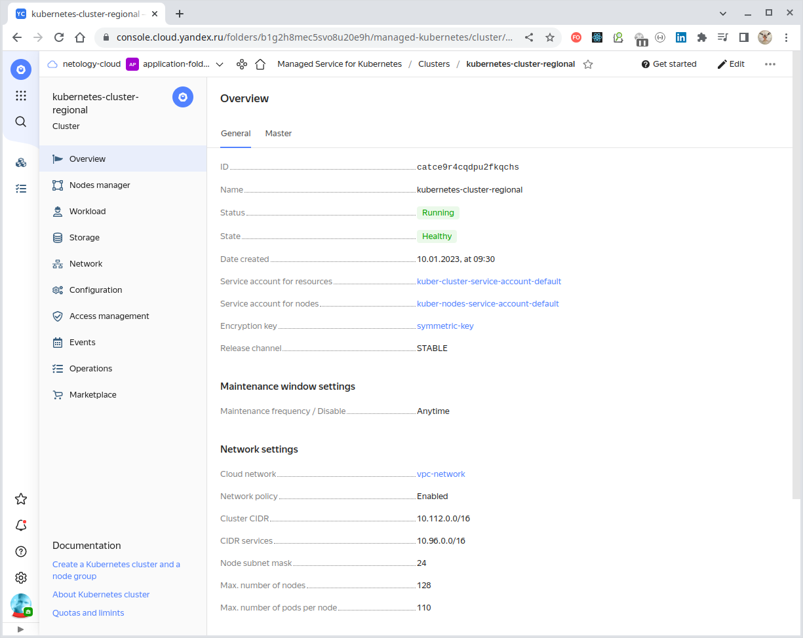     |
| 13. [Создание группы узлов](./terraform/13_kuber_node_group.tf)                                  | 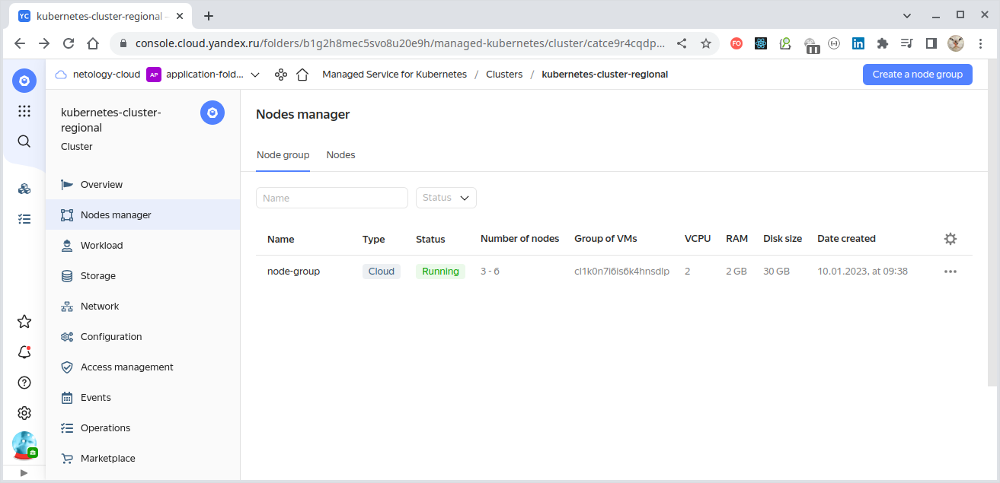             |
| 14. [Создание Container Registry](./terraform/14_container_registry.tf)                          | 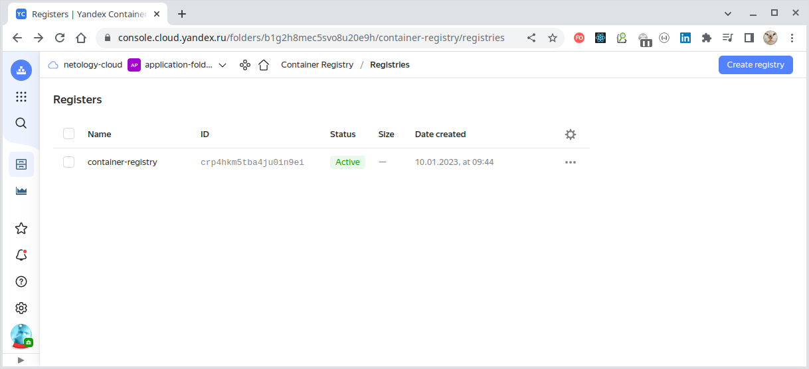         |

Теперь, чтобы подключиться из локального окружения к кластеру Kubernetes нам нужно получить идентификационные
данные кластера. Поэтому инициализируем консоль Yandex.Cloud для доступа к текущему каталогу:

````bash
$ yc init
Welcome! This command will take you through the configuration process.
Pick desired action:
 [1] Re-initialize this profile 'default' with new settings 
 [2] Create a new profile
Please enter your numeric choice: 1
Please go to https://oauth.yandex.ru/authorize?response_type=token&client_id=1a6990aa636648e9b2ef855fa7bec2fb in order to obtain OAuth token.

Please enter OAuth token: [AQAAAAABL*********************PBEbq222c] 
You have one cloud available: 'netology-cloud' (id = b1g8mq58h421raomnd64). It is going to be used by default.
Please choose folder to use:
 [1] application-folder (id = b1g98l8rbuco369mal49)
 [2] empty (id = b1grnvgme46inhr5nu72)
 [3] Create a new folder
Please enter your numeric choice: 1
Your current folder has been set to 'application-folder' (id = b1g98l8rbuco369mal49).
Do you want to configure a default Compute zone? [Y/n] n
````

Чтобы иметь доступ из локального окружения `kubectl` к кластеру, идентификационные данные кластера д.б. сохранены
в локальной папке `~/.kube/config`. Это можно выполнить специальной командой
`yc managed-kubernetes cluster get-credentials <Идентификатор кластера Kubernetes> --external`:

````bash
$ yc managed-kubernetes cluster get-credentials catf5dg0ppdutmnj2rmd --external

Context 'yc-kubernetes-cluster-regional' was added as default to kubeconfig '/home/oleg/.kube/config'.
Check connection to cluster using 'kubectl cluster-info --kubeconfig /home/oleg/.kube/config'.

Note, that authentication depends on 'yc' and its config profile 'default'.
To access clusters using the Kubernetes API, please use Kubernetes Service Account.
````

Идентификационные данные получены, убедимся, что кластер доступен через локальную инсталляцию `kubectl`:

````bash
$ kubectl cluster-info        
Kubernetes control plane is running at https://130.193.37.255
CoreDNS is running at https://130.193.37.255/api/v1/namespaces/kube-system/services/kube-dns:dns/proxy

To further debug and diagnose cluster problems, use 'kubectl cluster-info dump'.
````

Кластер доступен, список нод отображается:

````bash
$ kubectl get nodes -A -o wide
NAME                        STATUS   ROLES    AGE     VERSION   INTERNAL-IP     EXTERNAL-IP      OS-IMAGE             KERNEL-VERSION      CONTAINER-RUNTIME
cl18l9iufidr86fmhi25-ijec   Ready    <none>   8m25s   v1.21.5   192.168.10.16   158.160.51.24    Ubuntu 20.04.4 LTS   5.4.0-124-generic   containerd://1.6.7
cl18l9iufidr86fmhi25-okew   Ready    <none>   8m16s   v1.21.5   192.168.10.17   158.160.50.41    Ubuntu 20.04.4 LTS   5.4.0-124-generic   containerd://1.6.7
cl18l9iufidr86fmhi25-ygeg   Ready    <none>   8m29s   v1.21.5   192.168.10.6    158.160.45.162   Ubuntu 20.04.4 LTS   5.4.0-124-generic   containerd://1.6.7
````

Также, как и список подов (на данный момент существуют только системные поды):

````bash
$ kubectl get po -A -o wide      
NAMESPACE     NAME                                                  READY   STATUS    RESTARTS   AGE     IP              NODE                        NOMINATED NODE   READINESS GATES
kube-system   calico-node-4jk7r                                     1/1     Running   0          8m54s   192.168.10.17   cl18l9iufidr86fmhi25-okew   <none>           <none>
kube-system   calico-node-4zhqv                                     1/1     Running   0          9m7s    192.168.10.6    cl18l9iufidr86fmhi25-ygeg   <none>           <none>
kube-system   calico-node-6qrjl                                     1/1     Running   0          9m3s    192.168.10.16   cl18l9iufidr86fmhi25-ijec   <none>           <none>
kube-system   calico-typha-6d7bddfb44-c64zc                         1/1     Running   0          7m39s   192.168.10.17   cl18l9iufidr86fmhi25-okew   <none>           <none>
kube-system   calico-typha-horizontal-autoscaler-8495b957fc-dc4k6   1/1     Running   0          12m     10.112.128.5    cl18l9iufidr86fmhi25-ygeg   <none>           <none>
kube-system   calico-typha-vertical-autoscaler-6cc57f94f4-hgv8r     1/1     Running   3          12m     10.112.128.4    cl18l9iufidr86fmhi25-ygeg   <none>           <none>
kube-system   coredns-5f8dbbff8f-7bxvj                              1/1     Running   0          12m     10.112.128.3    cl18l9iufidr86fmhi25-ygeg   <none>           <none>
kube-system   coredns-5f8dbbff8f-phdxm                              1/1     Running   0          8m22s   10.112.129.3    cl18l9iufidr86fmhi25-ijec   <none>           <none>
kube-system   ip-masq-agent-5dqrt                                   1/1     Running   0          9m3s    192.168.10.16   cl18l9iufidr86fmhi25-ijec   <none>           <none>
kube-system   ip-masq-agent-n6lvk                                   1/1     Running   0          9m7s    192.168.10.6    cl18l9iufidr86fmhi25-ygeg   <none>           <none>
kube-system   ip-masq-agent-wrwqz                                   1/1     Running   0          8m54s   192.168.10.17   cl18l9iufidr86fmhi25-okew   <none>           <none>
kube-system   kube-dns-autoscaler-598db8ff9c-sntr2                  1/1     Running   0          12m     10.112.128.6    cl18l9iufidr86fmhi25-ygeg   <none>           <none>
kube-system   kube-proxy-6x6xb                                      1/1     Running   0          9m7s    192.168.10.6    cl18l9iufidr86fmhi25-ygeg   <none>           <none>
kube-system   kube-proxy-f4wl5                                      1/1     Running   0          9m3s    192.168.10.16   cl18l9iufidr86fmhi25-ijec   <none>           <none>
kube-system   kube-proxy-hpblp                                      1/1     Running   0          8m54s   192.168.10.17   cl18l9iufidr86fmhi25-okew   <none>           <none>
kube-system   metrics-server-7574f55985-946vq                       2/2     Running   1          8m20s   10.112.129.4    cl18l9iufidr86fmhi25-ijec   <none>           <none>
kube-system   npd-v0.8.0-lnqcr                                      1/1     Running   0          8m54s   10.112.130.2    cl18l9iufidr86fmhi25-okew   <none>           <none>
kube-system   npd-v0.8.0-qnkqp                                      1/1     Running   0          9m7s    10.112.128.2    cl18l9iufidr86fmhi25-ygeg   <none>           <none>
kube-system   npd-v0.8.0-w2g26                                      1/1     Running   0          9m3s    10.112.129.2    cl18l9iufidr86fmhi25-ijec   <none>           <none>
kube-system   yc-disk-csi-node-v2-6t8mt                             6/6     Running   0          8m54s   192.168.10.17   cl18l9iufidr86fmhi25-okew   <none>           <none>
kube-system   yc-disk-csi-node-v2-9p45v                             6/6     Running   0          9m3s    192.168.10.16   cl18l9iufidr86fmhi25-ijec   <none>           <none>
kube-system   yc-disk-csi-node-v2-rtvmq                             6/6     Running   0          9m7s    192.168.10.6    cl18l9iufidr86fmhi25-ygeg   <none>           <none>
````

Таким образом мы убедилсь, что кластер работает и доступен из локального окружения.

---

Теперь запустим в кластере приложение "phpMyAdmin". Для этого существуют два способа:

- запустить в кластере образ приложения из "Container Registry" Yandex.Cloud;
- запустить в кластере образ приложение непосредственно из стороннего репозитория (Docker Hub).

Продемонстрируем оба этих способа.

<br/>

**Загрузка образа, находящегося в "Docker Hub", в репозиторий "Container Registry" Yandex.Cloud и запуск его в
кластере**

Сначала загрузим в локальный репозиторий образ "phpMyAdmin" из "Docker Hub":

````bash
$ docker pull phpmyadmin:5.2.0

$ docker image ls                                            
REPOSITORY                              TAG          IMAGE ID       CREATED         SIZE
phpmyadmin                              5.2.0        bc444490f73f   3 days ago      510MB
...
````

Назначим образу тег в том формате, который требуется для Yandex.Cloud:

````bash
$ docker tag phpmyadmin:5.2.0 cr.yandex/crpj57qmohdjp9ppfrrk/phpadmin:5.2.0 

$ docker image ls                                                          
REPOSITORY                                TAG          IMAGE ID       CREATED         SIZE
cr.yandex/crpj57qmohdjp9ppfrrk/phpadmin   5.2.0        bc444490f73f   3 days ago      510MB
...
````

Теперь аутентифицируемся в репозитории "Container Registry" Yandex.Cloud используя имеющийся у нас `OAuth`-токен
(сохранен в локальной переменной окружения `YC_TOKEN`):

````bash
$ docker login --username oauth --password $YC_TOKEN cr.yandex
WARNING! Using --password via the CLI is insecure. Use --password-stdin.
WARNING! Your password will be stored unencrypted in /home/oleg/.docker/config.json.
Configure a credential helper to remove this warning. See
https://docs.docker.com/engine/reference/commandline/login/#credentials-store

Login Succeeded
````

После успешной аутентификации в репозитории "Container Registry" Yandex.Cloud отправим в него наш образ:

````bash
$ docker push cr.yandex/crpj57qmohdjp9ppfrrk/phpadmin:5.2.0
The push refers to repository [cr.yandex/crpj57qmohdjp9ppfrrk/phpadmin]
4671fa4f963c: Pushed
...
8a70d251b653: Pushed
5.2.0: digest: sha256:016e3ca648ef59853298771c8a508256882586fe870d7e00adaaf8271ad0639c size: 4080
````

Можно получить список имеющихся на данный момент в "Container Registry" Yandex.Cloud образов:

````bash
$ yc container image list   
+----------------------+---------------------+-------------------------------+-------+-----------------+
|          ID          |       CREATED       |             NAME              | TAGS  | COMPRESSED SIZE |
+----------------------+---------------------+-------------------------------+-------+-----------------+
| crptquevgslb2m5l1l2j | 2023-01-09 14:18:46 | crpj57qmohdjp9ppfrrk/phpadmin | 5.2.0 | 171.7 MB        |
+----------------------+---------------------+-------------------------------+-------+-----------------+
````

Теперь развернем в кластере Kubernetes образ из "Container Registry" Yandex.Cloud используя `kubectl`:

````bash
$ kubectl run --attach phpadmin --image cr.yandex/crpj57qmohdjp9ppfrrk/phpadmin:5.2.0 --labels="app=neto15_4,component=mysql"
...
````

Через короткое время экземпляр образа "phpMyAdmin" успешно запущен в кластере:

````bash
$ kubectl get deploy,pod -n default
NAME           READY   STATUS    RESTARTS   AGE
pod/phpadmin   1/1     Running   0          71s

$ kubectl get pod -n default -o wide --show-labels 
NAME       READY   STATUS    RESTARTS   AGE   IP              NODE                        NOMINATED NODE   READINESS GATES   LABELS
phpadmin   1/1     Running   0          70s   10.112.130.11   cl18l9iufidr86fmhi25-okew   <none>           <none>            app=neto15_4,component=mysql
````

<br/>

**Разворачивание "phpMyAdmin" через деплоймент**

Развернем в кластере [публичный образ "phpMyAdmin"](https://hub.docker.com/_/phpmyadmin) на основе
его [yml-описания](./infrastructure/deploy-apps.yaml) в качестве деплоймента:

````bash
$ kubectl apply -f deploy-apps.yaml 
deployment.apps/phpmyadmin created
service/phpmyadmin-svc created

$ kubectl get pod -n default -o wide
NAME                          READY   STATUS    RESTARTS   AGE     IP             NODE                        NOMINATED NODE   READINESS GATES
phpmyadmin-75f86fdb4f-jx7ld   1/1     Running   0          8m44s   10.112.130.3   cl18l9iufidr86fmhi25-okew   <none>           <none>
````

Получим информацию об имеющихся внешних IP:

````bash
$ kubectl get node -n default -o wide
NAME                        STATUS   ROLES    AGE    VERSION   INTERNAL-IP     EXTERNAL-IP      OS-IMAGE             KERNEL-VERSION      CONTAINER-RUNTIME
cl18l9iufidr86fmhi25-ijec   Ready    <none>   173m   v1.21.5   192.168.10.16   130.193.39.213   Ubuntu 20.04.4 LTS   5.4.0-124-generic   containerd://1.6.7
cl18l9iufidr86fmhi25-okew   Ready    <none>   173m   v1.21.5   192.168.10.17   158.160.44.123   Ubuntu 20.04.4 LTS   5.4.0-124-generic   containerd://1.6.7
cl18l9iufidr86fmhi25-ygeg   Ready    <none>   173m   v1.21.5   192.168.10.6    158.160.53.134   Ubuntu 20.04.4 LTS   5.4.0-124-generic   containerd://1.6.7
````

После этого к работающему экземпляру "phmMyAdmin" можно подключиться по внешнему IP-адресу и порту `30000`
(сопоставленному с портом `80`, на котором контейнер экспонирует приложение "phmMyAdmin" через организованный
[NodePort](./infrastructure/deploy-apps.yaml)):

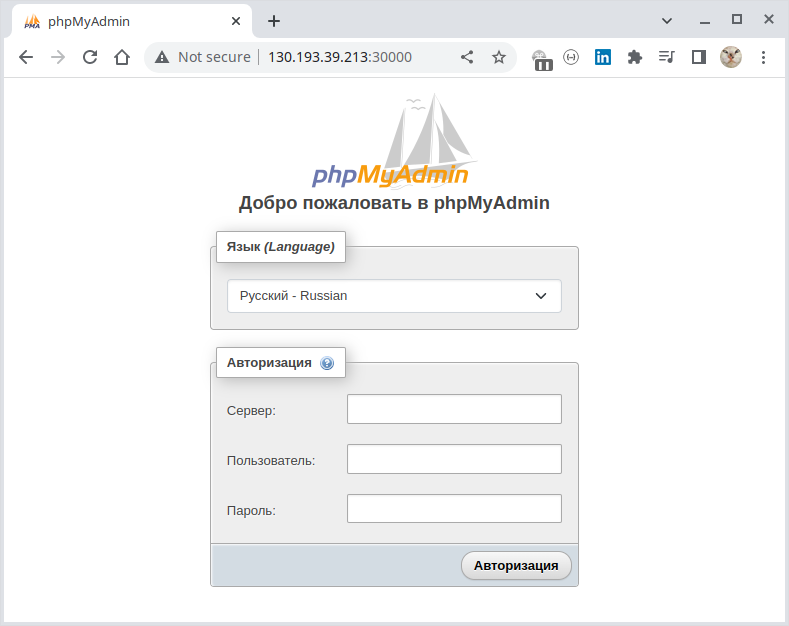

<br/>

**Подключение к "phpMyAdmin" через маппинг порта в локальное окружение**

Кроме маппинга порта контейнера `80` на внешний порт `30000` с помощью [NodePort](./infrastructure/deploy-apps.yaml))
также можно осуществить подключение к "phpMyAdmin" через **маппинг порта `80` в локальное окружение, например
на порт `8080`.**

Прокидываем порт `80` пода с "phmMyAdmin" в локальное окружение, сопоставляя его с локальным портом `8080`:

````bash
$ kubectl port-forward pod/phpadmin -n default 8080:80                                                     
Forwarding from 127.0.0.1:8080 -> 80
Forwarding from [::1]:8080 -> 80
Handling connection for 8080
Handling connection for 8080
````

Теперь можно подключиться к "phpMyAdmin" из локального окружения по порту `80`:

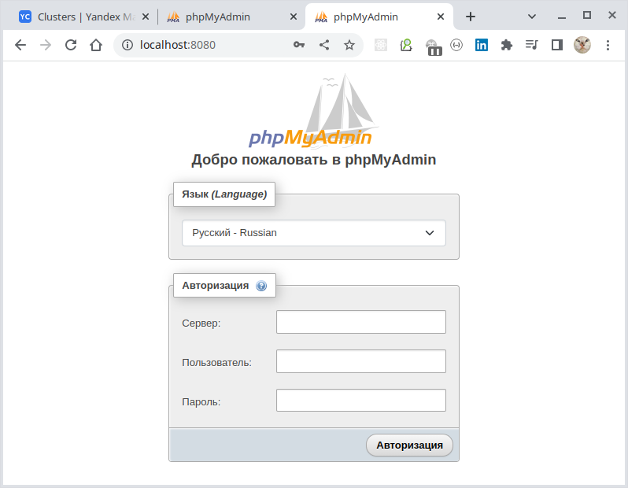

<br/>

**Отдельный запуск сервиса Node Port**

Кроме маппирования портов на локальное окружение, также можно **запустить в кластере Node Port**,
аналогично тому, как мы сделали это через деплоймент.

Добавим в кластер сервис, эспонирующий наружу порт `30000`:

````bash
$ kubectl apply -f nodeport.yaml
service/phpmyadmin-svc created
````

Т.к. при создании пода мы назначили ему ярлыки `app=neto15_4` и `component=mysql`:

````bash
$ kubectl get pod -n default --show-labels 
NAME       READY   STATUS    RESTARTS   AGE     LABELS
phpadmin   1/1     Running   0          8m41s   app=neto15_4,component=mysql
````

То указанный [Node Port](./infrastructure/nodeport.yaml) подключится к контейнеру через
внешний порт, аналогично тому, как это произошло, когда мы развернули "phpMyAdmin" через деплоймент:

````bash
$ kubectl get svc -n default --show-labels 
NAME             TYPE        CLUSTER-IP      EXTERNAL-IP   PORT(S)        AGE     LABELS
phpmyadmin-svc   NodePort    10.96.201.117   <none>        80:30000/TCP   16s     app=neto15_4,component=mysql
kubernetes       ClusterIP   10.96.128.1     <none>        443/TCP        3h16m   component=apiserver,provider=kubernetes
````

> Обращаем внимание, что инструкция `targetPort` в [объявлении Node Port](./infrastructure/nodeport.yaml) в этом
> случае отсутствует!

Получим информацию об имеющихся внешних IP нод кластера Kubernetes:

````bash
$ kubectl get node -n default -o wide
NAME                        STATUS   ROLES    AGE    VERSION   INTERNAL-IP     EXTERNAL-IP      OS-IMAGE             KERNEL-VERSION      CONTAINER-RUNTIME
cl18l9iufidr86fmhi25-ijec   Ready    <none>   173m   v1.21.5   192.168.10.16   130.193.39.213   Ubuntu 20.04.4 LTS   5.4.0-124-generic   containerd://1.6.7
cl18l9iufidr86fmhi25-okew   Ready    <none>   173m   v1.21.5   192.168.10.17   158.160.44.123   Ubuntu 20.04.4 LTS   5.4.0-124-generic   containerd://1.6.7
cl18l9iufidr86fmhi25-ygeg   Ready    <none>   173m   v1.21.5   192.168.10.6    158.160.53.134   Ubuntu 20.04.4 LTS   5.4.0-124-generic   containerd://1.6.7
````

После этого можно подключиться к "phpMyAdmin" через внешний IP-адрес любой ноды и порту `30000`, экспонируемому
наружу благодаря `NodePort`:

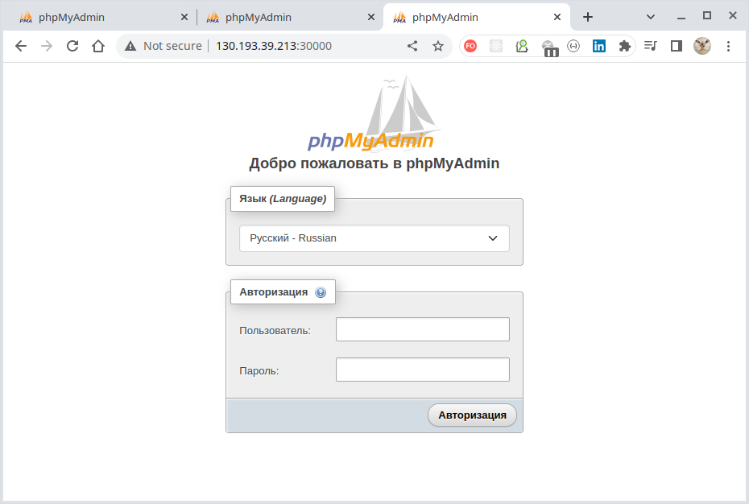

<br/>

**Подключение миросервиса "phpMyAdmin" к БД MySQL**

**Имея запущенный "phpMyAdmin"** подключим его к организованному ранее кластеру MySQL.
Для этого получим список кластеров БД "MySQL" в каталоге:

````bash
$ yc managed-mysql cluster list
+----------------------+---------------+---------------------+--------+---------+
|          ID          |     NAME      |     CREATED AT      | HEALTH | STATUS  |
+----------------------+---------------+---------------------+--------+---------+
| c9qk77gtde786ll1s0lt | mysql-cluster | 2023-01-09 12:09:37 | ALIVE  | RUNNING |
+----------------------+---------------+---------------------+--------+---------+
````

Имея имя кластера можно получить список его хостов:

````bash
$ yc managed-mysql host list --cluster-name mysql-cluster
+-------------------------------------------+----------------------+---------+--------+---------------+-----------+--------------------+----------+-----------------+
|                   NAME                    |      CLUSTER ID      |  ROLE   | HEALTH |    ZONE ID    | PUBLIC IP | REPLICATION SOURCE | PRIORITY | BACKUP PRIORITY |
+-------------------------------------------+----------------------+---------+--------+---------------+-----------+--------------------+----------+-----------------+
| rc1a-9y9974v6x5euqv6n.mdb.yandexcloud.net | c9qk77gtde786ll1s0lt | MASTER  | ALIVE  | ru-central1-a | false     |                    |        0 |               0 |
| rc1b-4qa8l0uiid8w1kva.mdb.yandexcloud.net | c9qk77gtde786ll1s0lt | REPLICA | ALIVE  | ru-central1-b | false     |                    |        0 |               0 |
| rc1c-kabeodntwvdqeq1i.mdb.yandexcloud.net | c9qk77gtde786ll1s0lt | REPLICA | ALIVE  | ru-central1-c | false     |                    |        0 |               0 |
+-------------------------------------------+----------------------+---------+--------+---------------+-----------+--------------------+----------+-----------------+
````

Подключение к серверу осуществляется имени хоста, которое следует ввести в поле "Сервер" формы логина:

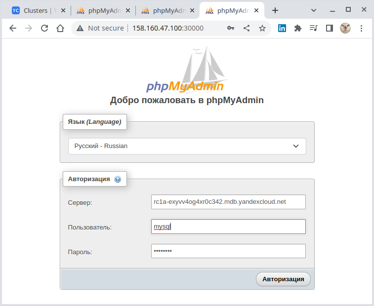

> Имя хоста можно задействовать любое из имеющихся, а пароль и логин используются те, которые были заданы при
> декларировании ["yandex_mdb_mysql_cluster"](./terraform/05_mysql_cluster.tf).
>
> Здесь это `mysql/mysql123`.

> Чтобы на форме появилось поле для ввода адреса сервера следует
> [запускать экземпляр MySQL](./infrastructure/deploy-apps.yaml) с параметром `PMA_ARBITRARY=1`.

Подключение к кластеру MySQL установлено:

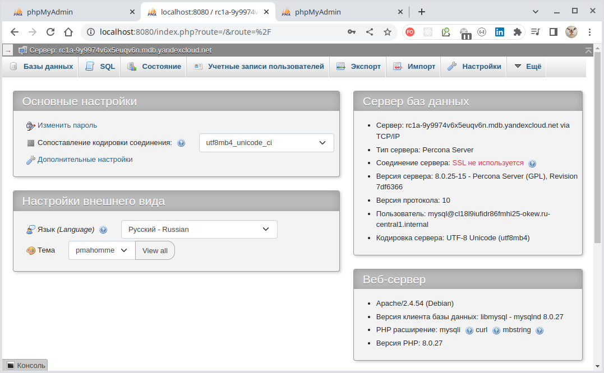

Для проверки выполним, например, SQL-запрос `SELECT version()`:

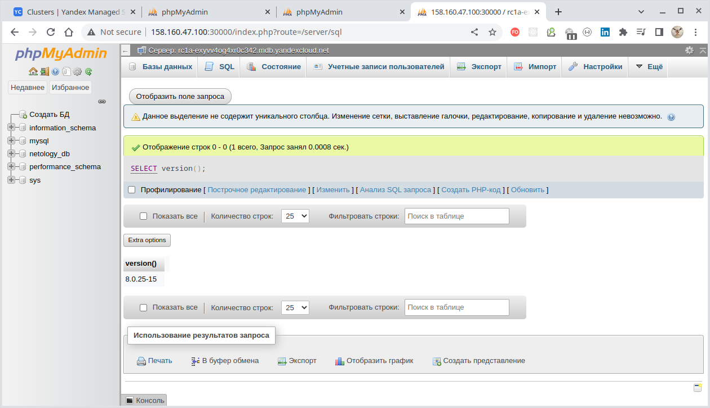

Запрос упешно выполнен - выведена версия MySQL - `8.0.25-15`.

Таким образом мы подключились к работающему кластеру MySQL используя консоль "myPhpAdmin" и получили информацию
из базы данных.

<br/>

**Подключение к миросервису "phpMyAdmin" через Network Load Balancer**

- *Создать Load Balancer и подключиться к phpmyadmin. Предоставить скриншот с публичным адресом и подключением к БД
  Чтобы была возможность подключиться снаружи по белому IP к phpmyadmin. Для этого и нужен балансировщик.

---

### _По причине блокировки AWS банковских карт задание №2 не выполнялось._

## Задание 2. Вариант с AWS (необязательное к выполнению)

1. Настроить с помощью terraform кластер EKS в 3 AZ региона, а также RDS на базе MySQL с поддержкой MultiAZ для
   репликации и создать 2 readreplica для работы:

- Создать кластер RDS на базе MySQL
- Разместить в Private subnet и обеспечить доступ из public-сети c помощью security-group
- Настроить backup в 7 дней и MultiAZ для обеспечения отказоустойчивости
- Настроить Read prelica в кол-ве 2 шт на 2 AZ.

2. Создать кластер EKS на базе EC2:

- С помощью terraform установить кластер EKS на 3 EC2-инстансах в VPC в public-сети
- Обеспечить доступ до БД RDS в private-сети
- С помощью kubectl установить и запустить контейнер с phpmyadmin (образ взять из docker hub) и проверить подключение к
  БД RDS
- Подключить ELB (на выбор) к приложению, предоставить скрин

Документация

- [Модуль EKS](https://learn.hashicorp.com/tutorials/terraform/eks)
