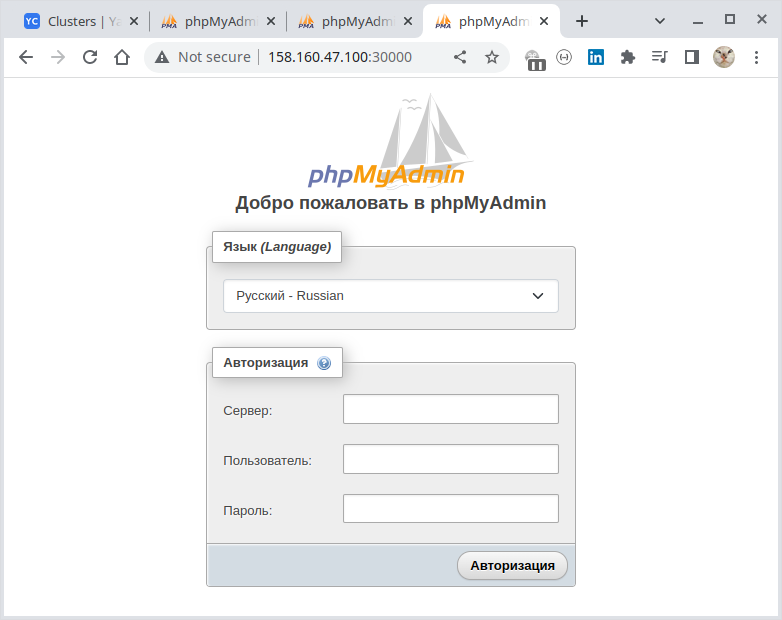
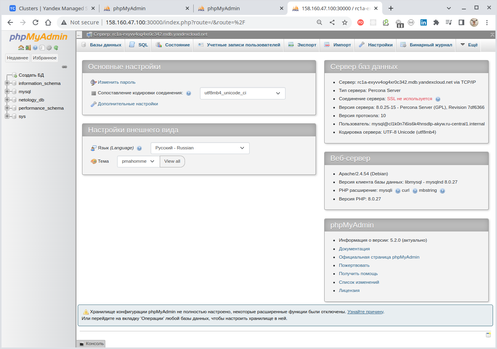
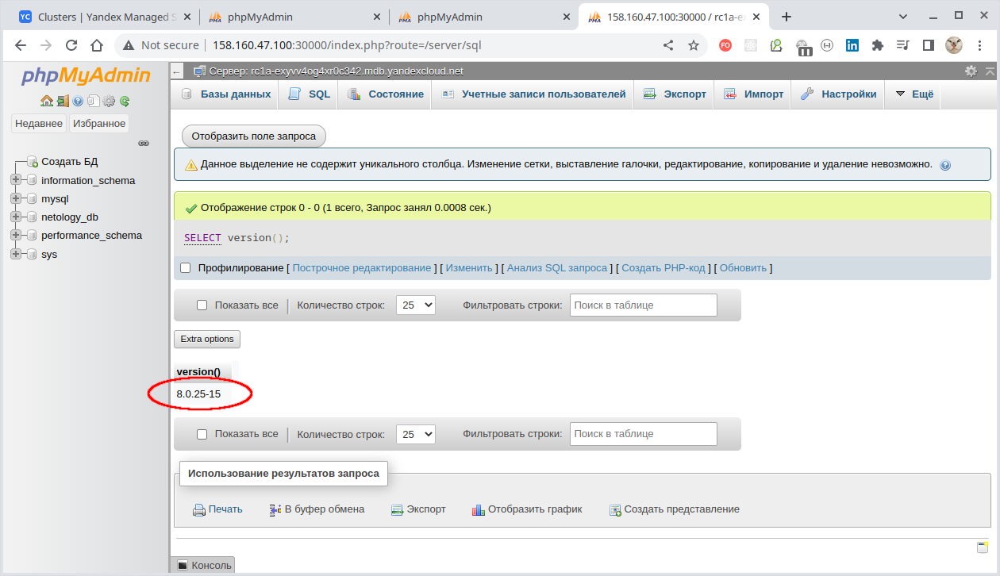

# Домашнее задание к занятию 15.4 "Кластеры. Ресурсы под управлением облачных провайдеров"

Организация кластера Kubernetes и кластера баз данных MySQL в отказоустойчивой архитектуре.
Размещение в private подсетях кластера БД, а в public - кластера Kubernetes.

---

## Задание 1. Яндекс.Облако (обязательное к выполнению)

1. Настроить с помощью Terraform кластер баз данных MySQL:

- Используя настройки VPC с предыдущих ДЗ, добавить дополнительно подсеть private в разных зонах, чтобы обеспечить
  отказоустойчивость
- Разместить ноды кластера MySQL в разных подсетях
- Необходимо предусмотреть репликацию с произвольным временем технического обслуживания
- Использовать окружение PRESTABLE, платформу Intel Broadwell с производительностью 50% CPU и размером диска 20 Гб
- Задать время начала резервного копирования - 23:59
- Включить защиту кластера от непреднамеренного удаления
- Создать БД с именем `netology_db` с логином и паролем

2. Настроить с помощью Terraform кластер Kubernetes

- Используя настройки VPC с предыдущих ДЗ, добавить дополнительно 2 подсети public в разных зонах, чтобы обеспечить
  отказоустойчивость
- Создать отдельный сервис-аккаунт с необходимыми правами
- Создать региональный мастер kubernetes с размещением нод в разных 3 подсетях
- Добавить возможность шифрования ключом из KMS, созданного в предыдущем ДЗ
- Создать группу узлов состояющую из 3 машин с автомасштабированием до 6
- Подключиться к кластеру с помощью `kubectl`
- *Запустить микросервис phpmyadmin и подключиться к БД, созданной ранее
- *Создать сервис типы Load Balancer и подключиться к phpmyadmin. Предоставить скриншот с публичным адресом и
  подключением к БД

Документация

- [MySQL cluster](https://registry.terraform.io/providers/yandex-cloud/yandex/latest/docs/resources/mdb_mysql_cluster)
- [Создание кластера kubernetes](https://cloud.yandex.ru/docs/managed-kubernetes/operations/kubernetes-cluster/kubernetes-cluster-create)
- [K8S Cluster](https://registry.terraform.io/providers/yandex-cloud/yandex/latest/docs/resources/kubernetes_cluster)
- [K8S node group](https://registry.terraform.io/providers/yandex-cloud/yandex/latest/docs/resources/kubernetes_node_group)

--- 

### Решение

**Сконфигурируем с помощью Terraform кластер баз данных MySQL:**

| Действие                                                                                 | Результат                                                                                                                                                                                                                                                                                                                                                                                                                      |
|:-----------------------------------------------------------------------------------------|:-------------------------------------------------------------------------------------------------------------------------------------------------------------------------------------------------------------------------------------------------------------------------------------------------------------------------------------------------------------------------------------------------------------------------------|
| 1. [Декларация провайдера](./terraform/01_provider.tf)                                   |                                                                                                                                                                                                                                                                                                                                                                                    |
| 2. [Создание сети](./terraform/02_network.tf)                                            |                                                                                                                                                                                                                                                                                                                                                                                      |
| 3. [Создание подсетей "private"](./terraform/03_private_subnets.tf)                      |                                                                                                                                                                                                                                                                                                                                                                        |
| 4. [Создание группы безопасности кластера MySQL](./terraform/04_mysql_security_group.tf) | <br/>                                                                                                                                                                                                                                                                          |
|                                                                                          | **Примечание:**<br/>- веб-интерфейс для просмотра Security Groups на момент написания данной работы находился в состоянии "PREVIEW" и для получения доступа к нему требовалось обратиться к техподдержке Yandex.Cloud;<br/> - в демонстрационных целях мы здесь не накладываем ограничений через Security Groups (CIDR `0.0.0.0/0` и любые порты). В промышленных решениях, конечно, должны выдаваться минимальные разрешения. |
| 5. [Создание кластера MySQL](./terraform/05_mysql_cluster.tf)                            |                                                                                                                                                                                                                                                                                                                                                                          |
| 6. [Создание БД в кластере MySQL](./terraform/06_mysql_db.tf)                            |                                                                                                                                                                                                                                                                                                                                                                                    |
| 7. [Создание пользователя БД в кластере MySQL](./terraform/07_mysql_user.tf)             |                                                                                                                                                                                                                                                                                                                                                                                |

**Таким образом, мы создали и запустили кластер MySQL.**

---

**Теперь создадим с помощью Terraform кластер Kubernetes**

| Действие                                                                                         | Результат                                                                |
|:-------------------------------------------------------------------------------------------------|:-------------------------------------------------------------------------|
| 8. [Создание подсетей "public"](./terraform/08_public_subnets.tf)                                |                  |
| 9. [Создание групп безопасности кластера Kubernetes](./terraform/09_kuber_security_groups.tf)    |    |
| 10. [Создание сервисных аккаунтов кластера Kubernetes](./terraform/10_kuber_service_accounts.tf) |  |
| 11. [Создание симметричного ключа](./terraform/11_symmetric_key.tf)                              |                    |
| 12. [Создание регионального кластера Kubernetes](./terraform/12_kuber_region_cluster.tf)         |      |
| 13. [Создание группы узлов](./terraform/13_kuber_node_group.tf)                                  |              |
| 14. [Создание Container Registry](./terraform/14_container_registry.tf)                          |          |

Далее, чтобы подключиться из локального окружения к кластеру Kubernetes нам нужно получить идентификационные
данные кластера. Поэтому инициализируем консоль Yandex.Cloud для доступа к текущему каталогу:

````bash
$ yc init                                                
Welcome! This command will take you through the configuration process.
Pick desired action:
 [1] Re-initialize this profile 'default' with new settings 
 [2] Create a new profile
Please enter your numeric choice: 1
Please go to https://oauth.yandex.ru/authorize?response_type=token&client_id=1a6990aa636648e9b2ef855fa7bec2fb in order to obtain OAuth token.

Please enter OAuth token: [AQAAAAABL*********************PBEbq222c] 
You have one cloud available: 'netology-cloud' (id = b1g8mq58h421raomnd64). It is going to be used by default.
Please choose folder to use:
 [1] application-folder (id = b1g2h8mec5svo8u20e9h)
 [2] empty (id = b1grnvgme46inhr5nu72)
 [3] Create a new folder
Please enter your numeric choice: 1
Your current folder has been set to 'application-folder' (id = b1g2h8mec5svo8u20e9h).
Do you want to configure a default Compute zone? [Y/n] n
````

Чтобы иметь доступ из локального окружения `kubectl` к кластеру, идентификационные данные кластера должны находиться
в локальной папке, по умолчанию это  `~/.kube/config`. Получение данных можно выполнить специальной командой
`yc managed-kubernetes cluster get-credentials <Идентификатор кластера Kubernetes> --external`.

Получим идентификатор кластера:
````bash
$ yc container cluster list
+----------------------+-----------------------------+---------------------+---------+---------+------------------------+-----------------------+
|          ID          |            NAME             |     CREATED AT      | HEALTH  | STATUS  |   EXTERNAL ENDPOINT    |   INTERNAL ENDPOINT   |
+----------------------+-----------------------------+---------------------+---------+---------+------------------------+-----------------------+
| catce9r4cqdpu2fkqchs | kubernetes-cluster-regional | 2023-01-10 06:30:59 | HEALTHY | RUNNING | https://158.160.49.225 | https://192.168.10.15 |
+----------------------+-----------------------------+---------------------+---------+---------+------------------------+-----------------------+
````

Получим идентификационные данные кластера:
````bash
$ yc managed-kubernetes cluster get-credentials catce9r4cqdpu2fkqchs --external --force

Context 'yc-kubernetes-cluster-regional' was added as default to kubeconfig '/home/oleg/.kube/config'.
Check connection to cluster using 'kubectl cluster-info --kubeconfig /home/oleg/.kube/config'.

Note, that authentication depends on 'yc' and its config profile 'default'.
To access clusters using the Kubernetes API, please use Kubernetes Service Account.
````

> Флаг `--force` позволяет перезаписать идентификационные данные кластера, если они уже существуют.

Идентификационные данные получены, убедимся, что кластер доступен через локальную инсталляцию `kubectl`:

````bash
$ kubectl cluster-info
Kubernetes control plane is running at https://158.160.49.225
CoreDNS is running at https://158.160.49.225/api/v1/namespaces/kube-system/services/kube-dns:dns/proxy

To further debug and diagnose cluster problems, use 'kubectl cluster-info dump'.
````

Кластер доступен, список нод отображается:
````bash
$ kubectl get node -A -o wide
NAME                        STATUS   ROLES    AGE   VERSION   INTERNAL-IP     EXTERNAL-IP      OS-IMAGE             KERNEL-VERSION      CONTAINER-RUNTIME
cl1k0n7i6is6k4hnsdlp-akyw   Ready    <none>   13m   v1.21.5   192.168.10.32   158.160.47.100   Ubuntu 20.04.4 LTS   5.4.0-124-generic   containerd://1.6.7
cl1k0n7i6is6k4hnsdlp-aqyn   Ready    <none>   13m   v1.21.5   192.168.10.31   158.160.43.181   Ubuntu 20.04.4 LTS   5.4.0-124-generic   containerd://1.6.7
cl1k0n7i6is6k4hnsdlp-ezyb   Ready    <none>   13m   v1.21.5   192.168.10.5    130.193.49.150   Ubuntu 20.04.4 LTS   5.4.0-124-generic   containerd://1.6.7
````

Список подов тоже можно получить (на данный момент существуют только системные поды):
````bash
$ kubectl get po -A -o wide  
NAMESPACE     NAME                                                  READY   STATUS    RESTARTS   AGE   IP              NODE                        NOMINATED NODE   READINESS GATES
kube-system   calico-node-4mkj8                                     1/1     Running   0          14m   192.168.10.5    cl1k0n7i6is6k4hnsdlp-ezyb   <none>           <none>
kube-system   calico-node-dx8cf                                     1/1     Running   0          14m   192.168.10.32   cl1k0n7i6is6k4hnsdlp-akyw   <none>           <none>
kube-system   calico-node-hstz4                                     1/1     Running   0          14m   192.168.10.31   cl1k0n7i6is6k4hnsdlp-aqyn   <none>           <none>
kube-system   calico-typha-6d7bddfb44-pfnr5                         1/1     Running   0          12m   192.168.10.31   cl1k0n7i6is6k4hnsdlp-aqyn   <none>           <none>
kube-system   calico-typha-horizontal-autoscaler-8495b957fc-jbwhx   1/1     Running   0          21m   10.112.128.5    cl1k0n7i6is6k4hnsdlp-ezyb   <none>           <none>
kube-system   calico-typha-vertical-autoscaler-6cc57f94f4-hrhxp     1/1     Running   4          21m   10.112.128.6    cl1k0n7i6is6k4hnsdlp-ezyb   <none>           <none>
kube-system   coredns-5f8dbbff8f-bsfz9                              1/1     Running   0          21m   10.112.128.4    cl1k0n7i6is6k4hnsdlp-ezyb   <none>           <none>
kube-system   coredns-5f8dbbff8f-qkmzb                              1/1     Running   0          14m   10.112.129.2    cl1k0n7i6is6k4hnsdlp-aqyn   <none>           <none>
kube-system   ip-masq-agent-9n8xs                                   1/1     Running   0          14m   192.168.10.5    cl1k0n7i6is6k4hnsdlp-ezyb   <none>           <none>
kube-system   ip-masq-agent-cwtr8                                   1/1     Running   0          14m   192.168.10.31   cl1k0n7i6is6k4hnsdlp-aqyn   <none>           <none>
kube-system   ip-masq-agent-wwjg4                                   1/1     Running   0          14m   192.168.10.32   cl1k0n7i6is6k4hnsdlp-akyw   <none>           <none>
kube-system   kube-dns-autoscaler-598db8ff9c-hjrsj                  1/1     Running   0          21m   10.112.128.3    cl1k0n7i6is6k4hnsdlp-ezyb   <none>           <none>
kube-system   kube-proxy-29lh6                                      1/1     Running   0          14m   192.168.10.32   cl1k0n7i6is6k4hnsdlp-akyw   <none>           <none>
kube-system   kube-proxy-hcp7c                                      1/1     Running   0          14m   192.168.10.5    cl1k0n7i6is6k4hnsdlp-ezyb   <none>           <none>
kube-system   kube-proxy-wxnl4                                      1/1     Running   0          14m   192.168.10.31   cl1k0n7i6is6k4hnsdlp-aqyn   <none>           <none>
kube-system   metrics-server-7574f55985-dc8nm                       2/2     Running   0          13m   10.112.130.2    cl1k0n7i6is6k4hnsdlp-akyw   <none>           <none>
kube-system   npd-v0.8.0-k85zw                                      1/1     Running   0          14m   10.112.129.3    cl1k0n7i6is6k4hnsdlp-aqyn   <none>           <none>
kube-system   npd-v0.8.0-sl2sg                                      1/1     Running   0          14m   10.112.128.2    cl1k0n7i6is6k4hnsdlp-ezyb   <none>           <none>
kube-system   npd-v0.8.0-xn54w                                      1/1     Running   0          14m   10.112.130.3    cl1k0n7i6is6k4hnsdlp-akyw   <none>           <none>
kube-system   yc-disk-csi-node-v2-hmpb4                             6/6     Running   0          14m   192.168.10.5    cl1k0n7i6is6k4hnsdlp-ezyb   <none>           <none>
kube-system   yc-disk-csi-node-v2-k85ml                             6/6     Running   0          14m   192.168.10.31   cl1k0n7i6is6k4hnsdlp-aqyn   <none>           <none>
kube-system   yc-disk-csi-node-v2-nn5hm                             6/6     Running   0          14m   192.168.10.32   cl1k0n7i6is6k4hnsdlp-akyw   <none>           <none>
````

Таким образом мы убедились, что **кластер работает и доступен из локального окружения**.

---
> Теперь запустим в кластере приложение "phpMyAdmin". Это можно выполнить, как минимум, двумя способами:
>
> - запустить в кластере образ приложения из "Container Registry" Yandex.Cloud;
> - запустить в кластере образ приложение непосредственно из стороннего репозитория (Docker Hub).
>
> Продемонстрируем оба этих подхода.

**Загрузка образа из "Docker Hub" в репозиторий "Container Registry" Yandex.Cloud и запуск его в
кластере**

Сначала загрузим в локальный репозиторий образ "phpMyAdmin" из "Docker Hub":

````bash
$ docker pull phpmyadmin:5.2.0
...
$ docker image ls                                            
REPOSITORY                              TAG          IMAGE ID       CREATED         SIZE
phpmyadmin                              5.2.0        bc444490f73f   3 days ago      510MB
...
````

Для загрузки образа в "Container Registry" Yandex.Cloud следует назначить образу тег в том формате,
который требуется для Yandex.Cloud - `cr.yandex/<ID реестра>/<имя Docker-образа>:<тег>`.

Получим идентификатор реестра:

````bash
````bash
$ yc container registry list                                                           
+----------------------+--------------------+----------------------+
|          ID          |        NAME        |      FOLDER ID       |
+----------------------+--------------------+----------------------+
| crp4hkm5tba4ju0in9ei | container-registry | b1g2h8mec5svo8u20e9h |
+----------------------+--------------------+----------------------+
````

Назначим образу требуемый тег:
````bash
$ docker tag phpmyadmin:5.2.0 cr.yandex/crp4hkm5tba4ju0in9ei/phpadmin:5.2.0

$ docker image ls                                                          
REPOSITORY                                TAG          IMAGE ID       CREATED         SIZE
cr.yandex/crpj57qmohdjp9ppfrrk/phpadmin   5.2.0        bc444490f73f   4 days ago      510MB
...
````

Для загрузки образа в "Container Registry" Yandex.Cloud необходимо сначала в нём аутентифицироваться.
Сделаем это используя имеющийся у нас `OAuth`-токен (хранится в локальной переменной окружения `YC_TOKEN`):

````bash
$ docker login --username oauth --password $YC_TOKEN cr.yandex
WARNING! Using --password via the CLI is insecure. Use --password-stdin.
WARNING! Your password will be stored unencrypted in /home/oleg/.docker/config.json.
Configure a credential helper to remove this warning. See
https://docs.docker.com/engine/reference/commandline/login/#credentials-store

Login Succeeded
````

После успешной аутентификации в репозитории "Container Registry" Yandex.Cloud отправляем в него наш образ:

````bash
$ docker push cr.yandex/crp4hkm5tba4ju0in9ei/phpadmin:5.2.0
The push refers to repository [cr.yandex/crp4hkm5tba4ju0in9ei/phpadmin]
4671fa4f963c: Preparing 
...
8a70d251b653: Pushed 
5.2.0: digest: sha256:016e3ca648ef59853298771c8a508256882586fe870d7e00adaaf8271ad0639c size: 4080
````

Образ загружен в реестр. Можно получить список имеющихся на данный момент в "Container Registry" Yandex.Cloud образов:

````bash
$ yc container image list
+----------------------+---------------------+-------------------------------+-------+-----------------+
|          ID          |       CREATED       |             NAME              | TAGS  | COMPRESSED SIZE |
+----------------------+---------------------+-------------------------------+-------+-----------------+
| crppuos77ftfbk7i4gbj | 2023-01-10 07:13:04 | crp4hkm5tba4ju0in9ei/phpadmin | 5.2.0 | 171.7 MB        |
+----------------------+---------------------+-------------------------------+-------+-----------------+
````

Загруженный образ можно наблюдать и через веб-интерфейс:


Теперь, используя `kubectl` развернем в кластере Kubernetes образ из "Container Registry" Yandex.Cloud:

````bash
$ kubectl run --attach phpadmin --image cr.yandex/crp4hkm5tba4ju0in9ei/phpadmin:5.2.0 --labels="app=neto15_4,component=mysql"
If you don't see a command prompt, try pressing enter.
AH00558: apache2: Could not reliably determine the server's fully qualified domain name, using 10.112.130.5. Set the 'ServerName' directive globally to suppress this message
AH00558: apache2: Could not reliably determine the server's fully qualified domain name, using 10.112.130.5. Set the 'ServerName' directive globally to suppress this message
[Tue Jan 10 07:20:11.993623 2023] [mpm_prefork:notice] [pid 1] AH00163: Apache/2.4.54 (Debian) PHP/8.0.27 configured -- resuming normal operations
[Tue Jan 10 07:20:11.993699 2023] [core:notice] [pid 1] AH00094: Command line: 'apache2 -D FOREGROUND'
````

Через короткое время экземпляр образа "phpMyAdmin" успешно запущен в кластере:
````bash
$ kubectl get pod -n default -o wide --show-labels
NAME       READY   STATUS    RESTARTS   AGE     IP             NODE                        NOMINATED NODE   READINESS GATES   LABELS
phpadmin   1/1     Running   0          5m52s   10.112.130.5   cl1k0n7i6is6k4hnsdlp-akyw   <none>           <none>            app=neto15_4,component=mysql
````

---
**Разворачивание "phpMyAdmin" через деплоймент и сервис NodePort**

Удалим ранее созданный под "phpMyAdmin":
````bash
$ kubectl delete pod/phpadmin                                                                                                   
pod "phpadmin" deleted

$ kubectl get pod -n default -o wide --show-labels
No resources found in default namespace.
````

И создадим его снова, но уже без посредничества локального Docker-репозитория
и "Container Registry" Yandex.Cloud, а непосредственно из
[публичного образ "phpMyAdmin"](https://hub.docker.com/_/phpmyadmin) на основе
его [yml-описания](./infrastructure/deploy-apps.yaml) как деплоймента:

````bash
$ kubectl apply -f deploy-apps.yaml               
deployment.apps/phpmyadmin created
service/phpmyadmin-svc created
````

Экземпляр микросервиса создан:
````bash
$ kubectl get pod -n default -o wide --show-labels
NAME                          READY   STATUS    RESTARTS   AGE   IP             NODE                        NOMINATED NODE   READINESS GATES   LABELS
phpmyadmin-7d56cf45f9-9gqh9   1/1     Running   0          19s   10.112.130.6   cl1k0n7i6is6k4hnsdlp-akyw   <none>           <none>            app=neto15_4,component=mysql,pod-template-hash=7d56cf45f9
````

---
**Подключимся снаружи к работающему экземпляру микросервиса "phpMyAdmin"**

Получим информацию об имеющихся внешних IP нодов кластера Kubernetes:
````bash
$ kubectl get node -n default -o wide
NAME                        STATUS   ROLES    AGE   VERSION   INTERNAL-IP     EXTERNAL-IP      OS-IMAGE             KERNEL-VERSION      CONTAINER-RUNTIME
cl1k0n7i6is6k4hnsdlp-akyw   Ready    <none>   57m   v1.21.5   192.168.10.32   158.160.47.100   Ubuntu 20.04.4 LTS   5.4.0-124-generic   containerd://1.6.7
cl1k0n7i6is6k4hnsdlp-aqyn   Ready    <none>   58m   v1.21.5   192.168.10.31   158.160.43.181   Ubuntu 20.04.4 LTS   5.4.0-124-generic   containerd://1.6.7
cl1k0n7i6is6k4hnsdlp-ezyb   Ready    <none>   58m   v1.21.5   192.168.10.5    130.193.49.150   Ubuntu 20.04.4 LTS   5.4.0-124-generic   containerd://1.6.7
````

После этого к работающему экземпляру "phmMyAdmin" можно подключиться по внешнему IP-адресу любой ноды и порту `30000`
(сопоставленному благодаря сервису [NodePort](./infrastructure/deploy-apps.yaml) с портом `80` контейнера):


> Чтобы на форме логина появилось поле для ввода адреса сервера следует
> [запускать экземпляр MySQL](./infrastructure/deploy-apps.yaml) с параметром `PMA_ARBITRARY=1`.

---
**Подключение к "phpMyAdmin" через маппинг порта в локальное окружение**

Помимо подключения к микросервису "phpMyAdmin" через внешний порт `30000` (сопоставленного с помощью
[NodePort](./infrastructure/deploy-apps.yaml))
также можно осуществить подключение к "phpMyAdmin" через **маппинг порта `80` в локальное окружение, например
на порт `8080`.**

Прокидываем порт `80` пода с "phmMyAdmin" в локальное окружение, сопоставляя его с локальным портом `8080`:

````bash
$ kubectl get pod -n default                      
NAME                          READY   STATUS    RESTARTS   AGE
phpmyadmin-7d56cf45f9-9gqh9   1/1     Running   0          14m

$ kubectl port-forward pod/phpmyadmin-7d56cf45f9-9gqh9 -n default 8080:80
Forwarding from 127.0.0.1:8080 -> 80
Forwarding from [::1]:8080 -> 80
Handling connection for 8080
Handling connection for 8080
````

Теперь можно подключиться к "phpMyAdmin" из локального окружения по порту `80`:


> Чтобы на форме логина появилось поле для ввода адреса сервера следует
> [запускать экземпляр MySQL](./infrastructure/deploy-apps.yaml) с параметром `PMA_ARBITRARY=1`.

---
**Отдельный запуск сервиса NodePort**

Кроме маппирования портов на локальное окружение, также можно **запустить в кластере Node Port**,
аналогично тому, как мы сделали это через деплоймент.

Удалим ранее созданные экземпляры деплоймента и сервиса NodePort:
````bash
$ kubectl delete -f deploy-apps.yaml
deployment.apps "phpmyadmin" deleted
service "phpmyadmin-svc" deleted
````

Снова создадим экземпляр пода из репозитория "Container Registry" Yandex.Cloud:
````bash
$ kubectl run --attach phpadmin --image cr.yandex/crp4hkm5tba4ju0in9ei/phpadmin:5.2.0 --env="PMA_ARBITRARY=1" --labels="app=neto15_4,component=mysql"
If you don't see a command prompt, try pressing enter

$ kubectl get pod -n default -o wide --show-labels
NAME       READY   STATUS    RESTARTS   AGE   IP             NODE                        NOMINATED NODE   READINESS GATES   LABELS
phpadmin   1/1     Running   0          13s   10.112.130.8   cl1k0n7i6is6k4hnsdlp-akyw   <none>           <none>            app=neto15_4,component=mysql
````
> Переменная окружения `PMA_ARBITRARY=1` передаётся контейнеру для того, чтобы на форме логина появилось поле
> для ввода адреса сервера.

Добавим в кластер [сервис NodePort](./infrastructure/nodeport.yaml), экспонирующий наружу порт `30000`:
````bash
$ kubectl apply -f nodeport.yaml
service/phpmyadmin-svc created

$ kubectl get ep -n default -o wide               
NAME             ENDPOINTS           AGE
phpmyadmin-svc   10.112.130.7:80     39s
...
````

Т.к. при создании пода мы присвоили ему ярлыки `app=neto15_4` и `component=mysql`:
````bash
$ kubectl get pod -n default --show-labels
NAME       READY   STATUS    RESTARTS   AGE     LABELS
phpadmin   1/1     Running   0          3m11s   app=neto15_4,component=mysql
````

То указанный [сервис NodePort](./infrastructure/nodeport.yaml) будет сопоставлен в кластере с контейнером через
внешний порт, аналогично тому, как это произошло, когда мы развернули "phpMyAdmin" через деплоймент:
````bash
$ kubectl get svc -n default --show-labels
NAME             TYPE        CLUSTER-IP      EXTERNAL-IP   PORT(S)        AGE    LABELS
phpmyadmin-svc   NodePort    10.96.210.160   <none>        80:30000/TCP   3m2s   app=neto15_4,component=mysql
...
````

> Обращаем внимание, что инструкция `targetPort` в [объявлении сервиса NodePort](./infrastructure/nodeport.yaml)
> в данном случае отсутствует!

Получим информацию об имеющихся внешних IP нодов кластера Kubernetes:
````bash
$ kubectl get node -n default -o wide
NAME                        STATUS   ROLES    AGE   VERSION   INTERNAL-IP     EXTERNAL-IP      OS-IMAGE             KERNEL-VERSION      CONTAINER-RUNTIME
cl1k0n7i6is6k4hnsdlp-akyw   Ready    <none>   81m   v1.21.5   192.168.10.32   158.160.47.100   Ubuntu 20.04.4 LTS   5.4.0-124-generic   containerd://1.6.7
cl1k0n7i6is6k4hnsdlp-aqyn   Ready    <none>   81m   v1.21.5   192.168.10.31   158.160.43.181   Ubuntu 20.04.4 LTS   5.4.0-124-generic   containerd://1.6.7
cl1k0n7i6is6k4hnsdlp-ezyb   Ready    <none>   81m   v1.21.5   192.168.10.5    130.193.49.150   Ubuntu 20.04.4 LTS   5.4.0-124-generic   containerd://1.6.7
````

После этого к работающему экземпляру "phmMyAdmin" можно подключиться по внешнему IP-адресу любой ноды и порту `30000`
(сопоставленному благодаря сервису [NodePort](./infrastructure/nodeport.yaml) с портом `80` контейнера):



---
**Подключение микросервиса "phpMyAdmin" к БД MySQL**

**Имея запущенный "phpMyAdmin"** подключим его к уже организованному ранее кластеру MySQL.

Получим список кластеров БД "MySQL" в каталоге:
````bash
$ yc managed-mysql cluster list                                                        
+----------------------+---------------+---------------------+--------+---------+
|          ID          |     NAME      |     CREATED AT      | HEALTH | STATUS  |
+----------------------+---------------+---------------------+--------+---------+
| c9q4dl4stb996cm5gn72 | mysql-cluster | 2023-01-10 05:57:49 | ALIVE  | RUNNING |
+----------------------+---------------+---------------------+--------+---------+
````

Имея имя (или идентификатор) кластера можно получить список его хостов:
````bash
$ yc managed-mysql host list --cluster-name mysql-cluster
+-------------------------------------------+----------------------+---------+--------+---------------+-----------+--------------------+----------+-----------------+
|                   NAME                    |      CLUSTER ID      |  ROLE   | HEALTH |    ZONE ID    | PUBLIC IP | REPLICATION SOURCE | PRIORITY | BACKUP PRIORITY |
+-------------------------------------------+----------------------+---------+--------+---------------+-----------+--------------------+----------+-----------------+
| rc1a-exyvv4og4xr0c342.mdb.yandexcloud.net | c9q4dl4stb996cm5gn72 | MASTER  | ALIVE  | ru-central1-a | false     |                    |        0 |               0 |
| rc1b-fo1q9fbpav09f4w6.mdb.yandexcloud.net | c9q4dl4stb996cm5gn72 | REPLICA | ALIVE  | ru-central1-b | false     |                    |        0 |               0 |
| rc1c-oynpt4wzwiplchyn.mdb.yandexcloud.net | c9q4dl4stb996cm5gn72 | REPLICA | ALIVE  | ru-central1-c | false     |                    |        0 |               0 |
+-------------------------------------------+----------------------+---------+--------+---------------+-----------+--------------------+----------+-----------------+
````

Подключение к серверу осуществляется по имени хоста, которое следует ввести в поле "Сервер" формы логина:


> Имя хоста можно задействовать любое из имеющихся, а пароль и логин используются те, которые были заданы при
> декларировании ["yandex_mdb_mysql_user"](./terraform/07_mysql_user.tf) - `mysql/mysql123`.


Подключение к кластеру MySQL установлено:



Для проверки выполним, например, SQL-запрос `SELECT version()`:



Запрос упешно выполнен - выведена версия MySQL - `8.0.25-15`.

Таким образом мы подключились к работающему кластеру MySQL используя консоль микросервиса "myPhpAdmin"
и получили информацию из базы данных.

---
**Подключение к миросервису "phpMyAdmin" через Network Load Balancer**

Организовывать прямой доступ пользователей микросервисов напрямую к кластеру по ряду причин нежелателен и лучше
осуществлять доступ посредством балансировщиков нагрузки. Продемонстрируем обеспечение доступа к микросервису
через публичный IP-адрес с использованием [Network Load Balancer](./infrastructure/nlb.yaml):

````bash
$ kubectl apply -f nlb.yaml
service/nlb created

$ kubectl get svc -n default --show-labels
NAME             TYPE           CLUSTER-IP      EXTERNAL-IP      PORT(S)        AGE    LABELS
kubernetes       ClusterIP      10.96.128.1     <none>           443/TCP        117m   component=apiserver,provider=kubernetes
nlb              LoadBalancer   10.96.151.134   130.193.49.231   80:30588/TCP   2m1s   app=neto15_4,component=mysql
phpmyadmin-svc   NodePort       10.96.210.160   <none>           80:30000/TCP   37m    app=neto15_4,component=mysql
````

Теперь микросервис "myPhpAdmin" доступен снаружи кластера по внешнему IP-адресу балансировщика `130.193.49.231` через
стандартный порт `80`:


> Здесь, как и ранее, в качестве адреса сервера указано имя сервера в кластере Yandex.Cloud, которое можно получить
> выполнив команду `yc managed-mysql host list --cluster-name <Имя кластера MySQL>`.

Залогинимся в микросервис:


Чтобы удостовериться, что подключение к БД MySQL работает, выполним запрос версии базы данных:


Ответ получен - номер версии базы данных `8.0.25-15`.

Таким образом мы организовали доступ к микросервису "phpMyAdmin" через балансировщик нагрузки с использованием
внешнего IP-адреса через стандартный порт `80`.

---

### _По причине блокировки AWS банковских карт задание №2 не выполнялось._

## Задание 2. Вариант с AWS (необязательное к выполнению)

1. Настроить с помощью terraform кластер EKS в 3 AZ региона, а также RDS на базе MySQL с поддержкой MultiAZ для
   репликации и создать 2 readreplica для работы:

- Создать кластер RDS на базе MySQL
- Разместить в Private subnet и обеспечить доступ из public-сети c помощью security-group
- Настроить backup в 7 дней и MultiAZ для обеспечения отказоустойчивости
- Настроить Read prelica в кол-ве 2 шт на 2 AZ.

2. Создать кластер EKS на базе EC2:

- С помощью terraform установить кластер EKS на 3 EC2-инстансах в VPC в public-сети
- Обеспечить доступ до БД RDS в private-сети
- С помощью kubectl установить и запустить контейнер с phpmyadmin (образ взять из docker hub) и проверить подключение к
  БД RDS
- Подключить ELB (на выбор) к приложению, предоставить скрин

Документация

- [Модуль EKS](https://learn.hashicorp.com/tutorials/terraform/eks)
