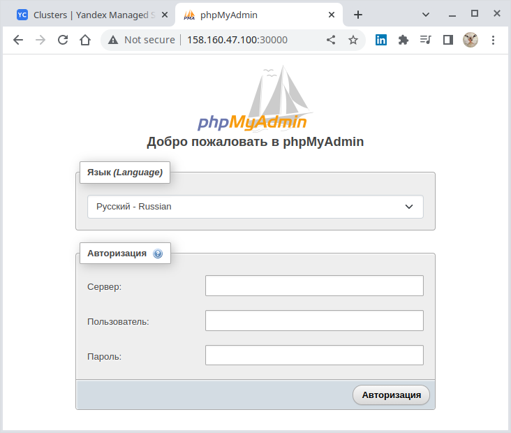

# Домашнее задание к занятию 15.4 "Кластеры. Ресурсы под управлением облачных провайдеров"

Организация кластера Kubernetes и кластера баз данных MySQL в отказоустойчивой архитектуре.
Размещение в private подсетях кластера БД, а в public - кластера Kubernetes.

---

## Задание 1. Яндекс.Облако (обязательное к выполнению)

1. Настроить с помощью Terraform кластер баз данных MySQL:
- Используя настройки VPC с предыдущих ДЗ, добавить дополнительно подсеть private в разных зонах, чтобы обеспечить отказоустойчивость
- Разместить ноды кластера MySQL в разных подсетях
- Необходимо предусмотреть репликацию с произвольным временем технического обслуживания
- Использовать окружение PRESTABLE, платформу Intel Broadwell с производительностью 50% CPU и размером диска 20 Гб
- Задать время начала резервного копирования - 23:59
- Включить защиту кластера от непреднамеренного удаления
- Создать БД с именем `netology_db` с логином и паролем

2. Настроить с помощью Terraform кластер Kubernetes
- Используя настройки VPC с предыдущих ДЗ, добавить дополнительно 2 подсети public в разных зонах, чтобы обеспечить отказоустойчивость
- Создать отдельный сервис-аккаунт с необходимыми правами
- Создать региональный мастер kubernetes с размещением нод в разных 3 подсетях
- Добавить возможность шифрования ключом из KMS, созданного в предыдущем ДЗ
- Создать группу узлов состояющую из 3 машин с автомасштабированием до 6
- Подключиться к кластеру с помощью `kubectl`
- *Запустить микросервис phpmyadmin и подключиться к БД, созданной ранее
- *Создать сервис типы Load Balancer и подключиться к phpmyadmin. Предоставить скриншот с публичным адресом и подключением к БД

Документация
- [MySQL cluster](https://registry.terraform.io/providers/yandex-cloud/yandex/latest/docs/resources/mdb_mysql_cluster)
- [Создание кластера kubernetes](https://cloud.yandex.ru/docs/managed-kubernetes/operations/kubernetes-cluster/kubernetes-cluster-create)
- [K8S Cluster](https://registry.terraform.io/providers/yandex-cloud/yandex/latest/docs/resources/kubernetes_cluster)
- [K8S node group](https://registry.terraform.io/providers/yandex-cloud/yandex/latest/docs/resources/kubernetes_node_group)


--- 

### Решение

1. Настроить с помощью Terraform кластер баз данных MySQL:
> - Используя настройки VPC с предыдущих ДЗ, добавить дополнительно подсеть private в разных зонах, чтобы обеспечить отказоустойчивость
> Создать подсети в разных зонах_
> - Разместить ноды кластера MySQL в разных подсетях
> - Необходимо предусмотреть репликацию с произвольным временем технического обслуживания
>- Использовать окружение PRESTABLE, платформу Intel Broadwell с производительностью 50% CPU и размером диска 20 Гб
> По числам угадать название шаблона, который надо использовать

> - Задать время начала резервного копирования - 23:59
> - Включить защиту кластера от непреднамеренного удаления
> - Создать БД с именем `netology_db` с логином и паролем

2. Настроить с помощью Terraform кластер Kubernetes
> - Используя настройки VPC с предыдущих ДЗ, добавить дополнительно 2 подсети public в разных зонах, чтобы обеспечить отказоустойчивость
> - Создать отдельный сервис-аккаунт с необходимыми правами
> - Создать региональный мастер kubernetes с размещением нод в разных 3 подсетях
> - Добавить возможность шифрования ключом из KMS, созданного в предыдущем ДЗ
> - Создать группу узлов состояющую из 3 машин с автомасштабированием до 6
> - Подключиться к кластеру с помощью `kubectl`
> В документации есть описание, как после работы терраформа получить готовую конфигурацию - он её скачает, её нужно скопировать в kubeconfig 
> и подключиться kubectl. Т.е. показать, что подключились локально с помощью kubectl.

Инициализируем консоль Yandex.Cloud для доступа к текущему каталогу:
````bash
$ yc init                  
Welcome! This command will take you through the configuration process.
Pick desired action:
 [1] Re-initialize this profile 'default' with new settings 
 [2] Create a new profile
Please enter your numeric choice: 1
Please go to https://oauth.yandex.ru/authorize?response_type=token&client_id=1a6990aa636648e9b2ef855fa7bec2fb in order to obtain OAuth token.

Please enter OAuth token: [AQAAAAABL*********************PBEbq222c] 
You have one cloud available: 'netology-cloud' (id = b1g8mq58h421raomnd64). It is going to be used by default.
Please choose folder to use:
 [1] application-folder (id = b1g98l8rbuco369mal49)
 [2] empty (id = b1grnvgme46inhr5nu72)
 [3] Create a new folder
Please enter your numeric choice: 1
Your current folder has been set to 'application-folder' (id = b1g98l8rbuco369mal49).
Do you want to configure a default Compute zone? [Y/n] n
````

Подключимся к внешнему IP-адресу кластера:
````bash
$ yc managed-kubernetes cluster get-credentials catf5dg0ppdutmnj2rmd --external

Context 'yc-kubernetes-cluster-regional' was added as default to kubeconfig '/home/oleg/.kube/config'.
Check connection to cluster using 'kubectl cluster-info --kubeconfig /home/oleg/.kube/config'.

Note, that authentication depends on 'yc' and its config profile 'default'.
To access clusters using the Kubernetes API, please use Kubernetes Service Account.
````

Убедимся, что кластер доступен:
````bash
$ kubectl cluster-info        
Kubernetes control plane is running at https://130.193.37.255
CoreDNS is running at https://130.193.37.255/api/v1/namespaces/kube-system/services/kube-dns:dns/proxy

To further debug and diagnose cluster problems, use 'kubectl cluster-info dump'.
````

Ноды присутствуют:
````bash
$ kubectl get nodes -A -o wide
NAME                        STATUS   ROLES    AGE     VERSION   INTERNAL-IP     EXTERNAL-IP      OS-IMAGE             KERNEL-VERSION      CONTAINER-RUNTIME
cl18l9iufidr86fmhi25-ijec   Ready    <none>   8m25s   v1.21.5   192.168.10.16   158.160.51.24    Ubuntu 20.04.4 LTS   5.4.0-124-generic   containerd://1.6.7
cl18l9iufidr86fmhi25-okew   Ready    <none>   8m16s   v1.21.5   192.168.10.17   158.160.50.41    Ubuntu 20.04.4 LTS   5.4.0-124-generic   containerd://1.6.7
cl18l9iufidr86fmhi25-ygeg   Ready    <none>   8m29s   v1.21.5   192.168.10.6    158.160.45.162   Ubuntu 20.04.4 LTS   5.4.0-124-generic   containerd://1.6.7
````

Поды тоже (на данный момент только системные):
````bash
$ kubectl get po -A -o wide      
NAMESPACE     NAME                                                  READY   STATUS    RESTARTS   AGE     IP              NODE                        NOMINATED NODE   READINESS GATES
kube-system   calico-node-4jk7r                                     1/1     Running   0          8m54s   192.168.10.17   cl18l9iufidr86fmhi25-okew   <none>           <none>
kube-system   calico-node-4zhqv                                     1/1     Running   0          9m7s    192.168.10.6    cl18l9iufidr86fmhi25-ygeg   <none>           <none>
kube-system   calico-node-6qrjl                                     1/1     Running   0          9m3s    192.168.10.16   cl18l9iufidr86fmhi25-ijec   <none>           <none>
kube-system   calico-typha-6d7bddfb44-c64zc                         1/1     Running   0          7m39s   192.168.10.17   cl18l9iufidr86fmhi25-okew   <none>           <none>
kube-system   calico-typha-horizontal-autoscaler-8495b957fc-dc4k6   1/1     Running   0          12m     10.112.128.5    cl18l9iufidr86fmhi25-ygeg   <none>           <none>
kube-system   calico-typha-vertical-autoscaler-6cc57f94f4-hgv8r     1/1     Running   3          12m     10.112.128.4    cl18l9iufidr86fmhi25-ygeg   <none>           <none>
kube-system   coredns-5f8dbbff8f-7bxvj                              1/1     Running   0          12m     10.112.128.3    cl18l9iufidr86fmhi25-ygeg   <none>           <none>
kube-system   coredns-5f8dbbff8f-phdxm                              1/1     Running   0          8m22s   10.112.129.3    cl18l9iufidr86fmhi25-ijec   <none>           <none>
kube-system   ip-masq-agent-5dqrt                                   1/1     Running   0          9m3s    192.168.10.16   cl18l9iufidr86fmhi25-ijec   <none>           <none>
kube-system   ip-masq-agent-n6lvk                                   1/1     Running   0          9m7s    192.168.10.6    cl18l9iufidr86fmhi25-ygeg   <none>           <none>
kube-system   ip-masq-agent-wrwqz                                   1/1     Running   0          8m54s   192.168.10.17   cl18l9iufidr86fmhi25-okew   <none>           <none>
kube-system   kube-dns-autoscaler-598db8ff9c-sntr2                  1/1     Running   0          12m     10.112.128.6    cl18l9iufidr86fmhi25-ygeg   <none>           <none>
kube-system   kube-proxy-6x6xb                                      1/1     Running   0          9m7s    192.168.10.6    cl18l9iufidr86fmhi25-ygeg   <none>           <none>
kube-system   kube-proxy-f4wl5                                      1/1     Running   0          9m3s    192.168.10.16   cl18l9iufidr86fmhi25-ijec   <none>           <none>
kube-system   kube-proxy-hpblp                                      1/1     Running   0          8m54s   192.168.10.17   cl18l9iufidr86fmhi25-okew   <none>           <none>
kube-system   metrics-server-7574f55985-946vq                       2/2     Running   1          8m20s   10.112.129.4    cl18l9iufidr86fmhi25-ijec   <none>           <none>
kube-system   npd-v0.8.0-lnqcr                                      1/1     Running   0          8m54s   10.112.130.2    cl18l9iufidr86fmhi25-okew   <none>           <none>
kube-system   npd-v0.8.0-qnkqp                                      1/1     Running   0          9m7s    10.112.128.2    cl18l9iufidr86fmhi25-ygeg   <none>           <none>
kube-system   npd-v0.8.0-w2g26                                      1/1     Running   0          9m3s    10.112.129.2    cl18l9iufidr86fmhi25-ijec   <none>           <none>
kube-system   yc-disk-csi-node-v2-6t8mt                             6/6     Running   0          8m54s   192.168.10.17   cl18l9iufidr86fmhi25-okew   <none>           <none>
kube-system   yc-disk-csi-node-v2-9p45v                             6/6     Running   0          9m3s    192.168.10.16   cl18l9iufidr86fmhi25-ijec   <none>           <none>
kube-system   yc-disk-csi-node-v2-rtvmq                             6/6     Running   0          9m7s    192.168.10.6    cl18l9iufidr86fmhi25-ygeg   <none>           <none>
````

Как мы убедилсь, кластер работает и доступен из локального окружения.

---

**Загрузка образа, находящегося в "Docker Hub", в репозиторий "Container Registry Yandex.Cloud" и запуск его в 
кластере**

Сначала загрузим в локальный репозиторий образ "phpmyadmin" из "Docker Hub":
````bash
$ docker pull phpmyadmin:5.2.0

$ docker image ls                                            
REPOSITORY                              TAG          IMAGE ID       CREATED         SIZE
phpmyadmin                              5.2.0        bc444490f73f   3 days ago      510MB
...
````

Назначим образу тег в формате, требуемом для Yandex.Cloud:
````bash
$ docker tag phpmyadmin:5.2.0 cr.yandex/crpj57qmohdjp9ppfrrk/phpadmin:5.2.0 

$ docker image ls                                                          
REPOSITORY                                TAG          IMAGE ID       CREATED         SIZE
cr.yandex/crpj57qmohdjp9ppfrrk/phpadmin   5.2.0        bc444490f73f   3 days ago      510MB
...
````

Залогинимся в репозиторий "Container Registry" Yandex.Cloud с использованием OAuth-токена:
````bash
$ docker login --username oauth --password $YC_TOKEN cr.yandex
WARNING! Using --password via the CLI is insecure. Use --password-stdin.
WARNING! Your password will be stored unencrypted in /home/oleg/.docker/config.json.
Configure a credential helper to remove this warning. See
https://docs.docker.com/engine/reference/commandline/login/#credentials-store

Login Succeeded
````

Отправим образ в репозиторий "Container Registry" Yandex.Cloud:
````bash
$ docker push cr.yandex/crpj57qmohdjp9ppfrrk/phpadmin:5.2.0
The push refers to repository [cr.yandex/crpj57qmohdjp9ppfrrk/phpadmin]
4671fa4f963c: Pushed
...
8a70d251b653: Pushed
5.2.0: digest: sha256:016e3ca648ef59853298771c8a508256882586fe870d7e00adaaf8271ad0639c size: 4080
````

Список загруженных в "Container Registry" Yandex.Cloud образов:
````bash
$ yc container image list   
+----------------------+---------------------+-------------------------------+-------+-----------------+
|          ID          |       CREATED       |             NAME              | TAGS  | COMPRESSED SIZE |
+----------------------+---------------------+-------------------------------+-------+-----------------+
| crptquevgslb2m5l1l2j | 2023-01-09 14:18:46 | crpj57qmohdjp9ppfrrk/phpadmin | 5.2.0 | 171.7 MB        |
+----------------------+---------------------+-------------------------------+-------+-----------------+
````

Развернем в кластере образ из "Container Registry" Yandex.Cloud:
````bash
$ kubectl run --attach phpadmin --image cr.yandex/crpj57qmohdjp9ppfrrk/phpadmin:5.2.0 --labels="app=neto15_4,component=mysql"
...
````

Через некоторое время экземпляр образа "phpMyAdmin" запущен:
````bash
$ kubectl get deploy,pod -n default
NAME           READY   STATUS    RESTARTS   AGE
pod/phpadmin   1/1     Running   0          71s

$ kubectl get pod -n default -o wide --show-labels 
NAME       READY   STATUS    RESTARTS   AGE   IP              NODE                        NOMINATED NODE   READINESS GATES   LABELS
phpadmin   1/1     Running   0          70s   10.112.130.11   cl18l9iufidr86fmhi25-okew   <none>           <none>            app=neto15_4,component=mysql
````

---
**Разворачивание "phpMyAdmin" через деплоймент**

Развернем в кластере [деплоймент](./infrastructure/deploy-apps.yaml) ["phpmyadmin"](https://hub.docker.com/_/phpmyadmin):
````bash
$ kubectl apply -f deploy-apps.yaml 
deployment.apps/phpmyadmin created
service/phpmyadmin-svc created

$ kubectl get pod -n default -o wide
NAME                          READY   STATUS    RESTARTS   AGE     IP             NODE                        NOMINATED NODE   READINESS GATES
phpmyadmin-75f86fdb4f-jx7ld   1/1     Running   0          8m44s   10.112.130.3   cl18l9iufidr86fmhi25-okew   <none>           <none>
````

Получим информацию об имеющихся внешних IP:
````bash
$ kubectl get node -n default -o wide
NAME                        STATUS   ROLES    AGE    VERSION   INTERNAL-IP     EXTERNAL-IP      OS-IMAGE             KERNEL-VERSION      CONTAINER-RUNTIME
cl18l9iufidr86fmhi25-ijec   Ready    <none>   173m   v1.21.5   192.168.10.16   130.193.39.213   Ubuntu 20.04.4 LTS   5.4.0-124-generic   containerd://1.6.7
cl18l9iufidr86fmhi25-okew   Ready    <none>   173m   v1.21.5   192.168.10.17   158.160.44.123   Ubuntu 20.04.4 LTS   5.4.0-124-generic   containerd://1.6.7
cl18l9iufidr86fmhi25-ygeg   Ready    <none>   173m   v1.21.5   192.168.10.6    158.160.53.134   Ubuntu 20.04.4 LTS   5.4.0-124-generic   containerd://1.6.7
````

После этого можно к "phmMyAdmin" можно подключиться по внешнему IP-адресу и порту, открытому через NodePort:



---

Подключение к "phpMyAdmin" через **маппинг порта в локальное окружение**

Прокидываем порт `80` в локальное окружение:
````bash
$ kubectl port-forward pod/phpadmin -n default 8080:80                                                     
Forwarding from 127.0.0.1:8080 -> 80
Forwarding from [::1]:8080 -> 80
Handling connection for 8080
Handling connection for 8080
````

Теперь можно подключиться к "phpMyAdmin" из локального окружения по порту `80`:


---

Вместо маппирования портов можно **запустить в кластере Node Port**, аналогично тому, как мы сделали это через
деплоймент.

Добавим в кластер сервис, эспонирующий наружу порт `30000`:
````bash
$ kubectl apply -f deploy-apps.yaml
service/phpmyadmin-svc created
````

Т.к. при создании пода мы назначили ему ярлыки:
````bash
$ kubectl get pod -n default --show-labels 
NAME       READY   STATUS    RESTARTS   AGE     LABELS
phpadmin   1/1     Running   0          8m41s   app=neto15_4,component=mysql
````

То мы можем подключить к нему [Node Port](./infrastructure/nodeport.yaml) и осуществить подключение к контейнеру через
внешний порт, аналогично тому, как мы поступили, разворачивая "mysqladmin" через деплоймент:
````bash
$ kubectl get svc -n default --show-labels 
NAME             TYPE        CLUSTER-IP      EXTERNAL-IP   PORT(S)        AGE     LABELS
phpmyadmin-svc   NodePort    10.96.201.117   <none>        80:30000/TCP   16s     app=neto15_4,component=mysql
kubernetes       ClusterIP   10.96.128.1     <none>        443/TCP        3h16m   component=apiserver,provider=kubernetes
````

Получим информацию об имеющихся внешних IP:
````bash
$ kubectl get node -n default -o wide
NAME                        STATUS   ROLES    AGE    VERSION   INTERNAL-IP     EXTERNAL-IP      OS-IMAGE             KERNEL-VERSION      CONTAINER-RUNTIME
cl18l9iufidr86fmhi25-ijec   Ready    <none>   173m   v1.21.5   192.168.10.16   130.193.39.213   Ubuntu 20.04.4 LTS   5.4.0-124-generic   containerd://1.6.7
cl18l9iufidr86fmhi25-okew   Ready    <none>   173m   v1.21.5   192.168.10.17   158.160.44.123   Ubuntu 20.04.4 LTS   5.4.0-124-generic   containerd://1.6.7
cl18l9iufidr86fmhi25-ygeg   Ready    <none>   173m   v1.21.5   192.168.10.6    158.160.53.134   Ubuntu 20.04.4 LTS   5.4.0-124-generic   containerd://1.6.7
````

После этого можно к "phpMyAdmin" подключиться по внешнему IP-адресу и порту `30000`, открытому через NodePort:


---

Теперь подключим "phpMyAdmin" к уже имеющемуся кластеру MySQL. Для этого получим cписок кластеров БД MySQL в каталоге:
````bash
$ yc managed-mysql cluster list
+----------------------+---------------+---------------------+--------+---------+
|          ID          |     NAME      |     CREATED AT      | HEALTH | STATUS  |
+----------------------+---------------+---------------------+--------+---------+
| c9qk77gtde786ll1s0lt | mysql-cluster | 2023-01-09 12:09:37 | ALIVE  | RUNNING |
+----------------------+---------------+---------------------+--------+---------+
````

Имея имя кластера получим список его хостов:
````bash
$ yc managed-mysql host list --cluster-name mysql-cluster
+-------------------------------------------+----------------------+---------+--------+---------------+-----------+--------------------+----------+-----------------+
|                   NAME                    |      CLUSTER ID      |  ROLE   | HEALTH |    ZONE ID    | PUBLIC IP | REPLICATION SOURCE | PRIORITY | BACKUP PRIORITY |
+-------------------------------------------+----------------------+---------+--------+---------------+-----------+--------------------+----------+-----------------+
| rc1a-9y9974v6x5euqv6n.mdb.yandexcloud.net | c9qk77gtde786ll1s0lt | MASTER  | ALIVE  | ru-central1-a | false     |                    |        0 |               0 |
| rc1b-4qa8l0uiid8w1kva.mdb.yandexcloud.net | c9qk77gtde786ll1s0lt | REPLICA | ALIVE  | ru-central1-b | false     |                    |        0 |               0 |
| rc1c-kabeodntwvdqeq1i.mdb.yandexcloud.net | c9qk77gtde786ll1s0lt | REPLICA | ALIVE  | ru-central1-c | false     |                    |        0 |               0 |
+-------------------------------------------+----------------------+---------+--------+---------------+-----------+--------------------+----------+-----------------+
````

Подключение к серверу осуществляется имени хоста, которое следует ввести в поле "Сервер":


> Пароль и логин используются те, которые были заданы при декларировании ["yandex_mdb_mysql_cluster"](./terraform/05_mysql_cluster.tf).
> 
> Здесь это `mysql/mysql123`.

> Чтобы на форме появилось поле для ввода адреса сервера следует запускать экземпляр MySQL с параметром 
> **PMA_ARBITRARY=1**

Подключение к кластеру MySQL установлено:


Для проверки выполним SQL-запрос `SELECT version()`:


Запрос упешно выполнен - выведена версия MySQL - `8.0.25-15`.

Таким образом мы подключились к работающему кластеру MySQL используя консоль myPhpAdmin и получили информацию
из базы данных.

---

MySQL-хосты с публичным доступом поддерживают только шифрованные соединения.
Чтобы использовать их, нужно получить SSL-сертификат, который будет сохранен в `~/.mysql/root.crt`:
````bash
$ mkdir --parents ~/.mysql && \
wget "https://storage.yandexcloud.net/cloud-certs/CA.pem" \
    --output-document ~/.mysql/root.crt && \
chmod 0600 ~/.mysql/root.crt
--2023-01-09 14:23:53--  https://storage.yandexcloud.net/cloud-certs/CA.pem
Загружен сертификат CA «/etc/ssl/certs/ca-certificates.crt»
Распознаётся storage.yandexcloud.net (storage.yandexcloud.net)… 213.180.193.243, 2a02:6b8::1d9
Подключение к storage.yandexcloud.net (storage.yandexcloud.net)|213.180.193.243|:443... соединение установлено.
HTTP-запрос отправлен. Ожидание ответа… 200 OK
Длина: 3579 (3,5K) [application/x-x509-ca-cert]
Сохранение в: «/home/oleg/.mysql/root.crt»

/home/oleg/.mysql/root.crt                              100%[==============================================================================================================================>]   3,50K  --.-KB/s    за 0s      

2023-01-09 14:23:53 (52,6 MB/s) - «/home/oleg/.mysql/root.crt» сохранён [3579/3579]
````

Устанавливаем mysql-client:
````bash
$ sudo pacman -Syu
...
$ sudo pacman -S mysql
...
````

---


- *Запустить микросервис phpmyadmin и подключиться к БД, созданной ранее
В кубере. Подключаемся к phpmyadmin и от него к БД.
phpmyadmin - приложение для подключения м MySQL.
 
- *Создать сервис типы Load Balancer и подключиться к phpmyadmin. Предоставить скриншот с публичным адресом и подключением к БД
Чтобы была возможность подключиться снаружи по белому IP к phpmyadmin. Для этого и нужен балансировщик.

---

### _По причине блокировки AWS банковских карт задание №2 не выполнялось._

## Задание 2. Вариант с AWS (необязательное к выполнению)

1. Настроить с помощью terraform кластер EKS в 3 AZ региона, а также RDS на базе MySQL с поддержкой MultiAZ для репликации и создать 2 readreplica для работы:
- Создать кластер RDS на базе MySQL
- Разместить в Private subnet и обеспечить доступ из public-сети c помощью security-group
- Настроить backup в 7 дней и MultiAZ для обеспечения отказоустойчивости
- Настроить Read prelica в кол-ве 2 шт на 2 AZ.

2. Создать кластер EKS на базе EC2:
- С помощью terraform установить кластер EKS на 3 EC2-инстансах в VPC в public-сети
- Обеспечить доступ до БД RDS в private-сети
- С помощью kubectl установить и запустить контейнер с phpmyadmin (образ взять из docker hub) и проверить подключение к БД RDS
- Подключить ELB (на выбор) к приложению, предоставить скрин

Документация
- [Модуль EKS](https://learn.hashicorp.com/tutorials/terraform/eks)
